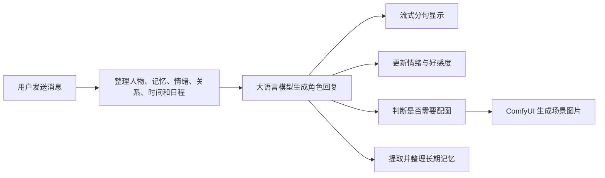

# 🎮 邻舍.EXE

[English](./README_EN.md)

受 Galgame 启发的 **AI 角色陪伴应用**。与可自定义人格的角色对话，AI 根据上下文自动触发 **ComfyUI** 生图，具备三维情绪模拟、长期记忆检索、朋友圈动态系统。

欢迎在视频底下提出更好的建设性建议：
[我好像让纸片人「活」过来了【邻舍 1.0】详细演示以及安装视频](https://www.bilibili.com/video/BV1uH7q6vEQ9/)
[😈既然是在本地AI生成，那凑成什么CP可就随我说了算了【邻舍 2.0】](https://www.bilibili.com/video/BV1wsNu61EX6/)
邻舍3.0视频制作中...

---

## 💡 一句话介绍

邻舍.EXE 是一款受 Galgame 启发的 AI 角色陪伴应用。用户可以创建具有独立人格、情绪、记忆和生活节奏的角色，与她们聊天，并在朋友圈、信箱、日程、群聊和随机事件中持续互动。角色还能够根据对话和当前场景主动调用 ComfyUI 生成图片，让文字交流自然延伸成视觉体验。

它想解决的问题很简单：普通 AI 聊天机器人往往只是在“回答问题”，而邻舍.EXE 希望让角色表现得更像一个持续生活着的人。

## 🏠 项目界面概览

邻舍.EXE 将单聊、群聊、朋友圈、日程、奇遇、相册和角色管理整合在同一个界面中。用户可以像使用日常社交软件一样与不同角色保持联系，同时进入由 AI 驱动的角色世界。

| 私聊、群聊 | 朋友圈 |
|------|--------|
| [](https://github.com/user-attachments/assets/2a08cbe1-f4c8-4814-a986-fc2d47fc8e85) | [](https://github.com/user-attachments/assets/7de290fe-3eb3-4d10-a329-81993cf19c56) |

*群聊中的角色会保持各自的说话方式，并可以结合当前话题生成多人场景图片。*

*角色可以发布带图动态，其他角色和用户能够点赞、评论并继续互动。*

## ✨ 这个项目能带来什么体验？

在普通聊天软件里，用户发一句话，AI 回一句话，一段时间后对话便结束了。

在邻舍.EXE 中，角色会拥有自己的状态和生活：

- 她会记得用户提过的重要经历、偏好和约定。
- 她的心情会受到近期交流影响，而不是每轮对话都回到初始状态。
- 她可能正在上班、学习、休息或睡觉，不一定总能立即回复。
- 她可以主动找用户聊天、发朋友圈、写信或邀请用户参与一段奇遇。
- 当对话适合出现画面时，她能够调用 ComfyUI 生成与当前人物、服装、时间和环境相符的图片。
- 多个角色可以认识彼此、建立关系，并在群聊和共同事件中互动。

因此，用户面对的不是一个孤立的问答窗口，而是一个会随着时间不断积累内容的角色世界。

## 🤖 AI 是怎样融入项目的？

邻舍.EXE 并不是简单地把聊天内容转发给大语言模型。系统会先整理角色当前的全部状态，再让 AI 在这些约束下生成自然回复。

一轮对话大致会经历下面的过程：



### 1. AI 人格与角色扮演

每个角色都有自己的基础设定，包括身份、性格、说话习惯、外观和人物关系。系统会把这些稳定设定与当前状态组合起来，避免角色只靠一句简单提示词维持人格。

用户也可以创建原创角色，或导入和整理已有角色资料。项目兼容 OpenAI 风格的接口，因此既可以连接 DeepSeek，也可以接入其他云端服务、本地模型或中转服务。

[](https://github.com/user-attachments/assets/8f77d9ac-7c38-4ccd-b467-880eb56c10b9)

*酒馆页面集中管理角色，支持招募新角色、查看聊天数量以及建立角色关系。*

### 2. AI 长期记忆

系统不会把全部聊天记录无限塞给模型，而是将记忆分成三个层次：

- 近期对话：保留最近的交流细节，保证上下文连贯。
- 滚动摘要：定期把较长的历史压缩成简洁摘要。
- 长期记忆：由 AI 从对话中提炼值得长期保留的事实、偏好、关系和事件。

当用户再次提到相关话题时，系统会通过关键词和向量语义检索找回记忆。即使用户换了一种说法，角色仍有机会理解它与过去经历的联系。

*记忆管理页面允许用户查询、测试和删除长期记忆，也能查看系统最近的记忆整理记录。*

### 3. AI 情绪系统

项目使用 VAD 情绪模型描述角色状态：

- Valence：情绪偏积极还是消极。
- Arousal：平静还是激动。
- Dominance：被动还是有掌控感。

角色同时拥有较稳定的长期心情和变化更快的即时反应。用户的表达、当前事件和角色关系会共同影响这些数值，再转化成模型可以理解的行为倾向。

这套设计的价值不在于显示几个数字，而在于让同一个角色面对相同问题时，可能因为最近的经历和心情不同而作出不同反应。

### 4. AI 与 ComfyUI 生图

生图不是独立于聊天之外的按钮，而是对话体验的一部分。系统提供多种触发方式：

- 用户明确要求查看照片或场景。
- 角色在回复中主动决定分享画面。
- 后台判断当前内容适合配图。
- 用户直接开启强制生图。

触发后，系统会整理角色外观、LoRA、画师风格、时间、光照、服装和场景等信息，优化提示词并注入 ComfyUI 工作流。生成进度会实时显示，完成后图片自动进入聊天记录和相册。

[](https://github.com/user-attachments/assets/6b746150-7974-43fa-b2f5-677406f23bcd)

*生成后的图片会自动进入聊天记录和相册，成为角色当前处境的视觉延伸。*

### 5. AI 驱动的生活系统

除了聊天，AI 还参与多个持续运行的功能：

- 主动聊天：根据关系、情绪和距离上次交流的时间决定是否联系用户。
- 日程系统：为角色生成每日活动，并影响回复速度和当前话题。
- 朋友圈：角色能够自动发布动态和图片，也能回复用户评论。
- 奇遇事件：生成带有选择和后续发展的随机故事。
- 信箱系统：以更慢、更完整的书信形式进行交流。
- 群聊系统：多个角色根据各自人格和关系共同对话。

这些功能共享同一套人物、关系、记忆和时间状态，因此不是彼此割裂的小游戏。

| 日程 | 奇遇 |
|------|------|
| [](https://github.com/user-attachments/assets/56ed71d3-ae25-4ac6-86c1-c0f04ebf3add) | [](https://github.com/user-attachments/assets/c2b80641-54c7-4c08-8d1a-661f14d8da9e) |

## 🏆 项目的核心优势

### 角色具有连续性

人格、情绪、关系、记忆、日程和世界事件共同参与回复生成。角色不会轻易因为一次新会话就“失忆”或变成通用助手。

### 文字与画面真正联动

项目将大语言模型的理解能力与 ComfyUI 的可控生图能力结合起来。LLM 负责理解“此刻应该画什么”，ComfyUI 负责按照工作流、模型和 LoRA 稳定地完成画面。

### 用户拥有较高的控制权

用户可以修改角色设定、世界观、人物关系、全局规则、LLM 接口、ComfyUI 地址、工作流模式、画师串、分辨率和 LoRA，而不是只能接受平台提供的固定角色。

*世界观可以按不同主题分别维护，并支持借助 AI 进行润色和扩写。*

### 本地优先、数据可掌握

聊天记录、角色资料、关系、日程和图片主要保存在本地 SQLite 数据库和文件目录中；ComfyUI 也可以完全在用户自己的设备上运行。LLM 和记忆模型既可以使用在线服务，也可以根据部署方案接入本地或自定义服务。

需要注意的是，“本地优先”不等于所有数据天然不会离开设备：当用户选择云端 LLM、在线嵌入或重排服务时，相应请求仍会发送给所配置的服务商。正式部署时应根据隐私要求选择服务并完善网络配置。

### 不依赖单一模型厂商

后端通过 OpenAI 兼容协议调用语言模型，生图通过标准 ComfyUI HTTP 和 WebSocket 接口完成。模型层和应用层相对解耦，方便替换服务、模型和工作流。

*系统参数页面可以切换 LLM 配置、连接 ComfyUI，并按需开启记忆、好感度、主动聊天和实时天气等能力。*

### 不只是概念原型

项目已经具备角色管理、单聊、群聊、记忆、情绪、关系、朋友圈、相册、日程、奇遇、信箱、通知、桌面启动器和 Android 外壳等完整模块，能够作为实际应用持续使用和迭代。

[](https://github.com/user-attachments/assets/c8d86580-94a5-4822-96bf-4dc9e459f201)

## 📊 它与普通 AI 聊天项目有什么区别？

| 对比方向 | 普通 AI 聊天 | 邻舍.EXE |
| ---- | ---- | ---- |
| 主要目标 | 回答当前问题 | 维持长期角色关系与世界状态 |
| 人格方式 | 一段 System Prompt | 人格、关系、情绪、记忆、日程共同驱动 |
| 历史处理 | 最近若干条消息 | 近期窗口、滚动摘要、长期 RAG 记忆 |
| 图片生成 | 手动输入提示词 | 理解对话后自动准备场景与工作流 |
| 时间概念 | 通常没有 | 当前时间、天气、日程、睡眠和回复延迟 |
| 主动性 | 等待用户提问 | 主动聊天、发动态、写信和触发事件 |
| 多角色 | 多个独立会话 | 角色之间可以建立关系并参与群聊 |
| 可控性 | 依赖平台提供的选项 | 可配置 LLM、ComfyUI、LoRA、规则和世界观 |

## 🏗️ 技术架构

项目由几个职责清晰的部分组成：

- Web 前端：Vue 3、Pinia、Vue Router 和 Vite，负责聊天、角色、朋友圈、相册等界面。
- 主控后端：Node.js、Express，负责上下文组装、业务状态、AI 调用和后台调度。
- 本地数据库：SQLite、FTS5，保存消息、角色、关系、记忆、日程和任务状态。
- 向量服务：Python、FastAPI、ChromaDB 和 ONNX Runtime，负责语义记忆检索。
- 生图引擎：ComfyUI，通过 HTTP 提交任务，通过 WebSocket 返回实时进度。
- 桌面启动器：PySide6，负责环境检测、依赖安装、版本管理和服务启动。
- Android 外壳：提供手机端访问和通知能力。

这种结构将“产品体验”和“模型能力”分开：前端负责用户体验，Node.js 负责决策与编排，语言模型负责理解和生成，ComfyUI 负责视觉表达，SQLite 与向量服务负责保持长期连续性。

```
浏览器 (Vue 3 SPA, :5173)
  │  HTTP + SSE
  ▼
Node.js + Express (主控 :3099)
  ├── 对话路由 & 会话管理
  ├── 人格引擎（固定人格 + 动态情绪 + 动态记忆）
  ├── 记忆管理器（SQLite 全量留存 + 滚动摘要 + RAG）
  ├── LLM API 调用（OpenAI 兼容）
  └── ComfyUI 客户端（生图调度）
  │
  ├── HTTP → Python FastAPI (向量服务 :8765)
  │           ├── ChromaDB（向量存储/检索）
  │           └── ONNX Embedding（Jina v2 base zh, 768d）
  │
  └── WebSocket/HTTP → ComfyUI (:8188)
                        └── Anima 推理
```

## 🚀 安装与使用

### 方式一：直接使用 Release 包（推荐）

在 [Releases](https://github.com/icecranberry/galgame-with-comfyUI/releases) 下载 `邻舍.EXE-vX.Y.Z.zip`，解压后即可使用。压缩包内置便携 Node.js / Python / Git 运行时、预装依赖、向量模型、前端构建产物和 **`邻舍.EXE.exe`** 启动器，Android APK 也会随版本附带（可选安装）。

使用前只需确保：

| 必要条件 | 说明 |
|----------|------|
| **ComfyUI** | 已安装并运行在 `:8188`，Anima 模型已就绪 |
| **LLM API Key** | 在启动器或网页 **设置** 中配置（默认 DeepSeek，兼容 OpenAI 接口） |

双击 **`邻舍.EXE.exe`**，在启动器 **设置** 中配置 ComfyUI 路径（可选），然后 **首页 → 「▶ 启动邻舍」**。浏览器会自动打开；手机端可在同一局域网内安装压缩包附带的 APK，并输入电脑端显示的局域网地址访问。

> 💡 Release 包由 `npm run release` 一键产出；日常源码开发不需要打包启动器和 APK，`npm run dev` 即可跑起全部服务。

### 方式二：从源码开发

前置条件：**Node.js ≥ 18**、**Python ≥ 3.10（含 venv）**、**Git**、ComfyUI `:8188`、LLM API Key。

```bash
# 1. 克隆仓库
git clone https://github.com/icecranberry/galgame-with-comfyUI.git
cd galgame-with-comfyUI

# 2. 安装依赖
cd agent-core && npm install && cd ..
cd web-ui && npm install && cd ..

# 3. 初始化向量服务（模型缺失时 npm run dev 也会后台自动下载）
cd vector-service
python -m venv venv
venv/Scripts/pip install -r requirements.txt  # Windows
# source venv/bin/pip install -r requirements.txt  # macOS/Linux
python download_model.py
cd ..

# 4. 一键启动开发服务（vector :8765 + core :3099 + web :5173）
npm run dev

# 停止服务
npm run stop
```

启动后访问 `http://localhost:5173`，脚本会自动打开浏览器。LLM、ComfyUI、天气等配置优先在网页 **设置** 页修改（自动写入 `agent-core/.env`，`.env.example` 仅作参考）。`npm run restart-core` 可单独重启 `agent-core`。

## 🛠️ 技术栈

| 组件 | 技术 |
|------|------|
| 前端 | Vue 3 + Pinia + Vue Router + Vite |
| 主控后端 | Node.js + Express (ESM) + better-sqlite3 |
| 本地数据库 | SQLite + FTS5 |
| 向量服务 | Python FastAPI + ChromaDB + ONNX Runtime |
| 嵌入模型 | Jina v2 base zh (768d, 均值池化 + L2 归一) |
| LLM | OpenAI 兼容接口（默认 DeepSeek，支持多 Profile） |
| 生图引擎 | ComfyUI (HTTP + WebSocket) |
| 桌面启动器 | PySide6 (Qt) + PyInstaller |
| Android 外壳 | WebView 套壳 + 原生通知（SSE 长连接） |

## 🛠️ 开发者指南

常用命令：

- `cd agent-core && npm test`：运行后端单元测试
- `npm run dev` / `npm run stop`：一键启动 / 停止全部开发服务
- `npm run build`：vite 构建前端 + PyInstaller 打包 `邻舍.EXE.exe`
- `npm run apk`：自动下载 JDK / Android SDK / Gradle 工具链并构建 APK
- `npm run install-apk`：构建 APK 并通过 adb 安装到已连接手机
- `npm run release`：一键打包完整 Release，输出 `release/邻舍.EXE-vX.Y.Z.zip`
- `npm run tag -- v2.0.0`：构建前端、打 tag 并推送（不传参数自动 patch+1）

启动器和 Android 壳是可选产物，不影响核心开发；日常改代码只需 `npm run dev`，正式发布用 `npm run release`。

## ⚙️ 配置

配置均通过网页 **设置** 页修改并热更新，自动持久化到数据库与 `agent-core/.env`：

| 配置项 | 说明 |
|--------|------|
| LLM | Provider / Key / BaseURL / Model / Thinking / 请求头 / 额外 Body，支持多 Profile 切换 |
| ComfyUI | URL / 画师串 / 分辨率 / TLS / 全局 LoRA / HiresFix 细化参数 |
| 工作流 | base / turbo / hybrid 模式及场景映射 |
| 功能开关 | 情绪 / 记忆 / 主动聊天 / 奇遇 / 日程 / 防打扰 / 群聊 / 天气 / 后台并发 等 |
| 群聊 | 温度、记忆总结间隔 |
| 用户信息 | 昵称 / 性别 / 外观 / 人设 |
| 天气 | 城市（留空自动） |

## 📁 项目结构

```
├── agent-core/          # 主控后端 (Express, :3099)
│   ├── src/
│   │   ├── routes/      # chat / groups / memory / moments / mailbox / events / schedule / ...
│   │   ├── services/    # 情绪 / 记忆 / 生图 / 朋友圈 / 群聊 / 日程 / 奇遇 / 信箱 / 天气
│   │   ├── maibot-bridge/ # MaiBot 桥接
│   │   ├── llm/         # OpenAI 兼容客户端
│   │   ├── db/          # SQLite 表定义 & 种子数据
│   │   └── config.js    # 环境变量 & 运行时配置
│   └── app.js
├── web-ui/              # Vue 3 前端 (Vite, :5173)
│   └── src/
│       ├── views/       # Chat / GroupChat / Tavern / Moments / Gallery / Schedule / Events / Mailbox / Settings
│       ├── components/  # NavBar / Sidebar / MomentCard / Gallery / ImageGenBubble / ...
│       └── stores/      # Pinia stores
├── vector-service/      # Python 向量服务 (FastAPI, :8765)
│   ├── server.py
│   ├── embedding.py     # ONNX 推理
│   ├── chroma_store.py  # ChromaDB 封装
│   └── download_model.py
├── launcher/            # 邻舍.EXE 启动器 (PySide6 + PyInstaller)
├── android-shell/       # Android WebView 外壳（局域网访问 / 通知 / 文件上传）
├── workflow/            # ComfyUI workflow 模板 & 提示词规则
├── scripts/             # dev / stop / build / release / apk / tag 脚本
└── ecosystem.config.cjs # PM2 生产配置
```

## 👥 适合哪些人？

- 喜欢 Galgame、虚拟角色和 AI 陪伴产品的用户。
- 希望设计原创角色和世界观的创作者。
- 已经使用 ComfyUI，希望让生图与故事、角色和聊天结合的玩家。
- 想研究 AI Agent、长期记忆、情绪模拟和多角色互动的开发者。
- 希望拥有可自部署、可修改、可继续开发的 AI 角色应用团队。

## 🎯 项目目前的定位

邻舍.EXE 不是要替代通用 AI 助手，也不是单纯追求模型回答得有多“聪明”。它更关心另一件事：如何利用大语言模型、生图模型、长期记忆和时间系统，让一个虚拟角色在长期互动中保持一致、产生变化，并逐渐形成只属于用户和角色的共同经历。

这也是项目最有价值的地方——AI 不再只是藏在聊天框后的回答机器，而是成为人物性格、记忆、情绪、生活和视觉表现的共同驱动力。

## 📄 License

MIT
