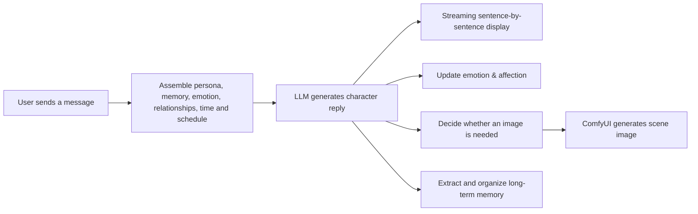

# 🎮 邻舍.EXE

[中文](./README.md)

A **local AI companion app** inspired by Galgame. Chat with characters that have customizable personalities; AI automatically triggers **ComfyUI** image generation from context, with 3D emotion simulation, an evolving long-term memory system, a Moments feed, and switchable UI themes.

Welcome to leave better suggestions under the videos:
- [我好像让纸片人「活」过来了【邻舍.EXE-1.0】- bilibili 详细演示以及安装视频](https://www.bilibili.com/video/BV1uH7q6vEQ9/)
- [【邻舍 2.0】😈既然是在本地AI生成，那凑成什么CP可就随我说了算了](https://www.bilibili.com/video/BV1wsNu61EX6/?share_source=copy_web&vd_source=e0c34a0021e0589a3fbdd4084f0a1b27)

---

## 💡 One-Sentence Introduction

邻舍.EXE is a Galgame-inspired AI character companion app. Users can create characters with independent personalities, emotions, memories, and life rhythms; chat with them, and keep interacting through Moments, mailbox, schedules, group chats, and random events. Characters can also proactively call ComfyUI to generate images based on the conversation and current scene, naturally extending text conversations into visual experiences.

The problem it wants to solve is simple: ordinary AI chatbots mostly just "answer questions", while 邻舍.EXE wants characters to feel like people who keep living their lives.

## 🏠 Interface Overview

邻舍.EXE combines private chat, group chat, Moments, schedules, adventures, gallery, and character management into one interface. Users can stay in touch with different characters like using a daily social app, while entering an AI-driven character world.

| Private chat & group chat | Moments |
|------|--------|
| [](https://github.com/user-attachments/assets/2a08cbe1-f4c8-4814-a986-fc2d47fc8e85) | [](https://github.com/user-attachments/assets/7de290fe-3eb3-4d10-a329-81993cf19c56) |

*Characters in group chats keep their own speaking styles and can generate multi-character scene images based on the current topic.*

*Characters can publish image posts that other characters and users can like, comment on, and keep interacting with.*

## ✨ What Experience Does This Project Offer?

In an ordinary chat app, a user sends a message, the AI replies, and after a while the conversation simply ends.

In 邻舍.EXE, characters have their own states and lives:

- She remembers important experiences, preferences, and promises the user has mentioned.
- Her mood is influenced by recent interactions instead of resetting to an initial state every conversation.
- She may be at work, studying, resting, or sleeping, and cannot always reply immediately.
- She can proactively chat with the user, post Moments, write letters, or invite the user into an adventure.
- When a scene deserves an image, she can call ComfyUI to generate one matching the current character, outfit, time, and environment.
- Multiple characters can know each other, build relationships, and interact in group chats and shared events.

So the user is not facing an isolated Q&A window, but a character world that keeps accumulating content over time.

## 🤖 How Does AI Fit Into the Project?

邻舍.EXE does not simply forward chat content to an LLM. The system first assembles the character's full current state, then lets AI generate natural replies within those constraints.

A single conversation roughly goes through this process:



### 1. AI Personality & Roleplay

Every character has a base setup including identity, personality, speaking style, appearance, and relationships. The system combines these stable settings with the current state, so a character is not held together by a single system prompt.

Users can also create original characters or import and organize existing character profiles. The project uses OpenAI-compatible APIs, so it works with DeepSeek, other cloud services, local models, or relay services.

[](https://github.com/user-attachments/assets/8f77d9ac-7c38-4ccd-b467-880eb56c10b9)

*The Tavern page manages characters centrally, supporting recruiting new characters, viewing chat counts, and building character relationships.*

### 2. AI Long-Term Memory

The system does not stuff unlimited chat history into the model. Instead, memory is divided into three layers:

- Recent conversations: keep the latest details for coherent context.
- Rolling summaries: periodically compress longer history into concise summaries.
- Long-term memory: AI extracts facts, preferences, relationships, and events worth keeping over time.

When the user mentions a related topic again, the system recalls memories through keyword and vector semantic search. Even if the user phrases it differently, the character still has a chance to connect it to past experiences.

In v3.4.0 the memory system was upgraded to the **Memory v3 architecture**, adding five capabilities on top of the three layers:

- **Multiple representations & indexes**: the same experience is encoded as factual statements, emotional impressions, and more, organized with entity and triple indexes and recalled through a four-way hybrid of keyword, vector, and entity retrieval — even rephrased mentions can be remembered.
- **Dual timestamps**: every memory records both "when it happened" and "when it was noted", so a character can tell "something we chatted about last week" apart from "a promise made long ago".
- **@memory active recall**: characters are no longer limited to passively receiving injected memories — when a topic touches the past, they can proactively search their memory and bring it into the conversation.
- **Sleep-time consolidation**: during idle periods a background daemon deduplicates, merges, and archives memories, under an LLM call budget to avoid unbounded cost.
- **Context budget**: dynamic context blocks (memories, schedules, weather, ...) are degraded by priority when the budget tightens, and every downgrade is logged — nothing is silently truncated.

*The memory management page lets users query, test, and delete long-term memories, and view recent memory organization records.*

### 3. AI Emotion System

The project uses the VAD emotion model to describe character states:

- Valence: whether emotion is positive or negative.
- Arousal: calm or agitated.
- Dominance: passive or in control.

Characters have both a relatively stable long-term mood and faster-changing instant reactions. The user's expressions, current events, and character relationships all influence these values, which are then converted into behavioral tendencies the model can understand.

The value of this design is not displaying a few numbers, but letting the same character react differently to the same question depending on recent experiences and mood.

### 4. AI & ComfyUI Image Generation

Image generation is not a button separate from chat; it is part of the conversation experience. The system supports several trigger paths:

- The user explicitly asks to see a photo or scene.
- The character decides on her own to share a picture in a reply.
- The background judges that the current content is suitable for an image.
- The user directly enables force generation.

Once triggered, the system collects character appearance, LoRA, artist style, time, lighting, outfit, scene, and other details, optimizes the prompt, and injects it into the ComfyUI workflow. Progress is shown in real time, and finished images automatically enter both the chat history and the gallery.

[](https://github.com/user-attachments/assets/6b746150-7974-43fa-b2f5-677406f23bcd)

*Generated images automatically enter the chat history and gallery, becoming a visual extension of the character's current situation.*

### 5. AI-Driven Life Systems

Besides chat, AI participates in several continuously running features:

- Proactive chat: decides whether to contact the user based on relationship, mood, and time since the last conversation.
- Schedule system: generates daily activities for characters and affects reply speed and current topics.
- Moments: characters automatically publish posts and images, and reply to user comments.
- Adventure events: generate random stories with choices and follow-ups.
- Mailbox system: slower, more complete letter-style communication.
- Group chat system: multiple characters talk together according to their personalities and relationships.

These features share the same personas, relationships, memories, and time states, so they are not isolated mini-games.

| Schedule | Adventure |
|------|------|
| [](https://github.com/user-attachments/assets/56ed71d3-ae25-4ac6-86c1-c0f04ebf3add) | [](https://github.com/user-attachments/assets/c2b80641-54c7-4c08-8d1a-661f14d8da9e) |

## 🎨 Personalized Themes & UI

The UI is built on the custom **Cel Glow design system** — cel-shaded anime texture × soft glass atmosphere: sticker-like buttons that sink when pressed, candy-dimpled inputs and selects, hard shadows and dot textures, with subtle entrance and feedback animations.

**4 complete themes** ship out of the box and can be switched in Settings. Switching is not just an accent color — every page follows the theme, from chat and Moments to the backpack, emoji manager, and Moments share posters:

| Theme | Vibe |
|------|------|
| 🌌 Violet | Default; blue-purple led with orange-red accents |
| 🌅 Sunset | Warm orange-tomato tones |
| 🌊 Ocean | Fresh blue-green |
| 🌸 Sakura | Soft pink and cream |

The theme preference is persisted per device; the mailbox and Toast pages keep their signature "warm paper" texture as accents, and semantic colors such as the gold gift color stay theme-independent for recognizability.

## 🏆 Core Advantages

### Character Continuity

Personality, emotion, relationships, memory, schedules, and world events all participate in reply generation. Characters do not easily "forget" or turn into a generic assistant after a new session.

### Text and Images Truly Connected

The project combines LLM understanding with ComfyUI's controllable image generation. The LLM figures out "what should be drawn right now", and ComfyUI reliably produces the image according to the workflow, model, and LoRA.

### Users Have High Control

Users can modify character settings, worldviews, character relationships, global rules, LLM endpoints, ComfyUI address, workflow modes, artist strings, resolutions, and LoRA, instead of accepting only fixed characters provided by the platform.

*Worldviews can be maintained separately by topic and polished or expanded with AI assistance.*

### Local-First, Data in Your Hands

Chat history, character profiles, relationships, schedules, and images are mainly stored in local SQLite databases and file directories; ComfyUI can also run entirely on the user's own device. LLM and memory models can use online services or local/custom services depending on the deployment.

Note that "local-first" does not mean all data never leaves the device: when users choose cloud LLMs, online embedding, or reranking services, requests are still sent to the configured providers. For production deployments, choose services and harden network configuration according to privacy requirements.

### Not Tied to a Single Model Vendor

The backend calls LLMs through OpenAI-compatible protocols, and image generation uses standard ComfyUI HTTP and WebSocket APIs. The model layer and application layer are decoupled, making it easy to swap services, models, and workflows.

*The settings page can switch LLM configurations, connect ComfyUI, and enable memory, affection, proactive chat, and real-time weather as needed.*

### More Than a Concept Prototype

The project already has complete modules including character management, private chat, group chat, multi-set emoji packs, a backpack with items and daily chests, character standing portraits, memory, emotion, relationships, Moments, gallery, schedules, adventures, mailbox, notifications, themeable UI, a desktop launcher, and an Android shell. It can be used and iterated as a real application.

[](https://github.com/user-attachments/assets/c8d86580-94a5-4822-96bf-4dc9e459f201)

## 📊 How Is It Different From Ordinary AI Chat Projects?

| Dimension | Ordinary AI chat | 邻舍.EXE |
| ---- | ---- | ---- |
| Main goal | Answer the current question | Maintain long-term character relationships and world state |
| Personality | A system prompt | Driven by personality, relationships, emotion, memory, and schedules together |
| History handling | Last few messages | Recent window, rolling summaries, long-term RAG memory |
| Image generation | Manually write prompts | Automatically prepare scenes and workflows from conversation |
| Time concept | Usually none | Current time, weather, schedule, sleep, and reply delays |
| Proactivity | Waits for user questions | Proactive chat, posts, letters, and triggered events |
| Multiple characters | Separate sessions | Characters build relationships and join group chats |
| UI themes | Usually a fixed style | 4 complete themes, one-click switching across the whole UI |
| Control | Depends on platform options | Configurable LLM, ComfyUI, LoRA, rules, and worldviews |

## 🏗️ Technical Architecture

The project consists of several clearly separated parts:

- Web frontend: Vue 3, Pinia, Vue Router, and Vite for chat, characters, Moments, gallery, and other interfaces.
- Core backend: Node.js and Express for context assembly, business state, AI calls, and background scheduling.
- Local database: SQLite and FTS5 for messages, characters, relationships, memories, schedules, and task state.
- Vector service: Python, FastAPI, ChromaDB, and ONNX Runtime for semantic memory retrieval.
- Image engine: ComfyUI, submitting jobs over HTTP and receiving real-time progress over WebSocket.
- Desktop launcher: PySide6 for environment detection, dependency installation, version management, and service startup.
- Android shell: mobile access and notifications.

This structure separates "product experience" from "model capability": the frontend handles UX, Node.js handles decisions and orchestration, LLMs handle understanding and generation, ComfyUI handles visual expression, and SQLite with the vector service maintains long-term continuity.

```
Browser (Vue 3 SPA, :5173)
  │  HTTP + SSE
  ▼
Node.js + Express (Core :3099)
  ├── Chat routes & session management
  ├── Personality engine (fixed persona + dynamic emotion + dynamic memory)
  ├── Memory manager (SQLite full retention + rolling summaries + RAG)
  ├── LLM API calls (OpenAI-compatible)
  └── ComfyUI client (image generation scheduler)
  │
  ├── HTTP → Python FastAPI (Vector service :8765)
  │           ├── ChromaDB (vector store / retrieval)
  │           └── ONNX Embedding (Jina v2 base zh, 768d)
  │
  └── WebSocket/HTTP → ComfyUI (:8188)
                        └── Anima inference
```

## 🚀 Installation & Usage

### Option 1: Use the Release Package (Recommended)

Download `邻舍.EXE-vX.Y.Z.zip` from [Releases](https://github.com/moye-galaxy/galgame-with-comfyUI/releases) and extract it anywhere. The archive bundles portable Node.js / Python / Git runtimes, preinstalled dependencies, the embedding model, frontend build output, and the **`邻舍.EXE.exe`** launcher. The Android APK is also included with each release (optional).

Before using it, make sure:

| Requirement | Notes |
|----------|------|
| **ComfyUI** | Installed and running on `:8188`, Anima models ready |
| **LLM API Key** | Configure in the launcher or web **Settings** (DeepSeek by default, OpenAI-compatible) |

Double-click **`邻舍.EXE.exe`**, configure the ComfyUI path in the launcher **Settings** (optional), then go to **Home → 「▶ 启动邻舍」**. The browser opens automatically. On mobile, install the included APK on the same LAN and enter the LAN address shown on the PC.

> 💡 The Release package is produced by `npm run release`; for daily source development you do not need to package the launcher or APK, `npm run dev` starts every service.

### Option 2: Develop From Source

Prerequisites: **Node.js ≥ 18**, **Python ≥ 3.10 (with venv)**, **Git**, ComfyUI on `:8188`, and an LLM API key.

```bash
# 1. Clone the repository
git clone https://github.com/moye-galaxy/galgame-with-comfyUI.git
cd galgame-with-comfyUI

# 2. Install dependencies
cd agent-core && npm install && cd ..
cd web-ui && npm install && cd ..

# 3. Initialize the vector service (npm run dev also downloads the model in the background if missing)
cd vector-service
python -m venv venv
venv/Scripts/pip install -r requirements.txt  # Windows
# source venv/bin/pip install -r requirements.txt  # macOS/Linux
python download_model.py
cd ..

# 4. Start all development services (vector :8765 + core :3099 + web :5173)
npm run dev

# Stop services
npm run stop
```

Open `http://localhost:5173` after startup; the script opens the browser automatically. Configure LLM, ComfyUI, weather, and other settings in the web **Settings** page first (they are written to `agent-core/.env` automatically; `.env.example` is only a reference). Use `npm run restart-core` to restart `agent-core` alone.

## 🛠️ Tech Stack

| Component | Technology |
|------|------|
| Frontend | Vue 3 + Pinia + Vue Router + Vite |
| Core backend | Node.js + Express (ESM) + better-sqlite3 |
| Local database | SQLite + FTS5 |
| Vector service | Python FastAPI + ChromaDB + ONNX Runtime |
| Embedding model | Jina v2 base zh (768d, mean pooling + L2 norm) |
| LLM | OpenAI-compatible (DeepSeek by default, multiple profiles) |
| Image engine | ComfyUI (HTTP + WebSocket) |
| Desktop launcher | PySide6 (Qt) + PyInstaller |
| Android shell | WebView wrapper + native notifications (SSE long connection) |

## 🛠️ Developer Guide

Useful commands:

- `cd agent-core && npm test`: run backend unit tests
- `npm run dev` / `npm run stop`: start / stop all development services with one command
- `npm run build`: build the frontend with Vite + package `邻舍.EXE.exe` with PyInstaller
- `npm run apk`: automatically download the JDK / Android SDK / Gradle toolchain and build the APK
- `npm run install-apk`: build the APK and install it to a connected phone via adb
- `npm run release`: build the full Release package, output `release/邻舍.EXE-vX.Y.Z.zip`
- `npm run tag -- v2.0.0`: build the frontend, create a tag, and push (auto patch+1 when no version is passed)

The launcher and Android shell are optional; they do not affect core development. Use `npm run dev` for daily development and `npm run release` for official releases.

## ⚙️ Configuration

All configuration is edited in the web **Settings** page with hot reload, and automatically persisted to the database and `agent-core/.env`:

| Setting | Description |
|--------|------|
| LLM | Provider / Key / BaseURL / Model / Thinking / Headers / Extra body, with multiple profiles |
| ComfyUI | URL / Artist string / Resolution / TLS / Global LoRA / HiresFix refinement settings |
| Workflow | base / turbo / hybrid modes and scene mapping |
| Feature flags | Emotion / Memory / Proactive chat / Events / Schedule / Disturb mode / Group chat / Weather / Background concurrency, etc. |
| Group chat | Temperature, memory summary interval |
| User info | Nickname / Gender / Appearance / Persona |
| Weather | City (empty for auto) |

## 📁 Project Structure

```
├── agent-core/          # Core backend (Express, :3099)
│   ├── src/
│   │   ├── routes/      # chat / groups / memory / moments / mailbox / events / schedule / ...
│   │   ├── services/    # emotion / memory / image / moments / group chat / schedule / events / mailbox / weather
│   │   ├── maibot-bridge/ # MaiBot bridge
│   │   ├── llm/         # OpenAI-compatible client
│   │   ├── db/          # SQLite schema & seed data
│   │   └── config.js    # env vars & runtime config
│   └── app.js
├── web-ui/              # Vue 3 frontend (Vite, :5173)
│   └── src/
│       ├── views/       # Chat / GroupChat / Tavern / Moments / Gallery / Schedule / Events / Mailbox / Settings
│       ├── components/  # NavBar / Sidebar / MomentCard / Gallery / ImageGenBubble / ...
│       └── stores/      # Pinia stores
├── vector-service/      # Python vector service (FastAPI, :8765)
│   ├── server.py
│   ├── embedding.py     # ONNX inference
│   ├── chroma_store.py  # ChromaDB wrapper
│   └── download_model.py
├── launcher/            # 邻舍.EXE launcher (PySide6 + PyInstaller)
├── android-shell/       # Android WebView shell (LAN access / notifications / file upload)
├── workflow/            # ComfyUI workflow templates & prompt rules
├── scripts/             # dev / stop / build / release / apk / tag scripts
└── ecosystem.config.cjs # PM2 production config
```

## 👥 Who Is It For?

- People who like Galgame, virtual characters, and AI companion products.
- Creators who want to design original characters and worldviews.
- ComfyUI users who want to combine image generation with stories, characters, and chat.
- Developers interested in AI agents, long-term memory, emotion simulation, and multi-character interaction.
- Teams that want a self-hostable, modifiable, and continuously developable AI character app.

## 🎯 Where the Project Stands Now

邻舍.EXE is not meant to replace general-purpose AI assistants, nor is it simply chasing how "smart" the model answers are. It cares about something else: using LLMs, image models, long-term memory, and a time system to keep a virtual character consistent and evolving through long-term interaction, gradually forming experiences that belong only to the user and the character.

That is where the project's real value lies: AI is no longer just an answering machine hidden behind a chat box, but a shared driver of a character's personality, memory, emotion, life, and visual presentation.

## 📄 License

MIT
