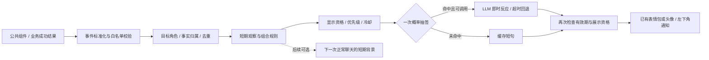

# 角色操作反馈：左下角轻通知计划书

编写日期：2026-10-03。静态核查基线：`7f3126a`（能把小镇居民拎起来）。

状态：**M1 / M2 / M3 已实施**（见 §13 / §14 / §15 实施记录）；§2.3 的非小镇 P1 记录事件已接入；**小镇相关明确不接入**。即时反应触发已按 §16 简化为**纯概率抽签（默认 15%）**，不再有日额度 / 模型间隔 / 单并发 / 幂等节流。跨窗口 / 跨设备验证仍单独安排。文中的频率、尺寸与性能数值是初始配置或验收目标，不是实测结论。

## 1. 产品目标与本次确定的方向

玩家执行与角色有关的操作后，界面左下角偶尔出现一张轻通知：**角色已有表情包或头像 + 角色名 + 一句短反馈**。例如置顶她、点赞她很久以前的动态、给她换一身外观，她会给出符合人设的小反应。

核心体验是“我的动作被角色注意到了”。反馈有具体来由、出现及时、说完就离开，不要求玩家进入新页面或继续一段剧情。

本次确定：

1. 主展示入口改为主界面左下角的角色通知，**不依赖立绘小窗是否打开**。
2. 日常触发由程序判断；通过展示资格检查的操作有小概率调用 LLM，结合当前人设与本次事实生成即时反应，其余使用缓存短句。不会每次操作都请求模型，所有路径均复用已有图片。
3. 只接入经过筛选的语义操作，不采集全部点击；一次业务事实只有一个权威事件来源。
4. “记录操作”首先指短期内存记录，不等于写入数据库、聊天记录或长期记忆。
5. 一次操作至多由一个角色反馈；已在聊天、送礼演出、地图气泡或奇遇中回应的操作，优先使用原有回应。
6. 首期交付通知链路与低概率即时 LLM 反应；批量专属短句包分阶段加入（组合判断、聊天上下文联动、小镇与图片预览等已确认不做）。

### 1.1 一次实际使用

玩家在朋友圈翻到角色 A 很久以前发的一条动态，点了个赞。操作确认后，通过冷却与去重检查：通常选择缓存短句，小概率由 LLM 根据 A 的人设、当前关系摘要与这次点赞事实现写一句。左下角配合已有表情包或头像显示，例如“你都翻到那么前面去了？”，约 5 秒后渐出。同一帖子取消后重赞不会重复抽签或追加模型调用。“即时反应”指结合当下已知信息生成，不代表模型知道动态内容或玩家动机。

点赞只证明“点了赞”，反馈不替角色判断玩家是否真的喜欢；普通点赞与翻旧动态是两条明确分支，同一事实只选一条。

### 1.2 与现有功能的关系

- 右上角系统 Toast 继续承担“保存成功、请求失败”等操作状态；角色通知表达角色反应。
- 立绘触摸继续在立绘舞台中反馈，首期不再为每次摸头或轻戳弹左下角通知。
- 左下角不是聊天消息入口，不增加聊天未读数，不主动推进聊天、好感度、VAD 情绪或记忆整理。
- 小镇后续接入时仍沿用 NPC 邀请与奇遇主链路；通知不新增结算面板，也不产生钱物和剧情后果。

## 2. 值得记录的操作目录

### 2.1 分类与优先级

- **直接反馈候选**：操作语义完整且角色关系明确，经过冷却和去重后可以弹出。
- **仅记录上下文**：用于组合或节奏判断，本身不弹出。
- **已有反馈优先**：只有原功能没有提供人物回应时，才可作为补充；首期默认不弹。
- **暂不接入**：语义不足、重复价值低，或需要尚未具备的入口和元数据。

P0 为首期；P1 为后续扩展；P2 为保留方向。表中台词是示例，用于说明事实边界，不能作为所有角色共用的唯一台词。

### 2.2 主系统：直接反馈候选

| 优先级 | 显式操作 / 语义事件 | 成立条件与接入位置 | 反馈示例 | 记录与去重 |
| --- | --- | --- | --- | --- |
| P0 | 置顶角色 `character.pin_enabled` | 从未置顶到置顶，接口确认成功；重复保存相同值不算 | “哦？给我留了个最前面的位置。” | 同角色本地日内至多一次；取消置顶静默 |
| P0 | 点赞角色动态 `moment.like_enabled` | 点赞接口结果为 `liked=true`，作者可确认；同一帖子取消后重赞不重复 | 普通：“这个你也喜欢啊。”；旧动态：“你都翻到那么前面去了？” | 同帖本地日内一次；超过 7 天按旧动态分支，同一事实只选一个分支 |
| P0 | 使用外观类道具 `appearance.applied` | 道具或外观操作已成功落地，目标角色和类型明确；使用 `backpack.useItem` 的业务成功结果，不能只看 Promise 完成 | “怎么样，这一身还合适吗？” | 记录有效外观版本；同物品操作去重。若原流程已有角色台词或图片叙事，则抑制通知 |
| P0 | 主动重开旧回信 `letter.reopened` | 在信箱中显式打开本人收到的、该角色写的历史回信；信件先前已读，完成时间距今超过 7 天。不能由后台 `markRead` 或列表加载推断 | “那封信，你还留着啊。” | 同封信本地日内一次；只确认打开，不声称玩家已读完或读懂 |
| P1 | 保存更换后的角色头像 `character.avatar_changed` | 新头像版本不同且保存成功；不分析头像内容 | “以后就用这张认我了？” | 同角色 30 分钟至多一次；上传预览不算完成 |
| P1 | 改变角色显示名 `character.display_name_changed` | 保存后新旧值确实不同，且玩家已开启此类“界面感知”反馈 | “那就试试这么叫我吧。” | 同角色 30 分钟至多一次；当前显示名是角色配置，不假装它已经是独立的亲昵称呼系统 |
| P1 | 导出角色动态分享图 `moment.share_exported` | 实际导出入口已完成合成或发起下载；需由分享组件补充作者信息 | “记得挑我好看的那张。” | 一次导出操作一次；不声称已经发到外部平台，也不读取分享对象 |
| P1 | 切回原有外观 `appearance.restored` | 玩家主动恢复，服务端确认有效外观发生变化；定时到期恢复不算玩家操作 | “还是这身穿着习惯。” | 同角色 30 分钟一次；与 `appearance.applied` 共用冷却 |
| P1 | 改动角色关系 `character.relationship_changed` | 关系图谱或关系推演里显式新建 / 修改 / 删除确认成功；不复述关系内容 | “原来在你眼里是这样啊。” | 同角色 30 分钟至多一次；批量确认推演结果按角色去重 |
| P1 | 瞄一眼日程 `schedule.peeked` | 成功发起「瞄一眼」快照；不描述画面，也不声称角色当时一定在做什么 | “被我发现了，你在偷看。” | 同角色 30 分钟至多一次；重拍与重试沿用同一次去重 |

“本地日”跟随应用统一时区配置；跨午夜只重置频率计数，不重新播放旧事件。

### 2.3 有价值但先不重复弹出的操作

| 优先级 | 操作 | 推荐处理 | 原因 / 实施前提 |
| --- | --- | --- | --- |
| P1 | 评论角色朋友圈 | 原评论回复优先 | 同一条评论不同时触发评论回复和左下角复述 |
| P1 | 明确保存与角色的日程约定 | 后续可以针对“约定排入日程”做简短确认 | 区分手动编辑、聊天约定与自动日程生成；有原确认则抑制；不声称已经赴约 |
| P2 | 邀请角色入住小镇 | 以入住成功为事实，已有入驻演出优先 | 不把“点击邀请”当作实际完成入住 |

> **实施口径（非小镇）**：`moment.comment` / `schedule.agreement` 已接入为**只记录、不弹出**事件，只进入短期观察与会话历史，不抽签、不展示；避免与既有评论回复 / 日程广播重复说话。图片预览/下载、礼物、寄信已整体退回监听；其余 P2 方向不排期，表中保留的「邀请角色入住小镇」属小镇范围，不接入。

### 2.4 小镇操作目录

> **范围说明：本计划当前不接入小镇相关操作。** 下表仅作为方向保留，不实现 NPC 身份适配、生产者或通知。

| 优先级 | 显式操作 | 有价值的记录 | 反馈策略 |
| --- | --- | --- | --- |
| P2 | 拎起 / 放下居民 | 一次完整动作、目标居民、是否合法落地 | 地图气泡与动作反应优先；确实没有台词时才补左下角一句，不按拖动帧记录 |
| P2 | 邀请居民同行 / 主动结束同行 | 仅在对应能力实际存在且操作确认成功后记录 | 可短评“走吧”；不为了通知提前新增同行玩法 |
| P2 | 与 NPC 完成交易或赠礼 | 交易 ID、双方、已结算物品 | 钱包与原交易回应优先；不对每件商品、每次刷新都弹出 |
| P2 | 接受 NPC 邀请、推进或完成奇遇 | 已确认的事件 ID 与来源角色 | 奇遇叙事负责回应，通知默认抑制 |
| P2 | 前往居民所在地点并主动交谈 | 地图、居民、交谈来源 | 可为后续组合提供背景；开场对白已经承担反馈，不追加“你来了” |

轻量 NPC 使用 `npc:{id}`，正式角色使用 `character:{id}`，涉及小镇时同时携带 `worldId`。通过既有身份映射确认二者是否为同一人，避免影子身份与正式角色各弹一次。本计划不接入小镇，NPC 适配不排期。

### 2.5 仅记录、不立即弹出的上下文

| 事件 | 用途 | 记录限制 |
| --- | --- | --- |
| 进入页面、退出页面、切到后台 | 判断反馈宿主是否适合展示 | 路由仅提供场景；单纯进入设置、背包或相册不触发人物台词 |
| 聊天生成中、弹窗 / 抽屉开启、场景演出中 | 暂停低优先级角色反馈 | 从现有组件生命周期或状态层接入，不用 DOM 扫描猜测 |


### 2.6 不记录或不让角色评价的操作

- 输入框逐字输入、密码、API Key、配置正文、未发送消息和信件草稿。
- 鼠标移动轨迹、每一帧滚动或缩放、截图快捷键、操作系统文件保存结果。
- 列表加载、图片预加载、后台轮询、SSE 重放、自动日程刷新、组件挂载和自动效果过期。
- 删除角色、清空聊天、清理记忆、解除誓约、取消置顶等管理操作；由原系统确认与结果提示负责。
- 没有明确角色归属的图片、多人图中无法确定反馈者的操作。
- 点击禁用按钮、失败请求、取消请求；不将失败解释为玩家故意冷落角色。

## 3. 左下角通知的产品与视觉方案

### 3.1 结构与交互

示意布局：

```text
┌──────────────────────────────────┐
│ [角色表情包]  角色名          [×] │
│               这张你也要留着啊。  │
└──────────────────────────────────┘
```

- 它是 **非模态轻通知**，没有遮罩、没有确认按钮、不锁定背景操作、不自动跳转聊天。
- 卡片只包含角色图、角色名、一句话和关闭按钮；不展示事件名称、奖励、操作日志或系统参数。
- 左下角可叠放多条（默认最多 3 条），新卡片从最下面出现、把旧卡片往上顶；超出上限时最旧的一条先退场。默认展示 5 秒，悬停或键盘焦点在卡片内时暂停该条计时；关闭后完成 0.3 秒渐出再卸载。
- 点击正文不触发隐含操作；关闭按钮使用 `LinsheButton variant="icon"`，支持键盘、明确的可访问名称及移动端至少 44px 热区。
- 整个宿主 `pointer-events: none`，仅卡片可交互，不拦截其它位置的点击；不把焦点从输入框抢走。
- `role="status"` / `aria-live="polite"`，同一条通知只播报一次。尊重现有减少动态效果设置。
- 新通知出现时播放一声很轻的合成提示音（可用设置里的「提示音」开关关闭；页面在后台时不响）；不增加红点或未读计数。设置提供功能总开关、反馈频率、显示时长、提示音和类别开关，以及即时反应开关与 LLM 触发概率。展示频率与模型概率分别配置。

### 3.2 位置、遮挡与主题

- 固定在应用视口左下角，桌面左侧及底部起始边距 16px；移动端分别叠加 `safe-area-inset-left` / `safe-area-inset-bottom`。底部导航、聊天输入栏、小镇操作栏由布局提供底部避让量，卡片显示在这些控件上方。软键盘打开时优先暂停新通知，已有卡片渐出，避免遮挡输入与发送按钮。
- 建议桌面宽度 300～360px；移动端最大宽度为视口宽度减左右安全边距。头像约 48px，表情包约 56～64px，预留固定媒体尺寸避免加载跳动。
- 表情包使用 `object-fit: contain`，保留透明背景和完整构图；头像按现有圆形头像表现；名字单行、句子可自然换到两行。
- 延续 [设计系统](design-system.md) 中 Toast 的暖纸质感岛、深棕文字与主题强调色；卡片使用比系统 Toast 稍强的投影（`--ct-shadow`），多条叠放时层次清晰。暗夜也保留暖纸的既有例外，保证文字对比。
- 颜色和尺寸放入 `styles/tokens.css` 的语义变量；不把现有 Toast 中的硬编码色值再复制进新组件。入场与离场使用 `--dur-interaction`（300ms），仅动画化 opacity / transform。
- 新通知在 `.page-host` 外的 `App.vue` 中挂载，通过 Teleport 放到 body，路由切换不重复创建队列。`AppRoot.vue` 的独立立绘路由首期不挂通知宿主。
- 新通知使用独立的命名 class 与 `--z-toast`，不继承旧 Toast 的 `.__toast__root` 全局 `99999 !important`。
- 系统 Toast、确认框、普通弹窗、手机抽屉、礼物演出、小镇全屏演出打开期间，暂停新角色通知。已展示的角色通知按 300ms 退场；短暂候选最多保留 8 秒，到期丢弃。
- 图片灯箱本身不再产生角色反馈；若通知卡片与灯箱同时出现，仍以场景遮挡规则为准，不覆盖灯箱的关闭 / 返回按钮。不得只抬高 z-index 强行覆盖。

这类通知沿用 `Toast.vue` 的通知结构，设置弹窗仍使用 `LinsheModal`。不为通知创建遮罩或另一套模态面板皮肤。

### 3.3 表情包与头像的选择

1. 缓存短句使用规则指定的语义；即时反应使用模型从 system3 输出格式里给出的该角色可选表情中挑一个 `emoji` 类别名（必须精确命中，否则按 null 处理）。
2. 从该角色当前启用的表情包配置单读取已经完成的图片，通过显式语义映射选择。
3. 表情类别可被用户重命名、删除，不能假设某个数字 ID 或中文名称永久代表“开心”；映射缺失时回退头像。
4. 加载失败、图片已删除、配置单失效时回退角色头像；头像也缺失时使用已有首字/名字占位样式。
5. 只加载本次候选需要的素材，使用现有缩略图或受控尺寸资源，不预解码所有角色的整套大图。
6. 图片缺失不会启动表情包生成、头像生成或新生图任务；替换图片时不重置通知计时。

## 4. 谁来反馈，以及什么才算“看见”

### 4.1 首期：操作对象模式

首期由操作直接涉及的角色反馈，不要求角色正在立绘小窗中。例如点赞 A 的动态，通知发言者就是 A。这个模式表达约定好的“界面感知”，不宣称角色物理上看到了玩家屏幕。

- `character.pin_enabled` 的目标由置顶接口入参确认。
- `moment.like_enabled` 的目标由帖子作者确认；用户本人发的动态没有角色目标。
- `appearance.applied` 的目标由成功的道具结算结果确认。
- `letter.reopened` 使用实际回信作者，不能使用当前聊天角色。
- 角色已删除、身份解析失败或处于睡眠时丢弃即时反馈，不积攒到醒来后补播。

### 4.2 固定陪伴角色模式（不做）

**本计划不做固定陪伴角色模式**，也不做「A 陪玩家浏览 B 的内容」这类观察者模式。该方向需要锁定陪伴角色、区分观察者与内容相关人，属于独立产品课题，已移出本计划范围。

## 5. 事件采集与集中处理

### 5.1 接入方式

| 来源 | 推荐接入 | 明确限制 |
| --- | --- | --- |
| 信件展开 | 在公共组件或明确交互函数中发出语义事件 | 上层只补业务归属；不在所有按钮复制规则 |
| 背包 `useItem`、朋友圈 `toggleLike` | Pinia `$onAction` 白名单或业务方法成功分支，二选一 | `after` 只代表函数返回，仍须检查 `ok/success/liked`；注册和卸载要有单一生命周期 |
| 置顶、改名、头像保存 | 对应 API 包装方法或调用方的确认成功分支 | 不全局拦截所有 fetch，不将无变化保存当新操作 |
| 关系图谱 / 关系推演 | 对应 API 的确认成功分支（新建 / 修改 / 删除 / 批量确认） | 批量保存按角色去重；状态未变化不新建通知 |
| 日程瞄一眼 | 日程 store 的 `peekSnapshot` 成功分支 | 重拍与重试沿用同一角色去重；不读取快照画面 |
| 路由与页面可见性 | `router.afterEach` 与可见性事件 | 只维护场景和计时，导航失败不记录进入；不据此猜测玩家意图 |
| 后台已完成事实 | 使用明确操作 ID 关联的结果 | SSE、原 API 回包必须共用去重键；首期不把任意广播当玩家操作 |

每种事件在注册表里声明唯一生产者、payload 规则、目标角色解析方法、成功条件和去重键。新增行为只补适配器及注册项。`LinsheButton` 等基础 UI 组件不承担人物判断、日志和反馈逻辑。

### 5.2 处理链路



### 5.3 事件契约（拟新增）

以下为程序事件示例，不是 LLM 输出：

```json
{
  "schemaVersion": 1,
  "eventId": "54fc5b95-1a22-486e-93df-2a4ce7db52d6",
  "type": "character.pin_enabled",
  "occurredAt": "2026-10-03T01:30:00.000Z",
  "sourceTabId": "tab-a1",
  "source": "character-pin",
  "initiator": "user",
  "actorKey": "character:42",
  "worldId": null,
  "subject": { "kind": "character", "id": "42" },
  "operationId": "pin-operation-1",
  "outcome": "confirmed",
  "payload": {}
}
```

- `type`、`source`、`subject.kind`、`outcome` 必须来自白名单；`initiator` 区分显式用户操作与自动来源。
- `actorKey` 由适配器据业务数据解析；身份未知即不进入展示队列。`worldId` 首期为空，小镇事件必须填所属地图/世界的规范标识。
- `eventId` 标识一次采集，`operationId` 标识一次业务操作；去重同时考虑语义、角色和资源。重试沿用业务操作 ID，独立重试成功后不制造多次效果。
- 当前图片未必有统一数据库 ID。适配器可以使用去掉 cache-bust 参数后的规范资源标识，并保留必要的版本；不能以文件修改时间代替照片生成时间。
- payload 只放对应事件需要的短字段，不放 base64 图片、完整聊天、输入草稿或整个角色对象。单条序列化事件目标上限 2 KiB。
- 延迟请求完成后，仍使用发起时捕获的角色与资源快照。不能读取“此刻选中的角色”来重新归属。
- 时间戳使用 UTC ISO；间隔计时使用单调时钟，日上限使用应用本地日期。

### 5.4 记录、去重与生命周期

- 原始观察：内存中最多 50 条，TTL 10 分钟；超限淘汰最早记录。浏览会话和少量计数可原位合并。
- 即时生成另维护当前用户、当前应用会话最近 3 次有效显式操作的轻量环形摘要，用于 §7.2 的 user 层；保留操作内容、目标、具体发生时间和是否已有反馈，不要求这些操作曾命中 LLM。此摘要独立于上述 10 分钟组合窗口，会话结束或关闭功能即清理，最长保留 24 小时。当前操作先截取前 3 次快照，再追加到环形摘要，避免把当前操作重复算入历史；不足 3 次如实提供，不补造。
- 去重记录：内存有界集合最多 256 项；已展示的“同资源日内一次”等摘要可以写 `sessionStorage`，带到期日并限定总容量，不保存事件正文。跨标签页共享去重留待需要时增加，首期保证原操作标签页唯一展示。
- 配置、类别开关、手动/生成短句属于持久数据；原始点击历史不是持久数据。
- 功能关闭后停止适配器采集和派生计时，清理未显示候选。已有卡片渐出结束后移除；不能只隐藏 UI 却继续生成内容。
- 页面卸载、角色删除、宿主销毁、热更新时清理订阅、计时器和候选；路由切换保持主宿主唯一。

## 6. 反馈节奏与短句策略

### 6.1 初始调度参数

以下数值统一放在配置模块，后续依据实际体验调整：

| 参数 | 默认建议 |
| --- | --- |
| 同时展示 | 最多 3 条（从下往上叠，超出时最旧的先退场） |
| 普通展示时间 | 5 秒，入场 / 离场各 0.3 秒 |
| 事件合并窗口 | 400ms，同一操作保留最具体的结果 |
| 全局显示间隔 | 20 秒 |
| 同一角色显示间隔 | 60 秒 |
| 同角色同类事件间隔 | 至少 5 分钟，并叠加目录中的资源级 / 日级限制 |
| 阻塞期间候选 | 最多 1 条，8 秒失效 |
| 文字 | 一句，通常 12～32 个汉字，硬上限 40 个可见字符；宽度不足时换行 |

冷却从真正开始展示时计入。合并窗口内的候选先去重，遇到冷却直接丢弃，不排成长队。阻塞期间只保留最新且优先级更高的候选，恢复展示时重新检查角色、有效期和冷却。

首期 P0 事件通过资格检查后进入反馈流程；是否使用即时 LLM 反应再单独抽签。未命中使用缓存短句，没有合适短句时静默。随机数只决定文本生成方式，不影响业务成功判定，也不绕过展示冷却。P1 弱信号若另设展示概率，需要与 LLM 概率明确区分。

### 6.2 一次操作只说一句

- 旧动态点赞覆盖普通点赞，不显示两张卡。
- 同一换装操作触发的道具更新、外观更新和图片刷新只认结算事件。
- 送礼、信件、群聊、小镇奇遇的已有角色回应优先，事件注册表标记 `feedbackOwner`，避免两个系统争着说话。
- 当同角色聊天正在输出时，低优先级通知暂缓至最长 8 秒，超时直接丢弃。
- 不修改服务端立绘的 `slotId`、`replyVersion` 或聊天情绪原因；通知是独立短反馈，不抢占触摸动画。

### 6.3 文本来源

首期以少量手工短句及角色级覆盖作为基础，同时加入低概率即时 LLM 反应。即时反应依据服务端读取的人设、已有的简短关系/情绪摘要和本次操作事实生成，允许不同性格表现出好奇、平静、得意或害羞，不统一套用甜蜜语气。后续可按角色批量生成反应包，每个事件约 3 条，以改善未命中 LLM 时的表达。

即时台词只用于本次事件，不自动收入通用句库，避免把当下关系和物品信息带入之后无关操作；也不写入聊天消息或长期记忆。

填入文本的事实占位符必须由注册表限制，例如物品名、经过校验的显示名。生成短句不能预先捏造衣服颜色、照片姿势、玩家视线或礼物内容。

表达要求：回应眼前动作，少用“谢谢你的支持”等客服语气；不说操作成功提示，不强行提问要求玩家回复，不对取消、离开或管理行为制造负罪感。

## 7. LLM 与素材预算

| 路径 | 新增 LLM | 新增生图 | 请求与持久化 |
| --- | --- | --- | --- |
| P0 未命中概率、冷却中 | 0 | 0 | 本地缓存短句或静默；角色摘要/图片/配置首次按需读取，可缓存 |
| P0 命中低概率即时反应 | 每个获准事件至多 1 次 | 0 | 只将本次最小事实送入专用接口；不自动重试，触发频率只由一次概率抽签控制（无日额度 / 模型间隔 / 单并发，见 §16） |
| 手动生成一个角色的短句包 | 一次请求，目标 4 类 × 每类 3 句 | 0 | 校验通过后保存一份反应包；不逐角色自动批量生成 |
| 修改人设后短句过期 | 0 自动调用 | 0 | 标记“可更新”，继续用合法旧包或基础短句，用户主动更新才生成 |
| 可选聊天联动（不做） | - | 0 | 不注入聊天上下文，不新增模型调用 |

首次加载素材和配置不计为模型调用，但需要计入网络验证。表情包缺失、句库缺项或模型生成失败时直接回退，不因此提高抽签概率、自动重试或补图。手动短句包单次目标输出预算不超过约 2,500 tokens；截断或不满足完整契约时整包不覆盖旧包，用户可主动重试。

### 7.1 低概率即时反应（首期）

以下是可调整的初始默认值，不是固定产品承诺：

| 参数 | 默认建议 |
| --- | --- |
| 即时反应 | 已配置可用 LLM 时默认开启，可单独关闭 |
| LLM 抽签概率 | 15%；仅对通过去重、合并和展示资格检查的候选抽签一次 |
| 等待与时效 | 请求最多等待 4 秒；事件自发生起 8 秒失效，以更早到达者为准 |
| 单次上下文预算 | 固定 system 前缀按现有世界观与人格实际长度计量，动态 user 层目标不超过 800 tokens，输出上限约 160 tokens；总输入须符合所选模型上下文上限，使用现有模型配置与调用封装 |

> **额度机制已简化（§16）**：设计上不再有每日上限、模型全局 / 角色最小间隔、单并发限制和后端幂等摘要。只要候选通过去重、合并窗口与展示冷却，抽签命中即请求模型一次；期望调用频率完全由概率控制。同一事实仍只抽一次签、在途请求仍占位防重复请求，重挂载、重发、失败均不重新抽签。

处理顺序与边界：

1. 先确认事件真实成立、身份明确、无原功能回应，完成 400ms 合并、去重与展示资格检查。模态阻塞时只保留短期候选，恢复后重新检查再抽签；隐藏、睡眠、冷却中、过期事件均不触发模型。
2. 对通过资格检查的候选抽签一次。15% 是“合格反馈候选中约百分之十五”，不是所有点击的百分之十五，也不保证每若干次必有一次。抽签结果绑定事件去重键，重挂载、重发、失败均不重新抽签。
3. 命中后请求专用后端接口。后端校验角色、事件类型和可核实的资源关系；同一事实在模型在途期间不会重复请求。请求期间暂不显示该事件的缓存通知，也不展示加载气泡。
4. 超时、失败与非法输出不自动重试，由前端回退一次缓存短句，没有短句则静默。不能先显示缓存、再补第二张生成通知。
5. 返回时重新校验功能开关、页面可见性、角色状态、场景遮挡、事件有效期与显示冷却。失效即丢弃，不补播、不退款重抽。
6. 上下文按 §7.2 的四层 system + 一层 user 组装：稳定规则、世界观、固定任务格式和人格在前，今天日期、当前时间、本次事件、前三次操作及具体时间在最后的 user 层。关系/情绪短摘要仅使用已有数据；不得额外调用摘要模型、检索完整历史、读图或生成图片。预算紧张时优先删可选关系背景、缩短操作说明，保留三条操作及各自时间；固定前缀过长时回退缓存，不因不同操作临时裁剪前缀。

例如一天有 40 个合格候选，15% 概率的期望约为 6 次调用；展示冷却与去重会进一步压低实际值。概率调为 0 或关闭即时反应时，保留完整缓存反馈能力。

### 7.2 即时反应的完整输出契约

模型只决定一句台词和表情语义，不决定是否调用模型、修改好感或再次发起动作。角色资料从服务端读取，事件附言与物品名视为数据，不允许覆盖提示词指令。

#### 7.2.1 固定消息顺序与缓存设计

严格按照下列顺序组装，`system1`～`system4` 是业务层名称，接口消息的 `role` 均为 `system`；最后一条才是 `user`。不向前置 system 混入本次事件、日期、随机值或请求 ID。

| 顺序 | 层 | 内容与来源 | 稳定范围 |
| --- | --- | --- | --- |
| 1 | system1：破甲 + 世界观 | 复用项目配置的系统规则与当前世界观入口；优先核对 `getSystemRulesWithWorld({ roleplay: false })` 的输出，避免世界观重复拼接，不在本功能另造一份破甲词 | 相同规则与世界观版本下逐字一致 |
| 2 | system2：世界观强化 | 复用 `getWorldIntegrationRule('interaction')`；无世界观时使用固定中性说明“未提供额外世界观设定，不自行编造”，保持层结构稳定 | 相同强化规则版本下逐字一致。与既有流程一致：`getSystemRulesWithWorld` 只拼一次 `<world_setting>` 正文，本层只承担优先级与框架约束，不重复世界观内容 |
| 3 | system3：本次任务与输出格式的固定部分 | 定义“对本次显式操作给出角色即时反应”、通用事实边界、历史仅作背景、句长、可选表情清单与完整 JSON 示例；**不再逐事件罗列类型对照**，事件语义由 user 层的自然语言事实承载 | 同一角色、同一表情清单下逐字一致（清单变化才重建） |
| 4 | system4：人格 | 角色稳定人格卡，优先完整 `base_prompt`，缺失回退 `short_prompt`；不拼接当前时间、情绪数值、动态关系、近期操作或生效外观查询结果 | 同一角色、同一人格版本逐字一致 |
| 5 | user：本次动态材料 | 一段**完全自然语言**的日志：当前时间、角色名、与玩家的关系与好感（数字已翻译成描述）、只属于当前角色的最近 3 次操作、本次操作；不出现 JSON / 字段名 / 数字角色 ID / 其他角色历史 | 每次请求变化，只放末尾 |

组装形态：

```js
[
  { role: 'system', content: system1 },
  { role: 'system', content: system2 },
  { role: 'system', content: system3 },
  { role: 'system', content: system4 },
  { role: 'user', content: userContext }
]
```

- 前三层按系统规则、世界观及任务模板版本复用；第四层按角色人格版本复用。只有对应配置修改才重建，字符串空白、换行、拼接顺序和 JSON 示例字段顺序保持稳定。
- 今日日期与具体时钟全部放 user；跨日不会改变 system 前缀。当前关系、情绪及操作描述也不能插入 system4，即使它们与角色有关。
- 不按本次事件裁剪 system3 的通用边界或替换其中的示例，不按本次操作给 system4 添加说明。输出 JSON 示例中也不放当前角色名、当前日期等变化值。
- 高缓存设计是让相同请求前缀尽可能稳定；供应商是否实际命中、最低长度、缓存生命周期和多 system 消息处理以现有适配器及模型能力为准，不承诺必然命中或固定折扣。实施时核查适配器转换后的实际请求前缀；如支持显式缓存标记，由适配器处理。
- 在供应商提供用量字段时记录汇总的缓存命中 tokens 和实际输入/输出 tokens，用于验证成本；不记录完整人格与操作正文，也不为了“暖缓存”额外发起模型请求。

#### 7.2.2 user 层：完全自然语言的日志

“前三次”定义为**本次触发之前，当前会话中最近 3 次有效显式操作**，按发生时间从早到晚排列；与 `currentOperation` 分开，最多包含 3 条历史 + 1 条本次操作。未触发通知、未命中 LLM 的有效操作同样可以进入历史；排除失败、重复回包、后台行为和 §2.6 禁止采集的内容。历史**只保留当前角色自己的操作**，其他角色的操作不注入；事实里的角色 id 一律换成角色名。当前操作使用「入历史前」的快照传给模型，不会既出现在 previousOperations 又当 currentOperation；不据此自动推断偏爱、吃醋或玩家动机。

- user 层是一条完全的自然语言日志：每条操作写成“M月D日 HH:MM 自然语言事实”（事实由事件字段程序化翻译，例如“用户把小满置顶了”），同一事实去重后最多三条、按发生时间从早到晚；不出现 JSON、字段名、事件类型名、数字角色 ID、actorKey、worldId 或裸好感度数字，也不额外请求 LLM 总结。
- 玩家昵称已设置时，日志里的「用户」替换成真实昵称（默认昵称「用户」保持不变），关系行以「与<昵称>：」开头。
- `now` 在后端准备模型请求时按应用配置时区生成，写成“YYYY年M月D日 HH:MM”；时间偏移已包含在该时刻里，不再单独输出 `today` 或 IANA `timezone`。
- 事件原始 `occurredAt` 仍按 §5.3 使用 UTC 保存，组装 user 时统一转换到上述时区并写成“M月D日 HH:MM”。后端校验事件时间合法性与先后顺序，不把接口到达时间冒充用户点击时间；相同秒数用采集顺序稳定排序。
- 不足 3 次时按实际条数写；没有历史时整段「此前操作」省略。前一天的操作保留月日，不标成今天；24 小时过期或会话清理后不补造历史。
- 历史只用于自然调整语气，不要求逐项复述；主要回应对象始终是 `currentOperation`。不再输出 `feedbackShown` 字段。
- 下例为后端组装的 user 数据示意，**不是模型输出格式**；动态字段全部留在这条 user 消息。可选关系摘要缺失时省略，不填猜测值。

```text
现在是 2026年10月3日 14:32。
角色：小满。
与玩家：你们的关系是常来串门的邻居，好感度不错，已经有些亲近。
此前操作：
- 10月3日 14:20 用户把小满置顶
本次操作：
- 10月3日 14:32 用户点赞了小满发布的一条动态
```

#### 7.2.3 system3 固定任务与输出示例

以下任务说明与 JSON 示例一起完整放进 system3；当前时间和操作实例不得填入此固定部分。事件语义由 user 层的自然语言事实承载；该角色的可选表情清单写进 system3 的输出格式（同一角色同一清单下逐字稳定）。

> 你是后续 system 人格层定义的角色。请依据已提供的世界观、人设，以及最后一条 user 消息里的关系与操作日志，用角色自己的口吻对「本次操作」给出一句当下反应。user 消息是完全自然语言的日志，含当前时间、角色名、与玩家的关系（好感度已翻译成描述）、此前操作与本次操作。此前操作只作背景，不能当成本次操作或逐项复述；主要回应本次操作，可以结合操作发生的时间自然调整口吻（比如隔了很久），但不要机械报时或念出具体时间字符串。只描述日志里明确写出的事实，日志没写的（画面、颜色、动机、他人反应、后续结果）不要补充；不写旁白、解释或系统操作提示，不要求玩家继续回复。严格按下面完整 JSON 示例输出，不输出 Markdown、解释或任何 JSON 以外的文字。禁止额外字段。`text` 将字段说明替换为实际中文台词，通常 12～32 个汉字、最多 40 个可见字符，不含 HTML 或占位符；`emoji` 只能从 JSON 示例里列出的可选表情类别名中原样选一个，并挑与台词情绪最贴切的那一个，不得自造；JSON 示例写 `null` 时固定填 null。

```json
{
  "text": "填写符合当前角色人设的一句即时台词，最多40个可见字符；仅回应提供的事实，不写说明或未知细节",
  "emoji": "从 开心 / 害羞 里原样选一个，并挑与台词情绪最贴切的；没有可选表情时填 null"
}
```

可选表情清单只出现在 system3 的 JSON 示例里（`emoji` 字段的占位说明会列出该角色的类别名），正文不再附带任何表情标记；模型自造的类别、或该角色没有表情包时（示例里 `emoji` 为 `null`），后端一律按 null 处理，前端直接回退头像 / 首字。由于 system3 含该角色的表情清单，前缀缓存按「角色 + 清单」复用，不再是全局一套；事件语义仍在 user 层。解析器检查必需字段、额外字段与文本长度；角色和事件关联使用服务端请求上下文，不信任模型重新指定身份。格式不合格直接回退，不调用第二次模型修复。生成文本始终按纯文本显示，字段增改必须同时更新完整示例、解析代码和正式测试。（短句包是另一套契约，仍保留它自己的 `schemaVersion`。）

### 7.3 可选短句包生成的完整契约示例

仅 M2 接入。实际生成请求必须附本次请求事件的完整输出示例，下例完整覆盖一个请求中的两种事件；扩为其他事件时同步展开示例和解析白名单。

提示词必须明确：

> 为指定角色生成可重复使用的界面操作短反馈。只依据提供的人设、事件含义与事实边界编写；用户操作是已定义的界面互动，不创造新经历。严格按下面完整 JSON 示例输出，不输出解释、Markdown 或 JSON 以外的文字。`schemaVersion` 必须为数字 1，`characterId` 必须等于请求角色 ID；`reactions` 必须覆盖本次指定事件且每种恰好出现一次；每种事件恰好 3 条。`emotion` 只能是 `neutral`、`pleased`、`shy`、`surprised`，表示素材选择意图，不要求存在对应图片。`text` 必须替换为实际台词，不照抄字段说明，不含未允许的占位符。

```json
{
  "schemaVersion": 1,
  "characterId": 42,
  "reactions": [
    {
      "eventType": "moment.like_enabled",
      "lines": [
        { "text": "中文一句，12至32字，回应玩家点赞角色的一条动态；不描述动态内容", "emotion": "pleased" },
        { "text": "同一事实的第二种角色口吻，中文一句且不超过40字；不假定动态新旧，不索求更多互动", "emotion": "neutral" },
        { "text": "同一事实的第三种表达，中文一句且不超过40字；遵循角色人格，不编造玩家动机", "emotion": "surprised" }
      ]
    },
    {
      "eventType": "character.pin_enabled",
      "lines": [
        { "text": "中文一句，12至32字，回应角色刚被置顶；不声称玩家取消了其他角色的置顶", "emotion": "pleased" },
        { "text": "置顶反馈的第二种表达，中文一句且不超过40字；符合人设，不将置顶等同告白或誓约", "emotion": "neutral" },
        { "text": "置顶反馈的第三种表达，中文一句且不超过40字；不要索取承诺，不重复系统成功提示", "emotion": "shy" }
      ]
    }
  ]
}
```

解析端校验根字段、版本、角色 ID、事件集合、每类条数、枚举、长度、占位符和额外字段。字段说明用于示例教学，解析器按实际生成台词的长度验证；示例说明本身不得写入句库。非法包不覆盖已有有效包，返回可读错误，保留基础回退；不执行生成文字中的指令，不把文本当 HTML。

反应包仅需普通角色人设，不属于生图人格拼接，不引入 `characterPersona` 的生图外观注入；本功能没有图片 prompt。若后续新增字段，必须同步提示词完整示例、解析器、存储版本与正式测试。

## 8. 工程拆分与现有代码依据

### 8.1 已核查现状

| 文件 | 当前能力 / 缺口 | 计划接入 |
| --- | --- | --- |
| `web-ui/src/components/Toast.vue` | 右上角通知、队列、悬停暂停；皮肤含硬编码，宿主有 99999 强制层级 | 增加可选角色通知内容与左下位置变体，保留旧调用默认行为；皮肤变量抽入 token，不复制整套实现 |
| `web-ui/src/App.vue` / `AppRoot.vue` | 主应用已挂 Toast，独立立绘路由单独渲染 | 主应用挂一个角色通知控制宿主；独立立绘首期不重复挂载 |
| `agent-core/src/routes/images.js` | 全局相册返回 name/url/size/mtime/folder，角色筛选依赖关联集合 | 首期未知归属静默；后续按需补批量来源摘要，不逐图回查全聊天，不将 mtime 当拍照时间 |
| `web-ui/src/api/index.js` | `togglePin`、角色修改已有集中包装 | 对明确成功且确实变化的操作发事件，不全局拦截所有请求 |
| `web-ui/src/stores/moments.js` | `toggleLike` 返回 liked；帖子含作者与时间 | 白名单订阅；区分用户、正式角色、轻量 NPC |
| `web-ui/src/stores/backpack.js` | `useItem` 返回业务结果 | 在请求前捕获物品元数据，成功后与结算结果核对；原结果已有演出则抑制 |
| `web-ui/src/stores/mailbox.js` / `web-ui/src/views/MailboxView.vue` | 信件列表、已读状态、寄送与异步回复 | 重开从显式展开入口采集，不将 `markRead` 当作阅读证明 |
| `web-ui/src/components/GiftPanel.vue` | 显式选择、发送成功后同时发 sent/close；错误会留在面板 | P1 补关闭原因和发送状态，防止把自动关闭误判为反悔 |
| `agent-core/src/routes/emoji.js` | 角色启用配置单与表情图片可读取 | 复用现有素材；必要时增加轻量已就绪素材摘要，不下载全量库 |
| `web-ui/src/components/standing/StandingInteractionControls.vue` | 本地触摸反馈与暂停清理 | 只保留立绘舞台反馈，不将触摸弹到主界面 |
| `agent-core/src/services/contextAssembler.js` | 动态上下文与预算入口 | 聊天联动不做，不接 |

### 8.2 拟新增 / 修改模块

- `web-ui/src/utils/characterObservationEvents.js`：标准化契约、白名单、事件派发与有界去重。
- `web-ui/src/utils/characterObservationAdapters.js`：集中注册 Pinia / API / 生命周期适配，返回统一卸载函数；公共组件只发送最小语义事件。
- `web-ui/src/utils/characterReactionRules.js`：纯规则，确定角色、事件语义、优先级、冷却与组合；时钟和随机源可注入测试。
- `web-ui/src/stores/characterReactions.js`：配置、短期观察、候选、显示状态及素材缓存；维护一次抽签结果、在途请求和取消状态，不创建长连接或轮询。
- `web-ui/src/components/CharacterReactionHost.vue`：只负责接收队列并使用 Toast 的角色变体，避免另写遮罩或复制皮肤。
- 修改 `Toast.vue`：保持旧 `show(message,type,duration)` 与原默认位置兼容，为角色通知增加媒体、角色名、关闭可访问性及位置变体；角色实例由外部控制单条展示，不使用旧四条堆叠策略。旧右上通知的生命周期要做回归。
- 修改 `tokens.css`：集中角色通知与共享纸张色值、布局和 300ms 动效变量；不在各业务页面覆盖皮肤。
- M1 新增 `agent-core/src/services/characterReactionService.js` 及对应路由：复用现有 LLM 配置和调用封装，校验事实、按四层 system + user 组装稳定前缀、注入今天与前三次操作时间、限制上下文并解析即时反应；实现用户级/角色级额度、并发与幂等，失败不自动重试。额度摘要跨刷新与服务重启保留，日切换按统一时区处理；复用现有持久设置能力或新增小型计数表，实施时确定。
- M2 可新增 `agent-core/src/services/characterReactionPackService.js`、配置路由和按角色存储的反应包表；保存完整 JSON、版本与人设摘要指纹，不保存行为流水。接口名称在实施时按项目路由组织确定。

首期预计涉及约 6～10 个既有业务接入位置，另加集中规则、展示模块和即时反应后端接口；这是工程估算，需以实际调用链核对。批量 LLM 句库和跨窗口功能不计入首期。即时生成增加的主要成本是异步失效处理、预算与幂等控制，不需要给所有按钮新增钩子。

### 8.3 跨窗口与跨设备

左下角通知默认只在发起操作的主应用标签页出现，首期不向全部 SSE 客户端广播用户浏览行为，因此不依赖 BroadcastChannel 或新增服务端转发。

后续如需主窗口操作、小窗同时反应，同浏览器可以使用带配对标识的 BroadcastChannel，验证 PiP iframe / 普通弹窗及存储分区，必要时用明确配对的 postMessage。主通知与小窗通过同一事件 ID 分工，不能重复说同一句话。

手机操作、电脑反馈需要单独设计设备和会话归属。当前统一 SSE 会广播给所有连接，不能直接复用为所有设备弹出操作反馈。

## 9. 聊天联动（不做）

**本计划不做聊天短期背景联动**，不把界面观察注入聊天上下文，也不新增聊天相关的模型调用。该方向仅作为独立课题保留，不在本计划范围。

## 10. 性能、风险与验证

### 10.1 资源目标

- 收集与规则判断均为小对象操作；不遍历全部聊天，不每次打开图就搜索数据库，不给每个按钮绑定全局观察器。
- 每次事件只检查注册规则与小型计数集合，不扫描整个 DOM，不使用 MutationObserver 推断业务。
- 短期原始事件最多 50 条 × 2 KiB，序列化数据预算约 100 KiB；这不等同实际 JS 堆内存，图片缓存另行计量。
- 所有素材缓存有上限，淘汰时释放引用；资源加载不改变台词、不延长显示时长。
- 纯筛选函数 1,000 次代表性事件测试的 p95 目标 <2ms / 次，需报告测试机器与结果；不把此目标当作整个 UI 或低端手机的保证。
- 连续触发 100 次同资源、同去重窗口内的重复显式操作，至多形成 1 个合格候选和 1 次 LLM 抽签，模型实际请求至多 1 次；关闭即时反应或概率为 0 时请求为 0。所有路径新增生图请求均为 0。
- 未命中抽签不请求即时反应接口；命中即请求一次，后端不再维护额度与幂等摘要（§16）。模型费用由实际调用次数和 token 使用量决定，期望频率只由概率与展示冷却控制。

### 10.2 正式测试范围

前端放 `web-ui/test/*.test.js`，首期即时反应与 M2 句库后端均放 `agent-core/test/*.test.js`，使用现有 `npm test` / `node --test`。临时诊断脚本和日志用后清理。

- 事件来源：用户成功操作触发；预加载、列表刷新、SSE 重复、失败、取消、禁用操作均不触发。
- 目标归属：A 的请求完成时界面已切 B，仍不会由 B 发言；NPC / 角色别名不双发。
- 业务成功：`useItem` 返回 `ok=false` 不触发；点赞返回 false 不触发；置顶重复保存不触发。
- 调度：冷却、优先级、组合覆盖、过期、队列上限、角色睡眠、关闭总开关、卸载、慢请求、重复注册。
- 模型抽签：注入固定随机源验证 0%、15% 边界和强制命中测试配置；资格不满足不抽签、同事件不重抽、未命中不请求。强制命中也不能突破展示冷却与去重。
- 提示词前缀：同角色不同操作/时间/日期下 system1～system4 逐字相同；切换角色仅 system4 变化；规则或世界观编辑按版本更新。验证四条 system 与一条 user 的顺序，以及适配器最终请求中的稳定前缀，不把本地字符串复用误报为供应商缓存命中。
- 历史与日期：0/1/2/3 条历史、当前操作不重复入历史、未命中 LLM 的操作仍能入历史、重复事件不占名额、跨角色目标不串、前一天记录与跨午夜请求、UTC 转应用时区、同秒排序、24 小时过期和会话清理；所有保留操作均含内容与具体时间。
- 异步返回：及时成功只弹生成句；4 秒超时仅允许一次缓存回退；8 秒过期、角色删除/睡眠、关闭开关、切后台、后来出现遮挡时丢弃失效内容，迟到结果不得再弹；超时与失败不自动重试。
- 素材：启用配置单切换、表情类别改名、404、无头像、中文长名、旧反应包版本及迟到图片响应。
- 文本：即时反应的版本、必需/额外字段、句长、未知占位符、表情枚举与纯文本渲染；M2 的错误角色 ID、缺事件、重复事件及模型失败回退。
- 视觉：桌面与手机竖横屏、暖色与暗夜；左下角与侧栏、底部导航、聊天输入栏、软键盘、小镇操作栏、灯箱操作、原系统 Toast 的遮挡关系。
- 可访问性：键盘关闭、不抢焦点、悬停/焦点暂停、减少动态效果、辅助技术不重复播报。
- 过渡：入场 300ms、离场 300ms，退场结束后再移除；关闭、切页、关闭总开关都遵循同一生命周期。
- 回归：右上角原 Toast 的错误/成功提示、送礼原演出、聊天流、小窗表情、信箱回复和小镇奇遇都保持各自的反馈职责。

## 11. 实施阶段与交付标准

### M1：缓存反馈与低概率即时反应

- [x] 落实事件注册表、身份和资源归属契约、唯一生产者及去重策略。
- [x] 接入置顶、点赞、外观道具、重开旧回信 4 类 P0 行为（下载 / 看图组合已退回监听）。
- [x] 完成左下角角色通知、头像回退、已有表情语义映射、总开关、频率与显示时长设置。
- [x] 手工基础短句及角色级覆盖；未命中模型且没有合适短句的事件可以静默。
- [x] 接入默认 10% 的一次抽签、即时反应接口、四层 system + user 的高缓存提示词、今日时间与前三次操作的具体时间、完整 JSON 提示及严格解析。
- [x] 完成一次概率抽签、超时回退与迟到结果丢弃；提供模型开关与概率设置（原额度 / 单并发机制已按 §16 简化移除）。
- [x] 完成原 Toast 兼容、手机与双主题、遮挡、300ms 生命周期与正式测试。

验收：关闭立绘小窗仍能运行；5 类事件均有正反例；同一操作不重复通知或重抽；未命中时无新增 LLM 请求，命中时至多一次且遵守额度；关闭即时反应后仍可用缓存反馈；所有路径无新增生图请求，没有全量行为流水。

### M2：个性化短句包

- [x] 增加用户主动触发的角色短句批量生成、完整 JSON 示例、严格解析和版本化保存。
- [x] 增加失效提示、手动编辑、失败回退、禁用单角色与语义素材映射设置。
- [x] 验证一次生成后反复使用不产生额外模型调用；人设变化不自动重新生成。

实现口径（M2）：

- `agent-core/src/db/characterReactionPackSchema.js`：`character_reaction_packs` 每角色一份（`pack_json` + `schema_version` + `persona_fingerprint` + `prompt_template_version`），不保存行为流水。
- `agent-core/src/services/characterReactionPackService.js`：提示词内附**本次请求事件**的完整 JSON 示例（`characterId` 在示例里用 0 占位，实际 ID 放 user 层）；严格解析根字段 / 版本 / 角色 ID / 事件集合与顺序 / 每类恰好 3 条 / 枚举 / 40 可见字符 / HTML / 占位符 / 额外字段；**超长直接判不合格，不做静默截断**；人格指纹只做稳定短哈希，人设变化仅标记 `updatable`，继续使用合法旧包。
- 路由：`GET|PUT|DELETE /api/character-reactions/packs/:characterId`、`POST /packs/:characterId/generate`、`GET /pack-meta`。手动编辑与生成走同一套解析器，非法包不覆盖旧包。
- 前端：`stores/characterReactions.js` 增加按角色读取 / 生成 / 保存 / 删除 / 停用；缓存短句优先级为「手动编辑 > 短句包 > 基础短句」，两层都不可用时静默。
- 语义素材映射：`emojiService.pickReactionMarker` 按「具体 → 宽泛」把表情类别名映射到 😊 / 😳 / 😮 / 🙂，保证一个类别只落一个标记、宽泛的「兴」不会把「难过」误判成开心；类别改名或删除后映射不到时由前端回退头像 / 首字。

### M3：组合与范围扩展

- [x] 范围裁剪：组合反馈（看图后下载、连续换装）一律不接入。
- [x] 按需求启用 P1 行为（礼物收起类已退回监听）。
- [x] 范围裁剪：**小镇相关一律不接入**（不做 NPC 身份、拎起/同行/交易/奇遇等操作监听）；奇遇仍是唯一玩法主链路（见 §2.4 / §15）。
- [x] 聊天短期背景与固定陪伴模式**不做**（见 §4.2 / §9）；跨窗口/跨设备单独安排验证。

实现口径（M3）：

- P1 事件 `character.avatar_changed` / `character.display_name_changed` / `moment.share_exported` / `appearance.restored` 按需启用（礼物收起已退回监听）。
- 组合反馈与图片预览 / 下载、礼物、寄信一并退回：`characterReactionCombinations.js` 删除，`appearance.changed_repeatedly` 从目录与后端事实移除。
- 小镇相关不在交付范围：事件采集层只接受正式角色 `character:{id}`，`npc:{id}` 一律拒绝；不新增小镇身份映射与小镇操作生产者。

### M3+：追加监听（已实施）

- [x] 关系变更 `character.relationship_changed`（关系图谱、用户关系图谱、关系推演批量确认）。
- [x] 日程瞄一眼 `schedule.peeked`（卡片 / 抽屉瞄一眼与重试）。

## 12. 参考与约束

- [项目协作约定](../AGENTS.md)
- [设计系统](design-system.md)
- [立绘互动计划](standing-interaction-plan.md)
- [测试维护说明](testing.md)
- [Pinia 动作订阅](https://pinia.vuejs.org/core-concepts/actions.html#subscribing-to-actions)
- [Vue Router 导航后置钩子](https://router.vuejs.org/guide/advanced/navigation-guards.html#global-after-hooks)
- [页面可见性事件](https://developer.mozilla.org/en-US/docs/Web/API/Document/visibilitychange_event)
- [BroadcastChannel 的作用范围](https://developer.mozilla.org/en-US/docs/Web/API/Broadcast_Channel_API)

设计完成不等于验收完成。实施时以实际事件元数据、原有调用链和浏览器验证为准；信息不足的动作先静默，不通过额外模型猜测补齐。

## 13. 实施记录（M1）

已交付的模块与口径，便于后续按代码核对：

**前端**

- `web-ui/src/utils/characterReactionRules.js`：事件注册表（生产者 / 去重作用域 / 冷却桶 / 长注释写明事实边界）、身份与资源键解析、400ms 合并、资源级与本地日去重、全局与角色冷却、一次抽签与当日额度、缓存短句与占位符白名单、标记语义（`😊#笑#正文`）。时钟与随机源全部注入。
- `web-ui/src/utils/characterObservationEvents.js`：事件契约标准化、来源 / 类型 / subject.kind / outcome 白名单、2 KiB 上限、有界 10 分钟观察窗与会话 3 条环形摘要。
- `web-ui/src/utils/characterReactionProducers.js`：五类 P0 生产者（含「归属不明就静默」「接口确认成功才算数」等事实边界）。
- `web-ui/src/utils/characterReactionScene.js`：遮挡判断（系统 Toast / 弹窗 / 演出标记）与软键盘探测。
- `web-ui/src/stores/characterReactions.js`：配置持久化、候选与单条展示、素材语义映射与头像 / 首字回退、在途请求与超时回退、迟到结果丢弃、角色级短句覆盖。
- `web-ui/src/components/CharacterReactionHost.vue` + `Toast.vue` 角色变体：复用暖纸皮肤、独立 `--ct-*` token 与 `--z-toast` 层级、300ms 入场离场、悬停 / 焦点暂停、`role="status"`。
- 设置入口在 `SettingsView.vue`「角色通知」卡片：总开关、显示时长、通知频率、逐类别开关、即时反应开关 / 概率 / 每日上限，以及一条预览。

**后端**

- `agent-core/src/services/characterReactionService.js`：事实二次校验（动态作者、信件方向）、四层 system + user 组装（`describePromptLayers` 可核对稳定前缀）、严格 JSON 解析、日额度与模型间隔的原子预占、单并发、幂等摘要（额度机制已在 §16 简化移除）。
- `agent-core/src/routes/characterReactions.js`：`POST /api/character-reactions/instant`、`GET /quota`（已在 §16 移除），以及只回四层摘要、不调用模型的 `POST /prompt-probe`。
- `GET /api/characters/:id/reaction-assets`：只读返回启用配置单里已完成的表情包图片与头像，不触发生成。

**测试**

- `web-ui/test/characterReactionRules.test.js`（37 例）：目录与身份、白名单与 2 KiB、观察窗与历史、100 次重复只出一个候选、跨午夜、冷却与类别开关、失败事件、8 秒失效、0% / 10% / 强制命中抽签、额度回退、迟到终检、缓存短句与占位符、各生产者的正反例与只记录事件。
- `agent-core/test/characterReactionService.test.js`（22 例）：事实校验与资源归属、四层前缀逐字稳定、user 层今天 / 时区 / 前三次操作、解析正反例、额度与并发、跨重启与跨日、幂等、成功 / 非法输出 / 超时 / 额度耗尽路径。

**尚未覆盖（需要人工验收）**

- 真机遮挡实测：手机竖横屏下与底部导航、聊天输入栏、软键盘、小镇操作栏、灯箱操作按钮的实际关系（当前实现按 `--ct-offset-y-mobile` 抬高 76px 并让出安全区，未逐机型核对）。
- 暖色 / 暗夜两套主题下的观感与对比度。
- 供应商侧缓存命中与 token 汇总：`POST /prompt-probe` 只证明本地四层前缀稳定，不证明上游命中缓存。
- 真实 ComfyUI / LLM 联调下的即时反应样式与语气抽样。
- M2 短句包的真实模型输出抽样（当前只用桩数据验证契约与保存路径）。

## 14. 实施记录（M2）

- 短句包按角色保存，一次生成、反复使用：`getReactionPack` 只读库，不产生任何模型调用；只有 `POST /packs/:id/generate` 会请求模型一次，且不做自动重试、不逐角色批量生成。
- 单次生成目标输出预算约 2,500 tokens（`PACK_MAX_TOKENS`），截断或不满足完整契约时整包不覆盖旧包，用户可手动重试。
- 设置页「角色通知 → 专属短句包」列出全部角色与状态（未生成 / 已生成 / 可更新 / 已停用 / 生成中），可生成、编辑、停用、删除；编辑弹窗只改台词文本，结构固定为每类 3 条。
- 测试：`agent-core/test/characterReactionPackService.test.js`（14 例）覆盖白名单与示例完整性、解析正反例、`packToOverrides`、人格指纹、生成与保存、非法包不覆盖旧包、人设变化标记、删除与手动保存、未知角色 / 空集合不请求模型、语义标记映射。

## 15. 实施记录（M3）

**组合反馈（已退回）**

- 组合判断整体退回：`web-ui/src/utils/characterReactionCombinations.js` 已删除，store 不再累计连续换装或替换组合事件；`appearance.changed_repeatedly` 从目录、前端短句与后端事实中移除。

**P1 行为**

- 目录与基础短句新增 `character.avatar_changed` / `character.display_name_changed` / `moment.share_exported`；`appearance.restored` 启用（礼物收起已退回监听）。
- 接入点：chat store 与 TavernView 头像保存（仅版本确实变化）、CharacterDetailModal 保存显示名（仅新旧不同）、ShareCard 导出 / 复制分享图、Backpack 移除生效外观、GiftPanel 主动收起（默认关闭；发送成功、尝试过发送、路由卸载都不算）。
- 生产者统一要求「接口确认成功且值确实变化」；未变化、失败、归属不明保持静默，不使用责怪或索要语气。

**§2.3 非小镇 P1：只记录、不弹出**

- `moment.comment`（moments store 评论成功）、`schedule.agreement`（CharacterDetailDrawer 明确保存日程约定）作为 `recordOnly` 事件接入；送礼 / 誓约 / 寄信已整体退回监听。
- `isRecordOnlyEventType` 把它们排除出展示白名单；`decide` 直接返回 `record-only`，不抽签、不展示、不请求模型；事件仍会被标准化并进入观察与会话历史，供后续上下文判断使用。
- 全部要求「接口确认成功」；用户自己的动态、镇民动态、发送失败都不会记录。

**小镇相关（明确不接入）**

- 本计划不做任何小镇相关改动：不做 NPC 身份适配、不做小镇操作监听、不改奇遇链路。
- 采集层只接受正式角色 `character:{id}`；`npc:{id}` 在标准化阶段直接返回 `unsupported-actor`，避免影子身份与正式角色各弹一次。
- 小镇 P2 目录（拎起 / 放下、同行、交易、奇遇、前往交谈）保留为方向，不排期。

**即时反应在途占位**

- 规则层新增 `pendingLlm`：已发起的模型请求仍挡重复派发，但异步返回后的终检只看已展示去重，不再把这次请求自身判成重复。修复了 M1 里模型结果会被 `stillValid` 丢弃的路径。

**后端**

- `characterReactionService.js` 的 `EVENT_FACTS` 补齐 M3 事件与事实边界，`PROMPT_TEMPLATE_VERSION` 升到 `reaction-task-v2`；`moment.share_exported` 复用动态作者归属核对。

**测试**

- `web-ui/test/characterReactionRules.test.js`：37 例，覆盖目录与身份、冷却与类别开关、在途占位、P1 生产者边界与 §2.3 只记录事件。
- `agent-core/test/characterReactionService.test.js`：22 例保持通过（system3 不再逐事件罗列边界，user 层用自然语言事实与角色名）。

**尚未覆盖 / 需要人工验收**

- 真机遮挡与暖色 / 暗夜主题、供应商缓存命中与真实模型的语气抽样仍按 §13 的清单人工验证。
- 小镇相关按范围裁剪不接入；事件契约只接受正式角色。
- 跨窗口 / 跨设备去重仍限于单标签页内存与 `sessionStorage` 的日内摘要。

### 15.1 明确不做

- 聊天短期背景联动（§9）：不做。
- 固定陪伴角色模式（§4.2）：不做。
- 跨窗口 / 跨设备去重与验证：单独安排，不在本计划交付范围。

### 15.2 追加监听：关系变更与日程瞄一眼

- `character.relationship_changed`：`RelationshipGraph.vue`（角色间关系的新建 / 修改 / 删除）、`UserRelationshipGraph.vue`（用户与角色关系）、`RelationshipDeductionModal.vue`（推演结果批量确认，按角色去重）在确认成功后发出。
- `schedule.peeked`：`stores/schedule.js` 的 `peekSnapshot` 成功分支统一发出，覆盖卡片瞄一眼、抽屉瞄一眼与重试。
- 目录新增 `schedule` 类别并默认开启（设置页「日程互动」）；关系变更归入「角色资料」类别。
- 后端 `EVENT_FACTS` 增加两条事实边界；`PROMPT_TEMPLATE_VERSION` 升到 `reaction-task-v8`（system3 不再逐事件罗列边界，user 层改为完全的自然语言日志，好感度数字翻译成描述）。
- 事实边界：关系变更不复述关系内容、不评判玩家、不制造负罪感；瞄一眼不描述快照画面、不声称角色当时一定在做某事。
- 测试：`web-ui/test/characterReactionRules.test.js` 新增两个生产者与目录断言。

## 16. 实施记录（额度机制简化，2026-10-03）

M1 引入的「日额度 + 模型最小间隔 + 单并发 + 幂等摘要」节流在实测中只增加了复杂度（后端一度靠 `skipQuota: true` 调试旁路绕过，前端也有 `DEBUG_NO_GATES` / `DEBUG_FORCE_LLM_PROBABILITY` 直通开关）。本次把即时反应的触发判断简化为**一次概率抽签**，并移除全部调试旁路：

**新口径**

- 候选通过去重、合并窗口与展示冷却后，按 `llmProbability`（默认 **15%**）抽签一次；命中即调用 `POST /api/character-reactions/instant`，未命中走缓存短句。期望调用频率完全由概率与展示冷却控制。
- 同一事实仍只抽一次签（抽签结果绑定去重键），模型在途期间 `pendingLlm` 占位防重复请求；失败 / 超时不自动重试，前端回退一次缓存短句。

**移除项**

- 前端 `characterReactionRules.js`：`llmDailyLimit` / `llmActorDailyLimit` / `llmGlobalGapMs` / `llmActorGapMs` 配置、`llmBudgetAvailable` / `consumeLlm` / 日计数器，以及 `debugNoGates` 调试开关。
- 前端 `stores/characterReactions.js`：`DEBUG_FORCE_LLM_PROBABILITY`（临时 100% 概率的来源）与 `DEBUG_NO_GATES` 两个调试常量，及前端单并发闸门。
- 设置页：移除「每日调用上限」滑条，仅保留即时反应开关与概率滑条。
- 后端 `characterReactionService.js`：`LIMITS`、`reserveQuota` / `quotaSnapshot` / `findIdempotent` / `recordIdempotent` 等额度与幂等机器，及 `system_settings.character_reaction_quota` 持久化（`db/settings.js` 的 `DB_ONLY_KEYS` 同步移除该键）。
- 后端路由：`/instant` 不再接受 `limits` / `skipQuota`，`GET /quota` 端点删除。

**保留项**：事件去重、400ms 合并窗口、三档展示冷却、8 秒有效期、在途占位、4 秒超时与迟到结果丢弃、事实校验、四层 system + user 提示词与严格解析全部不变。

**测试**：`web-ui/test/characterReactionRules.test.js` 删除三个额度 / 模型间隔用例，抽签用例改为 15% 口径并断言默认值；`agent-core/test/characterReactionService.test.js` 删除额度预占、模型间隔、单并发、幂等与 429 用例。两端 `npm test` 通过（agent-core 仅剩 main 上已知的 townNpcMomentGenerator 遗留失败）。
