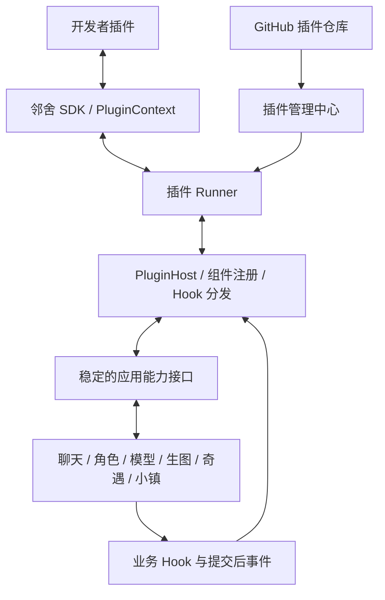

# 邻舍插件框架与开发者 SDK 改造方案

评估日期：2026-09-22。基于当前工作区（应用版本 3.4.7）和 MaiBot 插件文档的静态检查。本稿按用户明确的方向重写：项目提供稳定接口，第三方开发者按文档编写各种功能，用户通过 GitHub 安装插件。本文中的邻舍 SDK、方法名和新增模块均为拟议设计，尚未实现。

## 1. 目标与架构

核心交付是「可编程插件框架 + 开发者 SDK + 文档 + 插件管理中心」。内容资源可以随插件提供，但不再以内容包导入作为架构主线。

开发者应能在独立仓库中完成一个功能，不需要修改邻舍源码；功能可以读取授权上下文、调用模型或生图、处理消息、订阅事件、执行定时任务、注册模型供应商、提供界面和被其他插件调用的 API。

MaiBot 当前采用 Host/Runner 进程通信，由主程序管理组件、分发调用，插件通过 PluginContext 访问能力。这一组织方式适合借鉴。MaiBot 文档描述的是内置与第三方分别由 Runner 承载；邻舍可以根据自己的运行环境选择进程粒度，无须照搬 Python、装饰器或 msgpack。[MaiBot 架构说明](https://docs.mai-mai.org/plugin/)

建议邻舍先提供 JavaScript/TypeScript SDK，因为后端已是 Node.js ESM；TypeScript 提供接口补全，开发者发布构建后的 JavaScript。将来如果需要 Python 插件，通过同一协议增加 Python Runner，不在第一版同时维护两套 SDK。



新增 API 层应以现有服务为实现基础。插件依赖文档化的接口，不依赖项目内部文件路径或 SQLite 表结构。

## 2. 开发者能够实现什么

插件组件与宿主能力要分开：组件回答「主程序什么时候调用插件」，能力回答「插件能调用主程序做什么」。

### 组件类型

| 组件 | 触发方式 | 功能例子 |
|---|---|---|
| Command | 用户输入命令或点击操作 | /拍照、/翻译、/今日回忆、骰子小游戏 |
| Hook | 主流程运行到指定阶段 | 修改输入、追加上下文、调整生图描述或参数 |
| EventHandler | 业务操作完成后发布事件 | 生图完成后分类、奇遇结束后记账、聊天统计 |
| Tool | 模型通过工具调用选择执行 | 查询外部资料、读取插件维护的日历、控制外部设备 |
| ScheduledTask | 宿主管理的定时任务 | 角色日报、定时提醒、外部信息同步 |
| Provider | 用户选择插件提供的服务 | 新 LLM 接口、其他生图后端、语音服务 |
| PluginAPI | 其他插件显式调用 | 日历插件给提醒插件提供日程查询 |
| UI | 插件设置、操作卡或独立页面 | 阅读统计面板、语音设置、插件自己的功能页面 |

MaiBot 的命名 Hook 支持同步参与处理与异步观察两种模式，这个区分适合邻舍：前者影响本轮行为，后者处理日志、统计等旁路任务。[MaiBot Hook 文档](https://docs.mai-mai.org/plugin/hooks)

### PluginContext 能力接口

下表为目标接口分组，不代表第一版一次性开放所有写操作。

| 拟议接口 | 提供的能力 | 邻舍现有实现基础 |
|---|---|---|
| `ctx.characters` | 列表、详情、创建、受控更新、外观查询 | characters 路由、outfitService、characterPersona |
| `ctx.messages` | 查询会话消息、读取当前触发消息 | chat.js、groupChatEngine、消息表 |
| `ctx.send` | 发送文本、图片、插件通知，返回消息 ID | 需抽统一发送服务；保证落库、推送和历史一致 |
| `ctx.chat` | 发起角色回复、请求追加本轮上下文 | 聊天编排、主动聊天、contextAssembler |
| `ctx.llm` | 文本生成、流式生成、工具调用 | llm/llm-client.js |
| `ctx.images` | 生图、任务查询、取消、取得资产引用 | imageSkill、imageRefine、imageTaskRecorder |
| `ctx.memory` | 按角色/会话范围检索，受控写入带来源记忆 | memory 服务；不能绕过记忆维护规则直接插表 |
| `ctx.events` | 创建或推进奇遇，查询状态 | eventGenerator、events 路由及小镇事件服务 |
| `ctx.moments / mailbox` | 发动态、发信及查询 | 现有服务和调度器；按需要补业务服务入口 |
| `ctx.town` | NPC、道具、钱包、服务邀请等业务操作 | 小镇已有服务，保留世界版本和事务规则 |
| `ctx.storage` | 插件私有 KV/文档与文件目录 | 新增按插件隔离的状态存储 |
| `ctx.config / logger` | 配置、日志和诊断 | 配置 Schema、插件专用日志 |
| `ctx.scheduler` | 注册任务、查看运行记录、取消任务 | 新增宿主管理的插件调度适配 |
| `ctx.ui` | 操作入口、预览、设置表单、页面路由 | Vue 扩展槽及 Linshe 组件 |
| `ctx.api` | 发现和调用其他插件的公开方法 | 新增 API 注册表与版本契约 |

MaiBot 也通过 ctx 组织消息、模型、数据库等能力。邻舍适合按自己的业务域定义接口；私有状态可以开放通用存储，主程序业务数据使用角色、消息、记忆等接口，便于日后修改数据库而不破坏插件。[MaiBot API 参考](https://docs.mai-mai.org/plugin/api-reference)

## 3. 插件代码应当是什么体验

以下为拟设计的开发体验，`@linshe/plugin-sdk` 尚不是本项目已有的包：

```js
import { definePlugin } from '@linshe/plugin-sdk';

export default definePlugin({
  async onLoad(ctx) {
    ctx.commands.register({
      name: '拍照',
      description: '让当前角色拍一张指定场景的照片',
      async execute(call) {
        const result = await ctx.images.generate({
          characterId: call.characterId,
          conversationId: call.conversationId,
          prompt: call.args || '自然地分享此刻的生活场景',
          idempotencyKey: call.requestId + ':image',
        });

        await ctx.send.image({
          conversationId: call.conversationId,
          assetIds: result.assetIds,
          idempotencyKey: call.requestId + ':send',
        });
      },
    });
  },

  async onUnload(ctx) {
    ctx.logger.info('拍照插件已停用');
  },

  async onConfigUpdate(ctx, change) {
    ctx.logger.info('配置已更新', { version: change.version });
  },
});
```

这个例子只处理当前角色私聊，组件声明中需要标记支持的会话类型。宿主为调用注入经过校验的角色、会话、请求标识及取消上下文。这里 `images.generate` 是等待任务完成的高级接口，返回任务 ID 和资产 ID；底层仍创建可查询的生图任务，Runner 不占住主线程等待。

生图人格、当前外观、LoRA、工作流选择与任务记录仍由宿主现有生图链处理。开发者只提供自己的业务逻辑，不复制角色人格拼装或消息写库逻辑。

目录建议：

```text
my-plugin/
  linshe-plugin.json
  package.json
  src/index.ts
  dist/index.js
  config.schema.json
  assets/
  README.md
  LICENSE
```

manifest 声明稳定 ID、版本、SDK 兼容范围、入口、组件摘要、能力需求和插件依赖。配置 Schema 生成默认值与 Linshe 设置表单；运行配置和私有状态存到 data/plugins，不放进会被更新替换的代码目录。加载阶段核对代码实际注册的组件与声明一致。

## 4. 现有项目真正要动的地方

### 4.1 抽业务服务，建立稳定接口层

目前 `agent-core/src/routes/chat.js` 同时处理请求、上下文、模型调用、流式分句、数据库和生图；主动聊天与延迟回复也各自写消息。仅把这些 HTTP 地址列入文档，开发者仍然很难稳定组合功能。

先抽最关键的边界：

- `messageService`：写入完整消息与展示消息、返回消息 ID、推送与提交后事件。
- `chatService`：接收规范化输入、命令分发、角色回复编排；现有复杂逻辑逐段迁入，无需整文件一次性重写。
- `characterService`：角色读写和招募规则；不把路由处理器直接给插件调用。
- `imageService`：组合现有生成服务、任务记录、资产保存及角色外观注入。
- `llmService`：稳定请求/响应类型，复用现有并发、计费和取消机制。

原 HTTP 路由和插件能力适配器都调用这些服务，防止出现插件发送的消息只推送到界面，却没有进入历史或后续模型上下文的问题。

消息模型还需定义 `sourcePluginId`、触发来源及呈现类型。插件自己的通知与以角色身份发言应有明确区分，避免所有插件内容都被当成角色本人的记忆。原有 role/展示结构如何兼容，在服务抽取阶段一并确定。

### 4.2 在真实业务链中加入 Hook

拟议初始 Hook 清单：

| Hook / Event | 位置与语义 |
|---|---|
| `chat.input.beforeProcess` | 验证会话、识别重试后，在写入及普通回复前处理规范化输入；可返回修改或已处理 |
| `chat.context.collect` | 请求模型前收集插件上下文块，随后统一做上下文预算 |
| `chat.reply.beforeGenerate` | 调整本轮允许修改的生成参数 |
| `chat.message.committed` | 消息成功提交后通知，观察型，不用于回写已经展示的正文 |
| `image.beforeGenerate` | 生图任务正式提交前调整允许的描述/参数，再做校验 |
| `image.completed` / `image.failed` | 资产提交或任务失败后发布 |
| `encounter.completed` | 奇遇完成且业务状态提交后发布 |
| `app.ready` / `app.stopping` | 宿主生命周期，控制插件初始化和退出 |

每个 Hook 文档必须明确：输入/返回 Schema、可修改字段、是否可中断、默认超时、异常策略、执行顺序、哪些业务路径会触发。优先级相同用插件 ID 和组件名稳定排序，不能依赖目录扫描顺序。

命令在日程延迟/睡眠回复排队之前分流；命令是否尊重角色作息由声明和宿主规则决定，不能让所有命令被误当成普通聊天排队。原始输入与处理后的输入按需分别记录。

私聊、群聊、主动聊天、延迟回复需要覆盖矩阵。第一版允许先支持私聊，但必须写明；不能称为“所有消息 Hook”却只在聊天 HTTP 路由里触发。

已有聊天会逐段展示回复，因此不增加含义模糊的“整段回复生成后任意改写”Hook。整体变换必须在发送前完成，必要时显式选择缓冲模式；已经发送/落库的事件只做观察。

统一 SSE 是 UI 通知通道。新增内部 HookDispatcher/EventBus 负责插件调用；对于需要重试且有副作用的事件使用持久化投递、幂等键和重试上限，不在 SQLite 事务内等待插件或外部请求。事件带来源及关联 ID，防止插件回复再次触发自身而无限循环。

### 4.3 补齐真正的 Tool 调用链

当前 `llm/llm-client.js` 的同步响应主要提取 `message.content`，流式响应主要消费 `delta.content`，没有看到供第三方注册工具并执行回填的完整循环。现有 `@memory` 属于专门协议，不能视为已支持任意 Tool。

需要增加：

1. ToolRegistry：命名空间、描述、参数 Schema、支持场景与调用权限。
2. 模型适配：保留 tool_calls、流式工具参数、工具结果及 usage；检查当前 Provider 的工具调用能力。
3. 执行循环：模型请求 → 工具调用 → 宿主验证并调用插件 → 结果回填 → 最终回复。
4. 限制轮数、超时、并发、成本；副作用工具使用持久化调用 ID，重试不能重复执行。
5. 首版工具执行期间可以只显示状态，最终回复再沿用原分句展示。明确与 @memory、Planner、生图标记的执行顺序，避免两个循环争抢控制权。
6. 不支持工具调用的模型清楚显示不可用，Command 仍可运行；如增加 JSON 指令兼容方式，按 AGENTS.md 提供完整 JSON 示例并同步解析与验证。

### 4.4 Provider 与前端扩展

ProviderRegistry 统一定义生成、流式、取消、能力查询和计量结果，把当前 OpenAI-compatible 与 ComfyUI 接入分别包装为内置实现。后续插件注册同类 Provider，业务调用方无需知道实现来自哪个插件。Provider 内部不得递归调用自身所接管的默认生成入口。

MaiBot 的 Provider 组件同样通过注册客户端类型接入宿主服务；这里借鉴注册机制，具体请求与流式协议按邻舍现有功能设计。[MaiBot Provider 文档](https://docs.mai-mai.org/plugin/llmprovider)

前端增加操作槽、插件设置容器和 `/plugins/:id` 页面容器。基础配置由 Schema 生成，完整功能页允许开发者提供预构建页面和前端桥接 SDK，通常无需用户重新构建主应用。页面在独立上下文加载，通过宿主桥访问 API，不直接注入下载的 JS 到主 Vue 实例。

设置、按钮和窗口遵循设计系统及 0.3 秒动画；小镇内插件仍使用既有对话/奇遇交互。增加新页面不代表允许绕过现有小镇经济和结算规则。

## 5. PluginHost、SDK 与运行生命周期

建议模块：

```text
packages/plugin-sdk/                  # 类型、definePlugin、ctx 代理、测试工具
agent-core/src/plugins/
  PluginHost.js                       # 生命周期和调度
  PluginRunner.js                     # 加载开发者代码
  rpc/                                # 请求、响应、流式、取消和错误协议
  ComponentRegistry.js                # Command / Tool / Provider / UI / API
  HookDispatcher.js
  EventBus.js
  capabilities/                       # ctx.* → 稳定业务服务
  config/                             # Schema、默认值、验证、配置变更
  installer/                          # GitHub 安装与更新
agent-core/src/services/
  messageService.js                    # 拟抽取
  chatService.js                       # 拟抽取
  characterService.js                  # 拟抽取
  imageService.js                      # 拟增加编排入口
web-ui/src/plugins/                    # 插件入口、页面容器、前端桥
web-ui/src/views/PluginCenterView.vue
docs/plugins/                         # 开发者文档
examples/plugins/                     # 可独立运行的参考插件
```

SDK 用 TypeScript 定义公开接口，宿主实现可以继续用现有 JavaScript，不要求全仓迁移 TypeScript。

建议首版采用按插件启动的 Node 子进程，便于单独重启和定位故障；空闲插件可按需启动，进程开销需要测量。通过 Node IPC 传输带版本的消息协议即可，不需要先引入网络微服务。协议为后续其他语言预留适配，明确定义 requestId、method、payload、deadline、结果与错误，流式调用增加事件和取消消息。

生命周期：发现 manifest → 验证版本/依赖 → 启动 Runner → 注入 ctx → onLoad → 原子发布组件 → 正常运行 → 停止接收新调用 → 取消/等待在途任务 → onUnload → 清理注册和进程。

所有通过 SDK 注册的命令、Hook、订阅和任务都由宿主跟踪；插件漏写清理也应能停用。加载中途失败不留下半注册组件。代码更新通过重启对应 Runner 完成，避免动态 import 缓存导致更新后仍执行旧版本。配置变更单独回调，失败时保留上一份有效配置。

运行状态区分安装、启用、加载失败、缺依赖、不兼容和崩溃退避。主程序退出必须等待有界清理；插件异常不能拖垮聊天入口。超时后宿主拒绝该调用继续产生副作用，必要时终止 Runner，不能只在 Promise 上报一个超时。

普通社区代码可以按这种本地插件模式安装，官方目录用于发现与治理。独立进程提供故障隔离，不宣称它是恶意代码沙箱；安装页面明确代码将在本机运行。SDK 权限限制宿主 API，但不能据此承诺 Node 代码不能自行访问本机文件。

插件管理写接口要有管理员认证；现有本机/局域网访问方式通过配对兼容。能力调用校验插件身份、授权范围和资源归属，不将管理员凭据注入 Runner。

## 6. 开发者文档与工具必须一起交付

文档是插件框架的正式产品接口。建议至少包括：

1. 快速开始：创建插件 → 本地加载 → 写第一个命令 → 发布。
2. manifest、生命周期、依赖、SDK/应用兼容规则。
3. Command、Hook、Event、Tool、Task、Provider、UI、跨插件 API 的教程。
4. 全部 ctx API 的参数、返回类型、错误码、取消与副作用说明。
5. Hook 清单与覆盖矩阵：私聊/群聊/主动/延迟路径、执行顺序和修改限制。
6. 配置与私有存储、模型费用和日志排查。
7. 发布到 GitHub、提交收录、升级及迁移指南。
8. 参考插件和可以由 CI 执行的契约测试。

类型和 JSON Schema 尽量成为文档与校验的共同来源。SDK 按语义版本发布；公开接口删除或改义需要新主版本与迁移文档，插件不能依赖内部源码文件。

配套开发工具提供 create、dev、validate、pack、test 能力（命令名称待定）：初始化项目模板，本地目录加载，重启单个插件，校验 manifest 与组件一致性，打发布包，以及 MockContext/宿主集成测试。文档示例应在 CI 中实际构建和运行，避免文档与 SDK 漂移。

参考插件建议选三个真正覆盖框架的功能：

- 拍照命令：Command + 角色生图 API + 消息发送。
- 自定义提示补充：Hook + 配置 + 上下文预算。
- 日报/提醒：Event + 持久化 + ScheduledTask + LLM/消息。

Tool 与 Provider 在接口完成后各补一个契约示例。第一版也允许创作者附带角色或画风资源，但这属于 API 的一种使用方式。

## 7. GitHub 安装与收录

保留独立官方索引仓库，记录插件 ID、仓库地址、分类、说明、兼容范围、维护状态、推荐版本与来源。插件代码由作者自己的仓库维护；用户既能从中心安装，也能粘贴 GitHub 地址安装未收录插件，页面区分来源。

MaiBot 的插件中心由独立 GitHub 索引仓库驱动，作者可通过 Issue 提交仓库地址，CI 校验后由维护者批准。这种低门槛投稿方式适合借鉴。[MaiBot 发布流程](https://docs.mai-mai.org/plugin/submission)

建议邻舍流程：作者发布 → 目录仓库 Issue 模板投稿 → CI 校验 manifest/兼容性/基本加载测试 → 维护者审核 → 生成索引。自动加载测试在无密钥、无用户数据的隔离 CI 环境运行；不能让投稿代码接触发布凭据。

安装优先取明确 Release 的运行包；也可支持指定 tag/commit 的源码仓库，只要满足运行格式。即使由分支选版本，也先解析并记录固定 commit，更新时取新版本到临时目录，验证后切换，不直接在运行目录拉取覆盖。

第三方依赖由作者随构建产物打包，或安装到插件独立环境；不得改主项目 package.json/node_modules。是否支持依赖安装脚本作为独立高级能力说明，不能在普通安装中隐式执行。

收录关注功能可用性、文档、兼容性、依赖可安装、权限声明、素材授权及维护状态。收录插件不代表替每次上游提交背书；官方推荐版本记录具体提交/资产摘要。更新提示展示版本和权限变化，用户可以锁定版本。严重问题可标记撤销，普通停止维护不自动删除用户插件数据。

代码、配置和用户数据分开保存。更新失败恢复旧 Runner 和版本；带私有状态迁移的插件必须声明可否降级，不能通过恢复整份主数据库回滚插件。卸载清理注册及代码，私有数据由用户选择保留，已发送的消息、已生成图片和已创建角色继续属于用户。

## 8. 落地顺序与验收

| 阶段 | 交付 | 验收 |
|---|---|---|
| 1. 插件框架内核 | SDK、Runner、ctx 基础能力、Command/Hook/Event、配置/存储/日志、本地加载；抽消息与生图服务 | 一个独立仓库插件无需改邻舍源码即可处理命令、改本轮上下文、发消息和生图；停用后无残留 |
| 2. 扩展真实业务 | Tool 调用循环、Provider 注册、定时任务、更多业务 API 和前端入口 | 插件能改变或扩展真实行为，具有取消、失败处理和路径覆盖测试 |
| 3. 开发者生态 | 文档站、脚手架、参考插件、版本契约、GitHub 安装/更新、官方收录中心 | 外部开发者只按文档即可开发、调试、发布，普通用户可在界面安装 |
| 4. 逐步内置插件化 | 将适合拆出的内置功能迁移为使用同一 SDK 的插件 | 主程序和第三方共同验证 SDK，避免内置功能走特权捷径 |

阶段 1 开始就维护文档和示例；阶段 3 是完善对外发布体验。首个对外版本建议覆盖阶段 1 至 3 的最小闭环，不要求迁移所有内置功能。

测试重点：零插件时原功能回归；命令重试不重复执行；Hook 顺序/异常/预算；插件无限循环或崩溃后的恢复；消息历史与界面一致；流式中断和 Tool 回填；私聊/群聊/主动/延迟覆盖；生图人格与外观保持统一；更新和停用无残留订阅；文档示例独立安装成功。正式测试沿用 agent-core/test 与 web-ui/test 的既有规则。

当前最值得先完成的是「统一消息服务 + 私聊扩展点 + PluginHost/SDK + 拍照示例」。通过它验证整个调用往返，再向模型、奇遇、小镇和页面扩展。工坊页面与 GitHub 下载建立在这套框架上。
