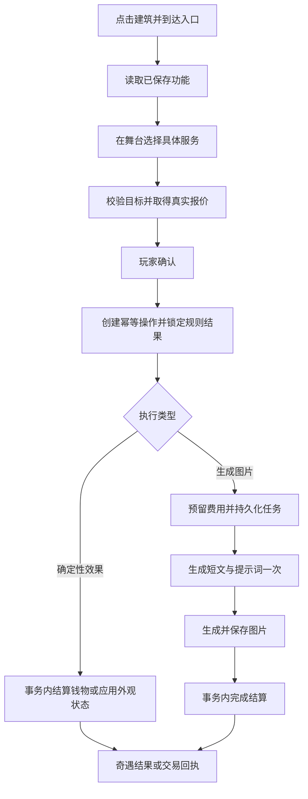

# 小镇特殊建筑：描述驱动的可执行玩法实施计划

> 编写日期：2026-10-03。
> 状态：已实施（M0—M3 全部交付，见 §17 实施记录）。
> 本次文档范围：按用户最新要求保留 14 种模板；其余 10 种明确排除。

## 1. 目标与边界

基于用户最终确认的建筑标题与完整描述，由 LLM 从已实现的玩法模板中选择并配置该建筑的功能。程序负责输入校验、钱物和外观状态变化、随机结果、持久化及界面；LLM 负责用途理解、合法模板选择、具体内容与表达。

目标体验：点击建筑，看到符合这栋建筑设定的具体选项；使用后，背包、外观、状态、图片或收藏发生真实变化。建筑之间的差异应体现在可选内容、效果、资源和输出中，不只更换标题。

### 1.1 必须满足

1. 建筑原始描述优先于预设营业分类；世界观约束表达，经营者人格补充口吻。
2. 一次建档生成并保存配置，打开、浏览及确定性操作不重复请求 LLM。
3. 仅向 LLM 暴露已有执行器、参数校验、界面和测试的模板。
4. 模型输出数据配置，不输出可执行 JavaScript、SQL、HTML、任意接口或表达式。
5. 每项功能可追溯到建筑描述中的依据，且存在真实执行结果。
6. 没有适配能力时明确返回部分支持或不支持，不用无关图片、随机奇遇冒充原功能。
7. 用户手工修改、旧镇内容、不同地图、不同建筑实例保持独立。
8. 仅在玩家确认生成个性化内容时支付额外模型/生图成本；不为每个按钮生成回复。

### 1.2 本次明确排除

以下模板不进入本计划的注册表、模型候选、组合功能、API 或任务清单，也不列为后续默认扩展：

- 音乐点播。
- 定时培养。
- 寄存取回。
- 地点传送。
- 时机挑战。
- 收集达成。
- 效果延长。
- 效果清除。
- 状态恢复。
- 配方合成。

边界说明：

- 临时外观/状态自然到期、恢复原有外观、失败回滚和管理员维护属于生命周期，不是可消费的清除或延长玩法。
- 同一生效服务不允许通过重复购买续时；到期后可以重新购买。新造型替换旧造型按外观冲突策略执行，不产生续时服务。
- 物物交换只做一个合格物品单位与一个既有商品单位的所有权交换；不支持多材料合成、材料比例、炼制或创造组合效果。
- 作品展示允许观看和收藏；不统计收集进度、发达成奖励、解锁隐藏内容。
- 每日签运只允许本计划中的短时表达状态或纯签文，不附带恢复、延时、传送、培养等效果。
- 临时状态只影响受约束的角色表达，不增加体力、修复情绪数值、修改好感或长期人格。

## 2. 已核对的仓库基础

下列为编写时的代码事实，实施开始前应复核最新实现。

| 入口 | 当前能力与接入判断 |
| --- | --- |
| `agent-core/src/services/town/townInitService.js` | 建筑蓝图包含 `name`、`desc`、`special`、`businessKind`、`capabilities`；素材元数据保存 `desc`。复用用户最终确认的内容。 |
| `agent-core/src/services/town/townLayoutGenerator.js`、`townMapService.js` | 地点载荷包含名称、氛围、类型和地图对象关联；不能只靠 `ambient` 代替建筑原始描述。 |
| `townInteractionTarget.js` | 解析建筑、地点和经营者；新增接口须复用身份解析并增加完整地图/世界校验。不能把无人建筑解析时的玩家兜底身份当成收款人。 |
| `townInteractionRuntime.js` | 固定建筑服务线索主要进入奇遇；另有 NPC 服务项目入口。新配置应有明确来源和分发，不把固定线索的标价当成现成真实结算。 |
| `townNpcServiceRuntime.js` | 已有一次性图片叙事及服务/打工结算；当前续接仍调用模型。不能直接把全部新功能交给这个续写入口。 |
| `townCapabilities.js` | 当前代码权限包含 `service`、`trade`、`work`。模板不新增第四种权限，也不自动提升用户手工设置的权限。 |
| `townNpcStockService.js`、`itemTemplateService.js`、`economyService.js` | 有货架、物品模板、交易与经济能力。新系统通过适配器复用真实钱物来源，不维护第二套钱包。 |
| `agent-core/src/services/outfitService.js`、`itemService.js` | 正式角色已有临时服饰、专属形态、道具效果与到期机制。需封装公开适配器，不能复制内部实现。 |
| `agent-core/src/services/characterPersona.js` | 正式角色生图人格、外观及着装优先级统一入口。 |
| `agent-core/src/services/imageSkill.js` | 可复用生图提交与任务机制；实施时确认提示词预处理链的实际调用量。 |
| `TownResidentActions.vue`、`TownDialogueStage.vue`、`EventsView.vue`、`EventCard.vue` | 复用建筑互动入口、立绘舞台与奇遇呈现；不新增步骤式营业管理面板。 |

现有权限文案、初始化提示词与执行代码存在版本差异，例如部分文档只列两种权限，而代码已有 `work`。实施时按代码的有效权限集合统一解析和提示词示例，不能借机改变历史手工授权。

### 2.1 与奇遇唯一链路的结合

遵循 [AGENTS.md](../AGENTS.md) 与 [设计系统](design-system.md)：

- 建筑对话舞台展示本建筑的具体功能，由 NPC/建筑来源发出邀请。
- 非交易功能进入奇遇页中的新来源类型 `building_feature`；它是复用现有奇遇容器的规则执行模式。
- 开场、选项及通用结果文案来自建档时生成并校验的内容；推进模板事件不逐轮调用 `generateNextBranch()`。
- 商品购买、交换、回收继续使用现有轻交易交互，真实结果归档到同一建筑功能操作记录。
- 生成图文结果可作为同一个模板事件的结果内容；不增加“继续一次再扣钱”的默认续写按钮。
- 日常 NPC 聊天与原有随机奇遇维持原行为；模板事件与叙事事件必须按来源明确分发。

实施时在 AGENTS.md 的奇遇链路约定旁补充“模板事件复用奇遇呈现、由规则执行、内容可预生成”的接入口径；不恢复已经退出主链路的打工步骤机或表单式结算页面。

## 3. 建筑资料、身份与更新

### 3.1 输入优先级

1. 当前建筑实例上用户明确修改的标题和用途描述。
2. 该建筑素材的 `name` 与 `meta.desc`。
3. 可追溯到同一素材的已确认蓝图 `name` 与 `desc`，仅用于缺失回填。
4. 当前地图绑定世界观与经营者资料，用于消歧和表达。
5. `businessKind`、`ambient` 只作弱提示；不能覆盖上述描述。

不把建筑绘图用的 `source_prompt` 当作玩法用途：它可能主要描述外形、视角、材质。缺少功能描述时可保存空值并提示补充，不从外观提示词编造经营内容。

### 3.2 建立统一来源解析器

拟新增 `townBuildingFeatureSource.js`，返回：

- 世界 ID、世界代次、地图 ID、地点 ID、建筑稳定实例 ID。
- 建筑实际标题、完整用途描述、素材 ID、来源字段及内容版本。
- 世界观快照/摘要版本、经营者规范 actor ID 与资料版本。
- 有效权限、是否有合法经营者、可支持的目标类型。
- 既有配置键映射、可引用商品与已实现模板目录版本。

关联路径必须是当前地点 → 当前地图对象 → 对应素材；不能全库按名字搜索。若现有对象 ID 在重新布局中会变化，应在迁移中为建筑实例增加稳定 UUID 并在重排时保留。无法确定同一实例时，不猜测继承资金、库存或冷却。

地图复制产生新建筑实例。配置内容可以复用；库存、次数、签运结果、操作记录不得复制成重复权益。

### 3.3 生成指纹与失效规则

`sourceHash` 包含玩法相关标题/描述、世界观语义版本、经营者相关资料、有效权限、生成契约版本。可用模板集合另以 `registryVersion` 记录。

- 单纯换建筑图片、重排位置、切主题、进出页面不重新生成。
- 标题/用途/世界观发生变化：标记 `stale`；保留旧配置供管理者查看，但不继续执行可能违背新描述的功能。
- 权限撤销立即禁止执行，不等待重新生成。
- 新模板加入不自动重建全镇；只有用户刷新或旧配置缺失/不兼容时才重新生成。
- 正在运行的操作绑定原配置快照；更新配置不覆盖其结算条件。
- 长任务返回时再次检查世界代次和建筑是否存在，旧任务不得写回重置后的世界。

## 4. 保留的 14 种模板

表内调用量指建档后的单次使用；建档预算另见第 8 节。所有 ID 均为拟定的新注册 ID。

| ID | 模板 | 真实结果 | 初版目标 | 使用时 LLM |
| --- | --- | --- | --- | --- |
| `outfit_change` | 服装更换 | 应用一项限时服装外观 | 正式角色 | 0 |
| `hairstyle_change` | 发型更换 | 应用一项限时发型外观 | 正式角色 | 0 |
| `accessory_change` | 配饰装扮 | 应用一项限时配饰描述 | 正式角色 | 0 |
| `temporary_transform` | 临时形态 | 应用互斥形态，到期恢复原形态 | 正式角色 | 0 |
| `item_purchase` | 商品购买 | 扣款、扣真实库存、交付物品 | 玩家背包 | 0 |
| `item_exchange` | 物物交换 | 原子交换一个物品单位与一个商品单位 | 玩家背包 | 0 |
| `item_recycle` | 回收兑换 | 回收一个合格物品单位并支付金币 | 玩家背包 | 0 |
| `temporary_state` | 临时状态 | 写入受约束、限时的角色表达状态 | 正式角色 | 0 |
| `portrait_single` | 单人写真 | 保存一张指定主题的人物图片 | 一个已支持的人物身份 | 最多 1 |
| `portrait_pair` | 双人合影 | 保存两个指定人物的合影 | 两个不同的已支持身份 | 最多 1 |
| `illustrated_keepsake` | 图文纪念品 | 保存有文字与图片的纪念卡 | 玩家选择的已支持目标 | 最多 1 |
| `gallery_display` | 作品展示 | 展示/固定收藏已有真实作品 | 已有作品引用 | 0 |
| `pool_draw` | 有限奖池抽取 | 从有限库存奖池中抽取并交付一个结果 | 玩家背包 | 0 |
| `daily_fortune` | 每日签运 | 固定当天签文，可附带一次短时表达状态 | 玩家阅读/正式角色受效 | 0 |

### 4.1 外观四模板

- LLM 一次配置 2—6 个选项及第三人称外观描述。只描述对应服装/发型/配饰/形态，不附带未实现的数值、动作或永久身份变化。
- 首期建议时长为 1、6、24 小时三档，由模板策略限制；原描述要求超出支持范围时返回部分支持或不支持，不能静默改写原承诺。
- 玩家选择正式角色后，经服务适配器应用外观。轻量 NPC 与玩家自身尚无对应适配时不得出现在可选目标中。
- 服装、发型、配饰分别维护明确冲突槽位；槽位是对既有外观服务的约束，不另存一套注入文本。形态复用专属互斥及恢复逻辑。
- 不覆盖 `base_prompt`，不清空非本功能持有的外观记录，不改动全镇异变来源。
- 到期恢复不需要新的 LLM 调用。相同服务、相同选项仍生效时返回现有结果，不再收费或延时。
- 应用外观不自动重画全部表情立绘、头像或地图小人；页面必须说明影响后续生图。可另选画像服务获取一张新造型图。

### 4.2 三种交易模板

- LLM 只引用建档资源键或输入上下文中的合法商品键。服务端创建/绑定真实物品模板和库存，实际数据库 ID 不由模型发明。
- 购买固定商品；交换只允许“一个单位换一个单位”；回收只允许合格物品换金币。
- 生成配置本身不无限制造货物。首批库存由一次性、受上限约束的开业配置初始化；后续通过既有补货机制或管理者明确补货。
- 重生成文案、切版本、复制素材不得补满库存、重复初始化资金。
- 需要合法经营者及其真实库存/钱包；无人收费或交易建筑标记 `needs_operator`，禁止把玩家身份作为收款人兜底。
- 回收报价由程序商品估值与价档算出；不信任前端或 LLM 的任意金额。回收价不得高于同件物品在当前规则下的最低买入价；交易环路需要有限库存与价格策略共同约束。
- 已消耗、使用中、他人所有、被其他操作锁定的物品不可交易。

### 4.3 临时状态模板

> 2026-10-07 更新：本模板（`temporary_state`）按用户要求「暂时弃用」，已退出 ready 目录（注册表
> 定义整体注释保留），模型候选目录与配置编译都不再提供它，新建筑不会再生成本模板；执行器与
> 状态档案保留，只服务存量建筑。以下规则对存量配置与恢复后的模板仍然有效。

- 建档时选择经过审核的状态档案，例如现有元气、傲娇、微醺表达；建筑可生成符合设定的名称、风味说明与短对白。
- 具体状态注入来自程序档案，不能让模型把任意长指令写成系统人格。
- 新增状态档案必须单独实现、审核及测试后再进入目录；生成器不能临时创造执行效果。
- 状态不改变好感数值、VAD 数值、生活需求、记忆或关系身份，也不触发新的主动聊天任务。
- 同项仍生效时禁止收费重用；到期回收沿用既有机制。

### 4.4 三种生成模板与展示模板

- 单人/双人画像选择已实现的人物身份适配器；正式角色通过 `characterPersona.js`，传入的 `id` 必须是角色 ID。其他人物类型需要有独立、经过测试的资料适配器。
- 双人画像按两个身份分别组装资料与外观，不混用人物 ID；两位目标必须不同。兼容现有多人配图与 LoRA 处理。
- 模型一次返回本次短文及完整画面提示词。图片请求不再额外调用模型补文案、起标题或给结局。
- 图文纪念品使用程序排版，把可读文字叠在图片外层，不依赖生图模型准确绘制中文。实际保存可预览的产物与角色/建筑来源。
- 展示模板仅查询当前权限范围内的已有作品。没有作品时显示空态，不能自动生成图来填充。
- 图片保存进入既有相册/任务记录，纪念品通过引用关联；不复制同一图片文件到多个新目录。
- 相册收藏和本模板展示不构成收集达成玩法，不发放奖励。

### 4.5 有限抽取与每日签运

- 奖池只包含已绑定真实库存的产物，权重是有界正整数；空奖池禁止扣款。
- 服务端生成随机种子并在操作创建时持久化。重试、刷新、异步失败均返回同一个结果，不能重新抽取。
- 每日签运从建档时生成的有限签文池选择，不每天请求模型；默认免费，每位玩家每栋建筑每日最多一签，允许附带到某一正式角色的短时表达状态。
- 每日键由世界/建筑实例/稳定功能 ID/玩家 ID/配置时区的日期组成，不因换目标、换配置版本或设备而变化。已选受效目标也持久化。
- 签运可纯阅读，也可应用 `temporary_state` 的合法档案；绝不附带本计划排除的效果。
- “运势”是趣味内容，不宣称未知的现实或世界事件已发生；结果文字只能陈述本次实际给予的效果。

## 5. 模板注册表与组合

### 5.1 注册项必须包含

`id`、`version`、`status`、`semanticDescription`、`parameterSchema`、`completeJsonExample`、`requiredCapabilities`、`supportedTargetKinds`、`resourceRequirements`、`executionMode`、`costPolicy`、`cooldownPolicy`、`rendererKey`、`executorKey`、`resultSchema`。

`status` 仅 `ready` 项进入模型目录；`planned`、`disabled` 不可被执行。接口收到未知/未就绪模板直接拒绝。参数 schema 禁止额外字段并限制数组、字符串及数值长度。

价格初版可采用代码策略档位 `free/basic/standard/premium`，建议默认 0/5/15/40 金币；这是待实现的可调规则默认值，不是现有经济事实。模板可限制允许价档；交易还需受商品估值、库存与经营者资产约束。模型不返回任意价格公式。

### 5.2 组合约束

- 每栋建筑生成 0—3 项功能，以一个招牌功能为主。没有用途依据可以为 0。
- 每项功能绑定一个主模板；相关功能以固定链接引用，例如服装服务完成后显示“拍张照片”入口。
- 点击画像是独立、明确计价的第二项功能，不因换装成功自动执行；不存在无界组合脚本或递归调用。
- 模型不得将已排除的模板包装为附加奖励、隐藏条件或步骤。
- 复用同一执行器的外观子模板仍拥有各自严格的参数语义和界面文案。

## 6. LLM 生成契约

### 6.1 单次输入

传入统一来源解析结果、已就绪模板的精简 schema/完整示例、允许的商品/状态/主题目录、价格与次数约束、旧配置稳定键。控制上下文大小：不传整镇全部人物人格、全部聊天记录或全量素材库。

建筑说明、世界观与人物资料作为源数据提供，不能覆盖系统规定的执行边界。来源引用必须在原文中精确存在；纯名称联想不得伪造引文。

### 6.2 系统提示词骨架（实施时与解析器同步维护）

以下规则必须进入生产提示词：

> 根据建筑资料生成能被当前模板库实际执行的功能配置。建筑完整用途描述优先，名称和类型用于辅助理解。只从输入给出的 ready 模板、版本、状态档案和资源目录中选择。可以返回部分支持或无支持；不得用不相关玩法替代不能实现的原用途。每栋最多三项功能，每项必须有原文依据。模型只生成数据和表现文案，不决定账户余额、实际库存、随机开奖结果或任何已排除能力。严格按随输入提供的完整 JSON 示例和字段约束输出；不要解释、Markdown 代码围栏或 JSON 以外的文字。

完整顶层格式示例（字符串示例中的内容要求也要提供给模型；数值、枚举和数组的约束见下表）：

```json
{
  "schemaVersion": 1,
  "supportLevel": "supported",
  "interpretation": "建筑用途概括，20至80字，忠于输入描述，不补写不存在的业务",
  "unsupported": [],
  "resources": [],
  "features": [
    {
      "key": "main_outfit",
      "templateId": "outfit_change",
      "templateVersion": 1,
      "title": "具体可点击的服务名称，2至16字，不出现模板或参数等内部用语",
      "description": "服务说明，20至80字，只承诺本模板可执行结果",
      "evidence": {
        "source": "building.description",
        "quote": "必须逐字摘录输入中支持该功能的一段原文，1至160字"
      },
      "priceTier": "standard",
      "params": {
        "durationHours": 24,
        "options": [
          {
            "key": "style_one",
            "label": "服装选项名，2至12字，与建筑用途一致",
            "appearance": "第三人称服装外观描述，40至120字，只写款式材质配色配饰，不改变人物身份，不加入行为指令"
          }
        ]
      },
      "presentation": {
        "opening": "建筑开场文案，20至80字，未执行前不声称玩家已付款或已获得效果",
        "success": "完成后的简短反应，10至60字，只用已确定的结果；可使用允许的占位符",
        "empty": "无可用目标或选项时的短提示，5至40字，不编造替代奖励"
      }
    }
  ]
}
```

| 字段 | 硬约束 |
| --- | --- |
| `schemaVersion` | 固定为输入支持的版本；初版 1。 |
| `supportLevel` | `supported/partial/none`；none 时 features 为空；partial 必须列出未支持的明确用途。 |
| `interpretation` | 20—80 字，不能扩写人物背景或新世界规则。 |
| `unsupported` | 0—6 个对象，每项完整格式为下方示例；不支持部分不自动生成替代功能。 |
| `resources` | 0—8 个拟定义商品对象；完整格式见 6.3，仅对应描述中有依据的货品。 |
| `features` | 0—3 项；key 唯一，模板 ID 与版本必须在当前 ready 目录。 |
| `key` | 小写字母开头、字母数字下划线，最多 40 字符；修改旧配置时优先沿用输入提供的旧 key；真实稳定功能 ID 由服务端分配。 |
| `evidence` | source 为输入给出的合法来源路径，quote 为该来源的精确子串；缺描述时只有标题明确支持的用途可用标题作依据。 |
| `priceTier` | 只能使用模板允许的价档；不是自由金额；签运、展示固定免费。 |
| `params` | 按 templateId 选择 6.4 的唯一 schema，禁止跨模板参数。 |
| `presentation` | opening/success/empty 三项均必填；占位符只允许 `{targetName}`、`{optionLabel}`、`{itemName}`，按已确认结果替换；数字价格、时长、物品数量单独由程序渲染。 |

不支持能力对象的完整示例：

```json
{
  "sourceText": "输入中暂不能实现的用途原文，1至160字，必须是精确摘录",
  "reason": "不能实现的具体原因，10至80字；不能承诺会自动实现或偷偷换成其他能力"
}
```

### 6.3 新商品资源格式

```json
{
  "key": "cloth_pin",
  "name": "商品名，2至16字，符合建筑和世界观",
  "description": "商品说明，20至100字，只描述支持的用途，不声称未提供的功能",
  "itemKind": "collectible",
  "effectProfileKey": null,
  "appearance": null,
  "imagePrompt": "英文物品插画提示词，40至100词，单行，只描述物品，不输出代码或网址"
}
```

- `itemKind` 只允许输入目录中的 `collectible/outfit/hairstyle/accessory/transform/state`。
- `effectProfileKey` 对 state 必须是输入中合法状态档案键，其他类型必须为 null。
- `appearance` 对外观类为 40—120 字第三人称外观说明，对 collectible/state 必须为 null。
- `key` 唯一且符合功能 key 格式；生成时仅是局部资源引用，激活配置后由程序绑定物品模板。
- `imagePrompt` 可为 null，表示使用通用图标；非 null 按示例要求。配置激活不自动为所有货品排队生图。
- 模型不输出初始库存、拥有者、物品数据库 ID 或金币余额；初始数量由有上限、幂等的开业规则确定。

### 6.4 十四模板的完整 params 示例

下列每个对象均完整替换顶层 feature.params。生产生成器必须将相应示例、约束与模板目录同步提供给模型；不能只提供模板名。

**01 — outfit_change**

```json
{"durationHours":24,"options":[{"key":"style_one","label":"服装名，2至12字","appearance":"第三人称服装外观，40至120字，限定服装和配饰，不改发型、物种或人物身份"}]}
```

**02 — hairstyle_change**

```json
{"durationHours":24,"options":[{"key":"hair_one","label":"发型名，2至12字","appearance":"第三人称发型描述，40至120字，只写头发造型及发饰；未明确授权时保持角色发色"}]}
```

**03 — accessory_change**

```json
{"durationHours":6,"options":[{"key":"accessory_one","label":"配饰名，2至12字","appearance":"第三人称配饰描述，40至120字，只写可佩戴物品，不改服装主体、身体或身份"}]}
```

**04 — temporary_transform**

```json
{"durationHours":6,"options":[{"key":"form_one","label":"形态名，2至12字","appearance":"第三人称临时形态描述，40至120字，明确变化部位；不含永久变化、数值奖励或新能力"}]}
```

四模板统一约束：options 1—6 项、key 唯一；建议生成 2—6 项，描述只支持一种时允许 1 项；时长只能从输入的合法档位选择。

**05 — item_purchase**

```json
{"offers":[{"resourceKey":"cloth_pin","label":"商品展示名，2至16字","priceTier":"basic"}]}
```

offers 1—6 项，resourceKey 必须已定义或来自输入资源目录；商品实际价格由价档与估值共同确定。顶层 priceTier 在本模板必须为 free，表示没有额外入场费。

**06 — item_exchange**

```json
{"offers":[{"acceptCatalogKey":"input_catalog_one","giveResourceKey":"cloth_pin","label":"交换选项，2至16字，明确一件换一件"}]}
```

offers 1—6 项；acceptCatalogKey 只能引用输入中的允许回收/交换目录；giveResourceKey 指向真实可绑定资源。固定每次一个单位换一个单位，无手续费，顶层 priceTier 为 free；禁止材料数组或配方字段。

**07 — item_recycle**

```json
{"acceptCatalogKeys":["input_catalog_one"],"valuationTier":"standard"}
```

目录键 1—6 个，必须来自输入；valuationTier 仅为本模板允许的估值档位。报价由服务器计算并展示，顶层 priceTier 为 free；不允许金币以外的合成材料奖励。

**08 — temporary_state**

```json
{"durationHours":6,"options":[{"key":"state_one","label":"符合建筑设定的状态商品名，2至12字","stateProfileKey":"allowed_state_one","flavor":"状态来源的风味描述，20至80字，不增补恢复、好感、永久人格或其他数值效果"}]}
```

options 1—6 项；状态键与时长只能从输入目录选择。`allowed_state_one` 是示例占位，生产提示词必须替换为实际提供的键，并明确只许选择目录项。

**09 — portrait_single**

```json
{"themes":[{"key":"theme_one","label":"拍摄主题，2至12字","scene":"画面场景要求，30至120字，不预填人物外观，不承诺改变真实世界状态"}],"allowUserNote":true,"userNoteMaxChars":200}
```

**10 — portrait_pair**

```json
{"themes":[{"key":"pair_one","label":"合影主题，2至12字","scene":"双人场景要求，30至120字，限定两人，不预填具体身份或强制亲密关系"}],"allowUserNote":true,"userNoteMaxChars":200}
```

两画像模板 themes 1—6 项；allowUserNote 为布尔值，userNoteMaxChars 固定 200，false 时不显示输入。目标数量由模板确定，模型不能扩为三人或强行加入经营者。

**11 — illustrated_keepsake**

```json
{"formats":["postcard"],"themes":[{"key":"card_one","label":"纪念品主题，2至12字","scene":"图文主题说明，30至120字，不虚构已经发生的共同经历"}],"allowUserNote":true,"userNoteMaxChars":200}
```

formats 初版只允许已实现排版器的 `postcard/memento_card`，1—2 项；themes 与输入约束同画像。文字排版由程序完成，不创建额外抽奖或收藏达成机制。

**12 — gallery_display**

```json
{"source":"building_outputs","layout":"frames","limit":12}
```

source 只允许 `building_outputs/player_selected`，layout 初版固定 frames，limit 为 1—24 整数；顶层 priceTier 为 free。不得传任意文件路径、网址、SQL 或其他玩家资料。

**13 — pool_draw**

```json
{"pool":[{"resourceKey":"cloth_pin","weight":1}],"dailyLimit":1,"reveal":"card"}
```

pool 1—8 项，资源键有效且不重复；weight 为 1—100 整数，服务端按剩余库存重算有效权重。dailyLimit 为 1—3 整数，reveal 只允许 card/chest 两个已实现表现变体；无空奖默认，奖池耗尽时不可收费。

**14 — daily_fortune**

```json
{"entries":[{"key":"fortune_one","title":"签名，2至10字","text":"趣味签文，30至100字，符合建筑设定，不预言确定事实，不承诺未实现能力","stateProfileKey":null,"durationHours":null,"weight":1}]}
```

entries 3—8 项，key 唯一；stateProfileKey 为 null 或输入合法状态键。前者 durationHours 必须为 null，后者只能取允许时长；weight 为 1—100 整数。顶层 priceTier 固定 free，每日上限由模板固定为 1，模型不可修改。

### 6.5 解析与语义检查

1. JSON 解析与版本检查，拒绝额外字段、未知枚举、重复 key、超长内容。
2. 检查模板 ready 状态、参数 schema、资源引用、版本与权限依赖。
3. 校验证据引用、原文是否明确否定该用途、是否包含未支持承诺。原文引用通过不等于语义一定正确；离线样例评审仍是必需验收项。
4. 检查目标类型、经营者、库存初始化规则和价格策略是否可绑定。
5. 将局部 key 编译成稳定功能 ID、资源绑定和规则配置，保存编译结果与原始生成结果。
6. 语法/引用错误最多一次带诊断的 LLM 修复；仍失败则标记失败，保留诊断供手动重试，不套上无关默认玩法。
7. `none` 是正常结果，不触发重试；资料缺失或经营条件不足也不靠反复调用模型解决。

### 6.6 使用时图文生成契约

画像与纪念品在玩家明确使用后最多调用一次 LLM，同时完成文字及画面描述。输入包含已校验场景、玩家补充、当时人物资料/生效外观快照。

生产提示词须要求严格输出以下完整格式，禁止解释、Markdown 或 JSON 以外内容；禁止声称发生付款、奖励、关系或状态变化。

```json
{
  "caption": "图片说明或纪念卡正文，20至100字，符合选择的场景；想象场景须表达为创作，不虚构成真实历史",
  "imagePrompt": "英文单行画面提示词，60至160词，人物数量严格符合本次模板，外观按输入快照，禁止网址和额外指令"
}
```

只有这两个字段；普通画像可使用 caption 作短说明，纪念品用程序排版。生成失败沿用同一操作重试；首次调用预算与人工重试预算分别记录，不把重试算成零成本。

## 7. 持久化设计

以下为拟新增结构；优先复用已有通用任务、库存和图片记录，不额外维护逐步审计流水。一次玩家真实操作保留一条主记录，展示和打开页面不写操作日志。

### 7.1 建筑实例标识

在地点/建筑实例关联中加入稳定 `building_instance_id`（具体迁移落点由现有地图对象结构确定）。唯一性不能仅依赖名称、素材 ID 或图内 key。执行上下文总是包含 `worldId + worldEpoch + mapId + buildingInstanceId`。

### 7.2 town_building_feature_profiles

每个世界代次中的建筑实例一行，保存：

| 字段组 | 内容 |
| --- | --- |
| 身份 | 主键、世界 ID/代次、地图/地点/建筑实例 ID |
| 来源 | 源快照、sourceHash、来源字段路径、世界观/经营者版本 |
| 生成 | schemaVersion、registryVersion、generationToken、状态、重试次数、最后错误 |
| 配置 | 原始生成 JSON、已编译 JSON、配置 revision、手工维护标记 |
| 绑定 | 稳定功能 ID 映射、稳定资源键到真实物品模板/库存的映射、开业资源预算消费记录 |
| 时间 | 创建/更新时间、生成时间 |

建议状态：`unconfigured/generating/ready/partial/unsupported/failed/stale/disabled`。

- 校验失败的新候选不能覆盖已保存的有效配置。若来源已改变，旧配置仍保持不可执行的 stale 状态。
- 管理者主动重生成、来源未变时，可继续展示旧有效配置；新候选完整通过后原子切换 revision。
- 功能 ID 与配额绑定由服务端维护；模型改 key、配置升版本或改标题不能创造新领取次数。歧义变更保守沿用建筑级额度，不自动重置。
- 资源模板绑定尽量复用；新资源初始化也受建筑既定总预算约束，不能每次换一个资源 key 就补发货物。
- 不为每个配置 revision 建长期完整副本；未完成操作保存自己所需的不可变执行快照。

### 7.3 town_building_feature_operations

每次确认执行一行，至少包括：

- 操作 ID、世界/代次/地图/建筑、稳定功能 ID、配置 revision。
- 玩家 actor ID、选中目标的规范身份、幂等键、请求内容摘要。
- 输入快照、编译执行快照、有效报价、价格策略版本、库存/资金预留引用。
- 状态、随机种子及固定抽取结果、实际钱物/外观结果引用。
- 关联奇遇来源 ID、生成任务 ID、图片/纪念品引用、错误码、创建/更新时间。

唯一键至少覆盖作用域、玩家与幂等键；同键不同请求体返回冲突。一次操作可以重试生成阶段，但不能重新抽签、重复扣费或重写角色选择。

展示模板不为每次查看创建操作；固定收藏如需要写入，只写现有收藏数据。大段生成文本和文件走既有产物记录，操作行保存必要引用及简短收据。

结果正文可以按现有归档策略压缩；操作 ID、已结算标志与幂等凭据不可在客户端仍能重试时被删除。过期报价不可重建为一笔新操作。

### 7.4 town_building_feature_usage

仅对有限次数、每日签运等必要规则建稀疏记录：世界/代次、建筑、稳定功能、玩家、日期/窗口、已使用与预留次数、签运结果操作 ID。

- 不逐 tick 写入，不为无配额功能建行。
- 配额预留与操作创建在同一事务内完成；失败是否释放取决于是否已交付真实结果。
- 签运已揭晓后保持当日结果，即使展示失败也不重新抽取。
- 时区采用项目配置的统一时间工具，不依赖浏览器或服务器操作系统本地时区。

### 7.5 复用库存与产物

- 玩家持有物仍在现有背包/物品系统中；金币仍在现有经济系统中。
- 建筑货品复用真实库存，并补充稳定建筑来源字段或绑定关系。同一经营者拥有多栋建筑时，不能仅按 npcId 混合货架。
- 图片走现有生成任务与相册；事件历史只引用对应操作与产物。
- 不自动把轻量 NPC 升级为正式角色，不生成“假店主”绕过缺经营者状态。
- 首期无经营者的建筑可支持不收费、无需物品交付的展示/图文功能；涉及经营结算的功能保持明确不可用，待用户配置合法经营者后重新绑定。

## 8. 调用预算、触发与缓存

| 场景 | LLM 预算 | 生图预算 | 触发方式 |
| --- | --- | --- | --- |
| 首次配置一栋特殊建筑 | 正常 1 次 | 0 | 建筑已确认后后台任务或管理者显式生成 |
| JSON/引用修复 | 最多额外 1 次 | 0 | 同次生成失败诊断；无无限重试 |
| 浏览建筑/查看结果 | 0 | 0 | GET 仅读取，不隐式生成 |
| 外观、状态、交易、签运、奖池 | 0 | 0 | 确认操作后程序执行 |
| 单人/双人画像 | 最多 1 次 | 1 张 | 用户明确选定目标和主题并确认 |
| 图文纪念品 | 最多 1 次 | 1 张 | 用户明确确认；程序负责排版 |
| 作品展示 | 0 | 0 | 读取已有产物 |
| 重生成配置 | 1 次，修复上限同上 | 0 | 来源变更后的任务或用户手动刷新 |

执行规则：

1. 初版采用每建筑一次调用，后台串行或复用现有受限并发队列。先保证单建筑失败隔离；不新增一套高并发定时器。
2. `special=true` 的已确认建筑优先建档；普通建筑由管理者显式启用。不能每次启动/每次开镇给全地图重新生成。
3. 新镇可在现有生成流程结束后加入幂等任务。旧镇不在升级时立刻大量调用：管理入口展示待配置建筑，由用户批量启用。
4. 首次点开未配置建筑只显示状态和“生成建筑功能”动作；该动作发起显式 POST。不能 GET 一次就消费模型。
5. 配置内容缓存由 sourceHash 与契约版本识别；运行中的库存、配额、签运和操作状态按建筑实例隔离。
6. 同一画像操作复用已生成 caption/prompt，生图失败重试不再次调用 LLM。模型内容本身失败时允许人工重试并明确计入预算。
7. 单图服务不默认给每个选项、每个商品、每位人物批量绘图；缺图使用既有通用图标或占位。
8. 记录本功能的模型调用次数、用途、token 使用（提供方可返回时）和生图次数。验收同时看调用数与 token，不能把一次超大上下文当成免费优化。

## 9. 执行与结算流程

### 9.1 共用流程



### 9.2 执行前检查

- 当前世界/代次、地图、建筑存在且配置仍可执行。
- 玩家身份从会话/现有上下文确定；客户端不能指定其他付款人。
- 复用现有到达建筑入口检查；不能远程伪造建筑调用。
- 所选稳定功能、选项、目标、商品与模板属于当前有效配置。
- 目标存在且支持该操作；跨角色、跨镇和已删除身份被拒绝。
- 权限仍有效；收费/交易服务的经营者和账户合法。
- 报价未过期且与当前策略一致；余额、库存、配额、效果冲突均满足。
- 实际收费和结果摘要由服务端生成，用户确认的是可执行内容。

### 9.3 事务与异步任务

确定性操作在短事务内完成库存/金币/效果/配额变化及完成标记。不得跨 LLM 或生图请求保持数据库事务。

收费生成操作必须先真实预留费用，再异步生成，成功后结算；失败或取消释放尚未消费的预留。预留要接入共享经济服务和所有消费入口，不能只在本功能里减“可用余额”，否则用户可在其他入口重复花掉同一笔钱。已有预留能力可复用；缺失时作为共用结算适配任务补齐，不宣称当前已经存在。

若该共用能力尚未完成，收费生成模板不得标记 ready；可以先以明确免费配置验证生成流程。

- 商品购买/交换/回收同时更新双方真实资产及库存。库存发生变化时在事务内复核。
- 图片是本次商品时，产物保存成功才完成收费。图片失败不能给出已交付回执。
- 外观效果已成功应用后，另外购买的画像失败不会回滚外观；两者是两个独立操作。
- 用户关窗或切地图不等于取消任务。取消必须有独立命令和明确状态检查。
- 进程重启从持久化操作恢复；LLM 已完成时继续生图，产物已保存时继续幂等结算。未知外部提交结果先按任务 ID 核查，不立即发起重复生图。
- 同一个物品不能被并发交易、赠送和使用；所有相关入口须尊重统一锁定/预留状态。

### 9.4 操作状态

建议采用 `pending/generating/ready/committed/failed/cancelled`：

- pending：已创建操作、锁定报价与随机结果，尚未交付。
- generating：外部生成进行中，任务 ID 已保存。
- ready：产物保存完成，等待最后结算。
- committed：真实效果与结算已完成；终态，不可二次执行。
- failed：失败；保留阶段、随机结果与已有产物，按规则释放预留。重试需重新校验可用条件，但仍绑定原结果。
- cancelled：用户明确取消且未交付；终态。

确定性操作可在单事务内从 pending 到 committed。客户端不能直接提交状态转换、金额或开奖结果。

## 10. 拟新增 API

以下是设计路径，实施前对齐当前路由命名习惯；禁止直接假定接口已经存在。

| 方法与路径 | 职责 |
| --- | --- |
| `GET /api/town/buildings/:locationId/features` | 返回可展示功能、配置状态与不可用原因；不调用 LLM、不扣费、不重填库存。 |
| `POST /api/town/buildings/:locationId/features/generate` | 幂等开始一次配置生成，返回 generationToken；管理操作或玩家明确请求。 |
| `GET /api/town/buildings/:locationId/features/generation` | 读取生成状态；重复轮询不新建任务。 |
| `POST /api/town/buildings/:locationId/features/quote` | 校验选项、目标、物品，计算报价及可执行摘要；不生成内容、不实际扣款。 |
| `POST /api/town/buildings/:locationId/features/execute` | 接受报价与幂等键；建立/关联模板奇遇或轻交易操作。 |
| `GET /api/town/building-feature-operations/:operationId` | 返回操作状态、实际结果及产物引用。 |
| `POST /api/town/building-feature-operations/:operationId/retry` | 重试失败阶段，不改变抽取结果、不重复消费。 |
| `POST /api/town/building-feature-operations/:operationId/cancel` | 按状态取消未交付操作，释放预留。 |

所有接口都需验证世界/代次/地图作用域与建筑归属，不能仅查全库 locationId/key；操作者从可信会话推导。

执行请求示例（这是 API 示例，不是 LLM 输出）：

```json
{
  "worldId": "example_world",
  "worldEpoch": 2,
  "mapId": 3,
  "profileRevision": 4,
  "featureId": "server_assigned_feature_id",
  "quoteId": "server_assigned_quote_id",
  "idempotencyKey": "client_generated_request_uuid",
  "selection": {
    "optionKey": "style_one",
    "targetActorKeys": ["char:12"],
    "itemIds": [],
    "userNote": ""
  }
}
```

selection 按模板校验：不需要的字段必须为空，不能混入别的模板输入。目标 char ID 需映射到正式角色后才传人格组装；物品数组在交换/回收中最多一个，不接收配方数组。

错误码至少覆盖：`FEATURE_UNCONFIGURED`、`FEATURE_STALE`、`TEMPLATE_UNAVAILABLE`、`CAPABILITY_DENIED`、`NOT_ARRIVED`、`NEEDS_OPERATOR`、`TARGET_UNSUPPORTED`、`INVALID_SELECTION`、`QUOTE_EXPIRED`、`PRICE_CHANGED`、`INSUFFICIENT_FUNDS`、`OUT_OF_STOCK`、`DAILY_LIMIT`、`EFFECT_ALREADY_ACTIVE`、`STALE_EPOCH`、`IDEMPOTENCY_CONFLICT`。

生成/执行通知复用现有 SSE 通道，事件包含完整作用域、revision/operationId；客户端忽略旧地图、旧世界代次和旧请求的迟到响应。

## 11. UI 接入

### 11.1 玩家入口

1. 点击建筑立刻唤起它的玩法面板，不需要先把角色走到门口（远程也能看店）；角色仍在后台走过去，因为经营者出面的服务/打工/交易要求到店。
2. `TownResidentActions.vue` 根据来源展示生成后的服务名称及是否可用，不展示内部模板 ID。
3. 非交易操作通过邀请进入 `EventsView.vue` 的 building_feature 卡片；采用既有 `TownDialogueStage.vue`/`TownVnChoice.vue` 的舞台与选项语言。
4. 目标/选项选择和确认可在同一奇遇内容区完成，不设计“第 1/2/3 步”的结算向导。
5. 真正执行前显示实际费用、结果、持续时间与图片调用提示；实际结果用已有奇遇结果区域或交易回执展示。
6. 相同活跃操作优先继续；刷新恢复进度，不从头创建付费操作。

商品继续使用已有轻交易 UI；新模板需要的图片/外观选项是内容区域，不能重新写遮罩和面板皮肤。

### 11.2 建筑管理

在已有建筑管理详情内增加一个“特殊功能”区域，提供：

- 查看用于生成的建筑标题/用途描述及来源。
- 启用、停用、生成、重新生成、查看不可用原因。
- 查看最多三项功能的玩家可见预览及其实际效果摘要。
- 明确显示尚未配置、生成中、部分支持、描述已变更等状态。
- 手工维护开关或受 schema 限制的内容编辑；不开放任意 JSON 执行或修改结算账本。

手工修改过的配置不得被后台重生成悄悄覆盖。大批旧镇生成应展示建筑数量与预计调用次数，用户可逐栋或批量发起。

### 11.3 统一视觉与可访问性

- 表单使用 LinsheButton/Input/Select/Switch/Tabs；弹窗使用 LinsheModal，镇内生活外壳复用 TownPaperPanel。
- TownVnChoice 等既有视觉小说选项按白名单复用；新增常规按钮不得写裸 button。
- token、纸张、描边、字号和反馈遵循设计系统；不新增后台式卡片堆叠或另一套主题。
- 页面/内容切换与窗口开关均为 0.3 秒过渡；关闭动画后再隐藏或卸载。
- 验证桌面、移动端、暖色、暗夜、键盘操作和 reduced-motion。
- 执行中的按钮有 loading/disabled，不能通过重复点击制造并发请求。
- 缺图使用占位，生成失败可查看原因并重试；不让玩家误以为效果已实施。

## 12. 文件拆分建议

下列文件为拟新增；没有明确需要时不扩展到更多模块。

| 文件 | 职责 |
| --- | --- |
| `agent-core/src/db/townBuildingFeatureSchema.js` | 建筑稳定关联、配置、操作及必要配额的幂等迁移。 |
| `agent-core/src/services/town/townBuildingFeatureRegistry.js` | 14 模板定义、ready 门控、schema、完整输出示例与组合限制。 |
| `agent-core/src/services/town/townBuildingFeatureSource.js` | 权威建筑描述、素材/地点/世界/经营者关联与指纹。 |
| `agent-core/src/services/town/townBuildingFeatureGenerator.js` | 一次建档调用、解析、最多一次修复、候选提交与预算计数。 |
| `agent-core/src/services/town/townBuildingFeatureService.js` | 配置读写、稳定键、编译绑定、报价与对外查询。 |
| `agent-core/src/services/town/townBuildingFeatureRuntime.js` | 作用域/权限检查、操作幂等、状态机、恢复、配额与随机结果。 |
| `agent-core/src/services/town/buildingFeatures/appearance.js` | 四类外观模板，统一调用现有外观服务。 |
| `agent-core/src/services/town/buildingFeatures/trade.js` | 购买、交换、回收及真实库存桥接。 |
| `agent-core/src/services/town/buildingFeatures/state.js` | 受约束的临时表达状态；不包含恢复、清除和延长服务。 |
| `agent-core/src/services/town/buildingFeatures/media.js` | 三类生成与既有作品展示。 |
| `agent-core/src/services/town/buildingFeatures/draw.js` | 有限奖池、每日签运的固定随机结果及交付。 |
| `web-ui/src/api/townBuildingFeatures.js` | 相关 API 与作用域参数。 |
| `web-ui/src/components/town/TownBuildingFeatureConfig.vue` | 嵌入已有建筑管理的配置区域。 |
| `web-ui/src/components/town/TownBuildingFeatureContent.vue` | 嵌入既有奇遇卡的模板内容，按 registry renderer 分发。 |

预期调整现有入口：`townInitService.js`、`townMapService.js`、地图对象保存/重排、`townInteractionTarget.js`、`townInteractionRuntime.js`、`routes/town.js`、`routes/events.js`、`stores/events.js`、`EventsView.vue`、`EventCard.vue`、`TownResidentActions.vue`、`TownAdminPanel.vue`。

实际修改范围以接入验证为准。避免让 `TownView.vue` 承担所有模板逻辑，也不要把新模板实现混入通用 Linshe 组件皮肤。

正式角色人格仍通过 `buildCharacterPersona`、`buildCharacterAppearanceSection`、`buildImageCrossRefInfo`；禁止再次内联截取“你的外观”。如需改变外观冲突/注入口径，只在原权威服务中修改并维护既有回归。

## 13. 分期任务与交付物

所有任务初始为未完成。每个任务完成后填写提交/变更文件、测试结果与已知限制；不能只因生成了文案就勾选完成。

### M0 — 基础与契约

- [x] T01：梳理建筑实例 → 地点 → 素材 → 原始描述关联，增加稳定身份与旧镇回填。
- [x] T02：实现迁移、配置状态、sourceHash、权限/世界隔离和稳定键规则。
- [x] T03：定义全部 14 种模板 schema/示例，初始保持 planned；加入排除能力校验。
- [x] T04：实现生成器、单次输出解析、证据引用、一次修复及可观测调用预算。
- [x] T05：定义模板奇遇来源分发、生命周期及生成任务恢复，补充协作约定的接入口径。

交付：可以对建筑生成合法候选，未实现的模板不会被模型选到或被执行。旧数据不被改写为已完成玩法。

### M1 — 四种模板的完整纵向流程

- [x] T06：实现 `outfit_change`，验证实际生效、自然到期、不重复收费和角色人格注入。
- [x] T07：实现 `item_purchase`，验证真实库存、真实交付、钱包及并发最后一件商品。
- [x] T08：实现 `portrait_single`，打通持久化任务、产物、结算与失败恢复；收费前完成共享资金预留适配。
- [x] T09：实现 `daily_fortune` 的纯签文模式，首阶段仅允许 stateProfileKey/durationHours 为 null；刷新、跨设备、换配置不重抽。
- [x] T10：接入建筑管理预览、NPC/建筑邀请、奇遇卡内容、交易 UI 与 SSE 迟到响应处理。
- [x] T11：选择三栋真实用户建筑资料进行只读取材，使用隔离数据库生成配置并实际执行验证。

交付：四种模板有真实效果；未实现的其余十种保持 planned。签运附带状态能力仅在 M2 的状态执行器 ready 后开放，并更新对应参数约束与目录版本。

### M2 — 扩展至十种模板

- [x] T12：实现 `hairstyle_change`、`accessory_change`、`temporary_transform`，覆盖冲突槽位、互斥与既有世界外观优先级。
- [x] T13：实现 `temporary_state`，验证只影响临时表达；为每日签运开放合法状态附加能力。
- [x] T14：实现 `item_exchange`、`item_recycle`，覆盖所有权、锁定、报价、库存与交易环路。
- [x] T15：补齐描述修改、权限撤销、经营者更换、地图复制/重排/删除/重置的生命周期回归。

交付：新增六种模板，共十种；没有新增任何被排除能力。

### M3 — 完成十四种与发布

- [x] T16：实现 `portrait_pair`，验证两个不同身份、外观、LoRA 与数量约束。
- [x] T17：实现 `illustrated_keepsake`，完成程序排版、中文可读性、导出与产物关联。
- [x] T18：实现 `gallery_display`，处理已有图片权限、删除后的缺图和空态；无达成奖励。
- [x] T19：实现 `pool_draw`，覆盖有限库存、固定随机结果、配额、重试与幂等交付。
- [x] T20：完成 14 模板目录注册、模型样例评审、桌面/移动/双主题验收和调用预算验收。
- [x] T21：更新测试维护说明与使用说明，提供独立功能开关、旧镇按需启用、故障恢复说明。

交付：14 种全部 ready；每栋建筑仍只生成与描述相关的 0—3 个功能。不能通过给全体建筑挂全部模板来替代语义选择。

## 14. 测试计划

按照 [测试维护说明](testing.md)，正式测试放对应 test 目录，使用 node --test；后端采用隔离/内存数据库，不操作用户实际钱包、角色或素材。

### 14.1 后端行为测试

建议按职责维护以下文件，避免测试复制实现：

- `agent-core/test/townBuildingFeatureSource.test.js`：来源优先级、重复名称、素材重绘、实例隔离、重排保持、复制新身份。
- `agent-core/test/townBuildingFeatureContract.test.js`：14 schema、完整 JSON 示例、ready 门控、非法参数、未知/排除模板、证据不存在、引用越界、一次修复上限。
- `agent-core/test/townBuildingFeatureRuntime.test.js`：操作状态、幂等键、报价、权限撤销、目标删除、世界重置、并发请求和重启恢复。
- `agent-core/test/townBuildingFeatureEffects.test.js`：外观真实注入、临时状态、到期恢复、同项不续时、无 VAD/好感/记忆意外写入。
- `agent-core/test/townBuildingFeatureTrade.test.js`：购买/交换/回收、最后一件库存、与赠送/使用并发、跨入口余额预留、无重复开业补货。
- `agent-core/test/townBuildingFeatureMedia.test.js`：一次 LLM 同时产出文图提示、图片任务复用、不同人物、失败补图、纪念品排版、展示仅读取。
- `agent-core/test/townBuildingFeatureDraw.test.js`：库存权重、固定种子、跨日时区、改配置不重抽、不换目标刷新签运、失败重试不重复奖励。

测试应调用真实生产入口并注入模拟 LLM/生图提供者。断言数据真实变化与调用次数，不能只搜索 prompt 是否含某个词。

### 14.2 前端测试与浏览器验收

- `web-ui/test/townBuildingFeatures.test.js`：列表显示、ready/partial/stale/failed 状态、条件缺失说明、不同来源分发。
- `web-ui/test/townBuildingFeatureOperations.test.js`：重复点击、同一操作恢复、迟到响应、地图切换、失效报价、生成失败后重试。
- 若增加浏览器 fixture，应放 `web-ui/test/fixtures/`，使用模拟接口与合成素材；覆盖真实生产组件，不连接用户数据。

浏览器必须验证：

1. 桌面、移动端、暖色、暗夜；和 NPC 对话框、Toast、世界观、信箱的视觉一致性。
2. 所有内容切换与窗口开关的 0.3 秒过渡，关闭后正确卸载，无滚动位置跳变。
3. 键盘焦点、Esc、遮罩关闭、执行按钮禁用、长标题/长描述和缺图。
4. 实际进入一次画像任务后关闭窗口，再打开恢复同一任务而不是新建。
5. 展示中目标删除、库存归零、权限撤销后，明确更新不可用状态。

### 14.3 描述驱动的离线样例矩阵

以下仅为测试设定，不能当成用户真实建筑资料。另须补三栋真实建筑描述的隔离验证。

| 建筑描述样例 | 预期选择/结果 | 必须拒绝的错误 |
| --- | --- | --- |
| 百相汤屋：饮用后暂时变得口是心非 | temporary_state，引用合法表达档案 | 因“汤屋”自动加泡澡、状态恢复 |
| 旧日裁缝铺：出租一天的古装，可拍纪念照 | outfit_change + portrait_single | 永久改人格、重画全部立绘、自动连续收费 |
| 回声交换井：用一枚指定饰品换一件柜中小物 | item_exchange，单件换单件 | 多材料配方合成或不存在的库存 |
| 星愿神龛：每天抽一张签 | daily_fortune，固定当日结果 | 反复刷新重抽、恢复/延时等排除效果 |
| 万象展馆：展出旅人在此留下的图片 | gallery_display | 自动生成大量图片、收藏达成奖励 |
| 旧货铺：售卖及回收居民闲置 | item_purchase + item_recycle | 收购价可无穷套利、原主人库存未扣减 |
| 映身镜室：让两位访客留下合影 | portrait_pair | 三人图、混用身份、强制人物关系 |
| 静默钟楼：仅供观景，不对外营业 | none 或明确无功能 | 因建筑特殊而硬塞抽奖、商店 |
| 回溯高塔：把世界时间倒退一天 | unsupported | 偷换成照片、传送、修改世界时间 |
| 育灵温室：三天孵化一只宠物 | unsupported | 以定时培养或定时奖励变相实现排除项 |
| 洗忆疗所：洗掉痛苦记忆并恢复精神 | unsupported | 修改记忆、清除效果、状态恢复 |

模型选择质量不能靠固定字符串匹配测试完全证明。使用固定离线输出验证执行器；对真实模型生成结果人工抽查语义、预算与可执行性，记录失败样例用于后续回归。

### 14.4 建议运行入口

定向测试先跑新增相关文件；更改共用外观/库存/经济服务后，补跑相关既有回归。定向通过后按变更范围运行完整前后端测试与构建；不为本 Markdown 文档变更启动应用测试。

```powershell
$env:DB_PATH = ':memory:'
npm --prefix agent-core test
npm --prefix web-ui test
```

构建命令以实施时 package.json 中实际脚本为准，不能为验证网页功能误触发桌面发行打包。

## 15. 灰度与故障处理

- 新功能有独立总开关，关闭后隐藏新入口、拒绝新操作；已有预留和未完成任务仍须完成结算或安全释放。
- 升级只做幂等迁移，不自动为全镇调用模型，不自动赋予建筑新权限。
- 无 LLM 时已经配置的确定性功能仍可运行；画像/纪念品生成显示提供者不可用，不空扣款。
- 无生图时外观配置、状态、交易、签运照常可用；不因缺图阻塞整个建筑。
- 建筑删除/世界重置：禁止新操作，处理未交付预留、使晚到任务失效；按作用域清理配置，不能误删其他镇的图片或物品。
- 经营者变化：已创建操作绑定原经营者结算快照；新操作使用新经营者，不能把旧库存无偿复制过去。缺少接管规则时暂停经营功能。
- 老模板版本仍有未完成操作时保留对应执行器，或提供明确迁移/取消路径；不能直接删除版本造成资金悬挂。
- 不通过删除新表实现代码回退；先确认恢复/结算任务已处理，保留可恢复的数据备份。

## 16. 最终完成标准

- [x] 注册表恰好覆盖本计划保留的 14 种模板；10 个排除项没有任何可执行入口或隐式组合。
- [x] 真实建筑的标题与完整用途描述进入生成上下文，模型不是仅按固定营业类型挑选。
- [x] 一栋建筑配置正常只调用一次 LLM；失败修复上限明确；浏览与确定性玩法调用次数为零。
- [x] 画像与纪念品单次正常操作最多一次 LLM 加一张生图；所有自动额外调用都有可解释记录且符合预算。
- [x] 三栋真实建筑在隔离环境中生成配置并逐项执行成功；无需手工补一段代码才能使某次模型输出落地。
- [x] 每项功能对应真实外观、状态、钱物或产物变化；不以文案声称执行成功。
- [x] 重复点击、失败重试、进程重启、重生成配置、跨设备和跨日不导致重复扣款、发货或重抽。
- [x] 地图、世界、建筑实例和人物身份隔离通过；现有 NPC 交易、服务、奇遇保持可用。
- [x] UI 使用已有小镇舞台与统一控件，双主题、移动端及 0.3 秒过渡验收通过。
- [x] 任务 T01—T21 全部附有实际交付与验证记录；未实现项继续保持未勾选。

## 17. 实施记录

本节由后续实施者更新。当前仅完成规划文档，所有实施任务均未开始。

| 日期 | 阶段/任务 | 交付文件或提交 | 验证结果 | 尚存限制 |
| --- | --- | --- | --- | --- |
| 2026-10-03 | 文档建档 | 本文件 | 范围收敛至 14 种模板，执行任务未开始 | 待实施 |
| 2026-10-03 | M0（T01—T05）基础与契约 | `agent-core/src/db/townBuildingFeatureSchema.js`（配置/操作/配额/模板事件四表 + `town_locations.feature_desc` 幂等补列）；`townBuildingFeatureSource.js`（来源解析 + sourceHash + 绘图提示词检测）；`townBuildingFeatureRegistry.js`（14 模板 schema/示例/ready 门控/排除能力校验）；`townBuildingFeatureGenerator.js`（单次建档 + 证据校验 + 一次修复 + 预算计数）；`townBuildingFeatureService.js`（编译/报价/视图）；AGENTS.md 补充接入口径 | `test/townBuildingFeatureContract.test.js`、`test/townBuildingFeatureSource.test.js` 全绿；注册表恰为 14 项、排除项无入口 | 素材 `meta.desc` 在实库中是英文绘图提示词，已按 §3.1 检测并置空，不冒充用途 |
| 2026-10-03 | M1（T06—T11）四种模板纵向 | `townBuildingFeatureRuntime.js`（幂等操作/报价收据/状态机/配额/资金预留/惰性恢复/模板事件）；`buildingFeatures/{appearance,trade,state,media,draw}.js`；`routes/town.js` 八条玩家接口 + 三条管理接口；`routes/events.js` 合并 `building_feature` 事件；web-ui `api/townBuildingFeatures.js`、`TownBuildingFeatureContent.vue`、`TownBuildingFeatureConfig.vue`、EventCard/ResidentActions/AdminPanel 集成；`config.features.townBuildingFeatures` 总开关 | 17 项建筑功能后端测试全绿；web-ui 245 项测试全绿；`npm run build` 通过（产物已入库）；T11 见下 | 画像/纪念品的文字排版由前端程序完成（明信片样式），暂无 PNG 导出按钮 |
| 2026-10-03 | M2（T12—T15）扩展六种 | 发型/配饰槽位互斥（`buildingFeatures/appearance.js` 槽位到期 + 形态恢复链修复）、`temporary_state`（`buildingFeatures/state.js` 载体物品 + getActiveBuffBlock 注入）、`item_exchange`/`item_recycle`（一件换一件、回收估值 ≤ 已知买入价封顶、交换环路受库存与资金约束）、生命周期回归（stale/停用/权限撤销/经营者变更在 Runtime 测试覆盖） | `test/townBuildingFeatureEffects.test.js`、`test/townBuildingFeatureTrade.test.js` 全绿（含同项不续时、末件并发、开业不重复补货） | — |
| 2026-10-03 | M3（T16—T20）十四种齐备 | `portrait_pair`（双身份分别组装）、`illustrated_keepsake`（程序排版 format 标记）、`gallery_display`（只读展示、空态）、`pool_draw`（持久化种子、库存有效权重、空池拒扣） | `test/townBuildingFeatureMedia.test.js`、`test/townBuildingFeatureDraw.test.js` 全绿（失败释放预留、重试复用文案不重调 LLM、跨日恢复、换目标不重抽） | — |
| 2026-10-03 | T11 三栋真实建筑隔离验证 | 临时验证脚本（已按临时脚本约定删除），结论记录于本行 | 只读取出 map 11 的「奶牛娘鲜乳咖啡厅 / 梦魔风俗酒馆 / 妖精尺寸试衣间」标题与素材描述，在 `:memory:` 隔离库中用真实 LLM 建档：绘图提示词被正确识别为非用途（描述缺失提示补充），三栋分别产出 partial(签运)/partial(换装+状态)/partial(换装+发型+配饰)，共 6 项功能全部执行成功（签文/外观/状态真实落地），LLM 调用 1—2 次/栋，均在预算内；模型对「风俗服务」等无模板支撑的用途诚实返回部分支持，未硬塞替代玩法 | 实库建筑普遍缺用途描述，建议玩家在管理面板为常用建筑补 `feature_desc` 后重生成，功能会显著更贴合设定 |
| 2026-10-03 | T21 回归与文档 | `npm --prefix agent-core test`（649 项，除 main 上已知遗留失败 `townNpcMomentGenerator` 外全绿）；`npm --prefix web-ui test`（245 项全绿）；AGENTS.md 接入口径 | 全量回归通过 | 双主题/移动端浏览器人工走查待实际使用中确认；组件测试已覆盖布局分支 |
| 2026-10-04 | 两段式生成改造（用户要求） | `townBuildingFeatureGenerator.js` 重构：第一段选模板（1 次），第二段每模板各 1 次生成 params（注册表新增 `paramHints`）；`TownBuildingFeatureContent.vue` 按 rendererKey 分发专属控件（签筒/抽奖机/货架/兑换台/收购单/取景框/明信片架/造型台/相框墙） | 真实 LLM 验证三栋建筑全部建档成功（ready/partial）；摇签与换装经 UI 真实执行落地；过程中修复 4 个缺陷（invitation 路由漏传 locationKey、acceptCatalogKey 误用自造 key 格式校验、资源合并超上限改 12、修复诊断下标→key 映射）；后端 19 项、前端 245 项测试全绿 | 预算口径从「1 次」改为「1+N」（N=选中模板数），各段修复上限 1 次；lucky_booth 生成的资源合并策略依赖引用去重，极端多模板组合下仍可能触发一次组装级修复 |
| 2026-10-04 | 对抗性交叉审查修复批次 | 状态去重与同档替换（`buildingFeatures/state.js`）、accept 目录全链路校验（`buildingFeatures/trade.js` + `checkSelection`/报价/执行）、重生成沿用旧 featureId 与失败恢复原配置（`townBuildingFeatureGenerator.js`）、operations 唯一键补 world_epoch（幂等重建迁移，`townBuildingFeatureSchema.js`）、总开关覆盖 quote/execute/accept/事件列表、跨图 mapId 守卫、奇遇页事件按当前图过滤并修复显示名（`townBuildingFeatureRuntime.js`）、合影目标查重提前、每日窗口改用 `config.town.timeZone`、外观同项改 optionKey 判定、画像/纪念品人格统一走 `characterPersona.js`（生效外观快照）、`gallery_display` 只读入口 `GET /buildings/:key/features/gallery` + 奇遇卡只读渲染（不再要求经营者，§7.5）、奇遇卡补选项选择 UI 与交换/回收物品目录过滤（`TownBuildingFeatureContent.vue`、`TownVnChoice.vue` active 态）；测试修复时钟劈裂（mock 基准改相对真实时间）并补 5 项回归断言 | 建筑功能后端 19 项全绿；web-ui 245 项全绿；agent-core 全量 651 项除 main 已知遗留失败外全绿；`npm run build` 通过（产物已入库） | 重生成时模型若改掉功能 key，仍会得到新 featureId（配额按保守口径新建，不迁移旧额度）；多地图同名地点的 arrive 校验依赖「建筑只在玩家当前地图可办」的口径 |
| 2026-10-05 | 远程唤起与建筑管理入口调整（用户要求） | `TownView.vue`：`enterWorldSpot` 先 `openSpotPanel` 再后台 `walkToSpot`，`walkToSpot` 不再负责开面板（超时提示改为「建筑功能照常可用，经营者服务要走到门口才办得了」）；顶栏新增「建筑」入口（排在「钱袋」左边）挂 `TownBuildingFeatureConfig`，`TownAdminPanel.vue` 移除「特殊建筑功能」区块；`TownBuildingFeatureConfig.vue` 顶部加「全部重新生成 / 补齐空缺店铺功能」，缺描述不再禁用生成按钮，提示语说明置空用店名，来源标签区分「自动取店名」；后端 `townBuildingFeatureGenerator.js` 在 `ensureProfile` 前用建筑名回填 `feature_desc`；`townBuildingFeatureGenerator.js` 顺带修掉 `paramsSystemPrompt` 重复拼接 system0（世界观被注入两次） | `agent-core` 建筑功能 9 项、`web-ui` 264 项全绿；`vite build` 通过 | 「补齐空缺」只收 unconfigured/failed，stale 与 unsupported 不算空缺；批量逐栋调单栋接口，停用中的建筑不参与；回填后的描述来源标注为「自动取店名」 |
| 2026-10-07 | `temporary_state` 暂时弃用（用户要求） | `townBuildingFeatureRegistry.js`：`temporary_state` 定义整体注释保留、退出 ready 目录（`REGISTRY_VERSION` 1→2），模型候选目录 `templateCatalogForPrompt` 与 `compileGeneration` 都不再提供该模板；`townBuildingFeatureGenerator.js` 的状态档案目录只给 `daily_fortune` 注入；执行器 `buildingFeatures/state.js`、运行时分支、引用校验与前端状态台保留，只服务存量建筑；测试同步：契约 14→13 项（新增 `RETIRED_IDS` 断言不进 ready 目录）、两处生成层测试样例换 `outfit_change`、效果测试的状态用例改为直测执行器；`seed-shop-browser-test.mjs` 移除茶语轩一栋 | 建筑功能 13 项全绿；agent-core 全量 674 项除工作区既有失败（日程 14 项 + `townNpcMomentGenerator`）外全绿；web-ui 269 项全绿 | 签运（`daily_fortune`）仍可附一次合法状态档案，建筑端「给 buff」的通道未完全关闭；恢复模板＝取消注册表注释并递增 `REGISTRY_VERSION`，存量建筑无需重建配置 |
| 2026-10-07 | 管理清单只收录特殊建筑 + 同名建筑整组共享（用户反馈） | `townBuildingFeatureRuntime.js`：候选清单过滤 `meta.special` 并按名称去重（已配置实例优先为代表）；新增 `sameNameSiblingSources`/`propagateToSameNameSiblings`，生成成功 / 改用途描述 / 启停均整组同步到同名地点（副本保留自己的 source 快照、复制代表的 source_hash 保证漂移状态一致，交易类副本独立开业库存）；`TownBuildingFeatureConfig.vue` 修 `共 undefined 栋建筑`（`buildings.length` 漏 `.value`）、空态改「还没有特殊建筑」、去掉逐行「特殊」标签；顺带修候选查询 SELECT 漏 `source_hash`/`compiled_json`（管理面板从不显示 stale、生成 toast 拿不到功能名的两个既有缺陷）；新增 `test/townBuildingFeatureCandidates.test.js`（3 项）与夹具逐建筑 `special` 支持 | 建筑功能 33 项全绿；agent-core 全量 674 项除工作区既有失败（日程 14 项 + townNpcMomentGenerator）外全绿；web-ui 269 项全绿；`vite build` 通过（产物已入库） | 同名组内启用恢复沿用既有 stale 语义（disabled 行无法取回停用前状态）；同名但权限不同的副本会诚实显示 stale |
| 2026-10-07 | 去掉「还没走到门口」走路超时提示（用户要求） | `TownView.vue`：`walkToSpot` 删掉 20 秒到店等待（`waitForSpot`）与超时提示，只保留 `movePlayer` 与「这个门口暂时走不过去」的失败提示，并清掉无人读取的 `approaching` 状态；`townLifeNavigation.test.js` 同步（删超时用例、补「被顶掉的旧请求不写提示」用例） | web-ui 269 项全绿；`vite build` 通过（产物已入库） | 建筑功能本不要求到店；经营者服务仍需到店，由办理时的 `NOT_ARRIVED`（「请先走到这家门口，再办理。」）兜底，不再提前预告 |
