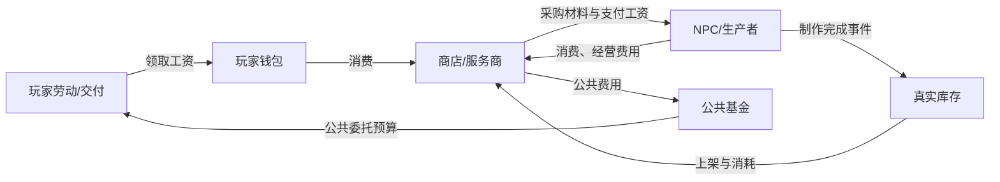
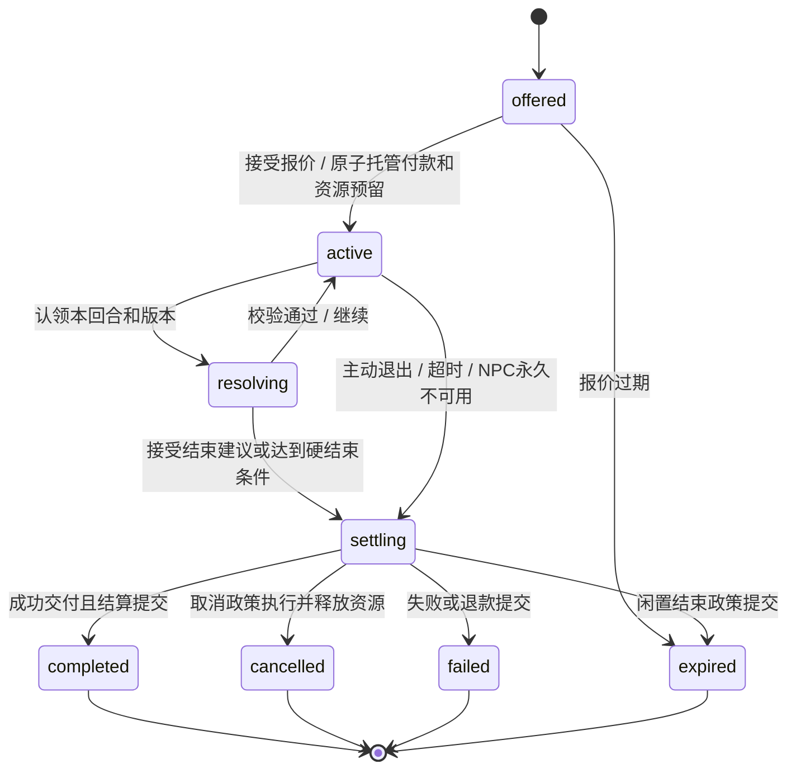

# 邻舍小镇 HD2D 与生活经济生态实施计划

> 调研日期：2026-09-07。依据：`ai-town` 分支，提交 `54e0380`。
>
> 文档状态：调研证据保留；2026-09-07 已落实 **M1 画面渲染实现及桌面隔离验收**，详见 [M1 实施记录](docs/hd2d-m1.md)。2026-09-08 已串通 M0 身份/地点/来源、M2 镇内对话、M3 本地行为及 M4 配送/生产和 M5 工坊服务的隔离运行链路；M6 固定发型卡 B 链已通过真实模块验证，经历记忆、日程回访、信箱任务及原私聊/回信/朋友圈/群聊/首次奇遇的生活记录已接入，详见 [生态矩阵](docs/hd2d-m6-integration-matrix.md)。天气有效期与城市来源、有限回家避雨、素材外观版本、M7 体积建筑/手动恢复及平面材质单遍已有隔离验证；最终后端663项、前端59项和242模块构建通过，进度与验证边界见 [本轮实施记录](docs/hd2d-progress-20260908.md)。2026-09-09 用户确认不再以送货为玩家玩法，咖啡馆 A 链改走“打工 / 临时代班”：玩家到店当班领工资，配送只保留为内部物流；固定契约、补货、饮品、打工结算与游戏化暖纸 UI 已接入，详见 [咖啡馆 A 链](docs/hd2d-m6-cafe-chain.md) 与 [设计系统](docs/design-system.md)。长期经济平衡、正式生活帖、Android真机与真实存档人工验收仍待进行；各阶段以记录中的实际证据为准，不把基础模块落地等同于整个里程碑完成。以下“本次调研”中的隔离限制描述的是原调研阶段。
>
> 优先级：先做“走得到、聊得完、钱物对得上”的一条完整生活链，再扩大职业、事件与画面复杂度。

## 1. 结论与最终体验

**可以做成接近《八方旅人》的 HD2D 方向。建议保留现有 Vue + Node + SQLite 架构，在小镇内部增加 Three.js 渲染器：真实水平地面、竖立的角色与建筑贴片、重要建筑的简化体积、统一光照与阴影、可关闭的远景移轴。** 不需要把整个邻舍迁移到 Unity 或 Unreal。

“能做出这类空间与光影”已经得到最小场景验证；“现有素材原封不动达到商业游戏完成度”并不成立。旧建筑自带等距透视，地砖也已经投影成菱形；需要兼容转换、美术校准与部分重要建筑重制。第一版固定镜头方向，避免旋转后暴露纸片侧面。

最终小镇应当形成这条生活链：

1. 玩家看见 NPC 正在营业、运货或休息，并能知道这件事的原因。
2. 从公告、信件、朋友圈中的正式活动卡，或 NPC 处接到有明确目标与报酬的委托。
3. 在镇上行动、交货、打工或参加服务，用钱和物品参与真实交易。
4. NPC 用收到的钱支付工资、采购材料；完成生产后上架商品；公共收入再支付公共委托。
5. 重要经历成为角色记忆，影响后续聊天、信件、朋友圈、群聊与奇遇；这些系统产生的有效约定又会改变小镇行动。

### 1.1 三条必须成立的规则

- **画面不决定事实。** 走路、到达、营业、交易和服务结束以服务端为准；掉帧、切页、缩放不会发钱或推进业务。
- **规则决定后果，LLM 补充表达与语义判断。** 工资、价格、库存、冷却、任务达成、可选服务结果都有本地规则；模型不能凭台词创造钱和道具。
- **每件事都有结束与来源。** 主题服务有不可逆的终态；钱物变动有账本；NPC 行动有简短日志；跨系统事件能追溯到一个真实起因。

### 1.2 范围默认值

沿用本地单玩家 `me`、当前小镇与真实日程。先支持固定视角、单层地面、已有两方向小人、3 个经济角色与 1 条完整服务链。昼夜跟随现有时间；不默认加速一天，不让玩家睡一晚回来遭受破产、道具损失或强制劳动惩罚。

首发不要求自由旋转、完整建筑室内、多人同步世界、全自动开放经济、任意脚本执行和每个居民持续 LLM 思考。这些都不能成为首条可玩链路的前置依赖。

## 2. 现有代码与验证证据

### 2.1 可以复用什么，实际缺什么

以下路径均相对仓库根目录；符号名是后续实施定位入口。

| 能力 | 已核实入口 | 当前能力与实施判断 |
| --- | --- | --- |
| 地图绘制 | `web-ui/src/views/TownView.vue`：`bakeStatic`、`drawObject`、`drawAgent`、`draw` | Canvas 2D；64×32 等距地砖；对象与居民按屏幕纵坐标排序。角色只有贴地椭圆影，没有统一光源和真实深度。拆渲染层，不重写业务 |
| 坐标、操作 | 同文件：`cellCenterWorld`、`worldToCell`、`hitAgent`、编辑器函数 | 投影、点击、键盘、对象占地和编辑器混在同一组件，必须先抽共享适配层 |
| 状态与通信 | `web-ui/src/stores/town.js`，`services/town/townBus.js` | 快照 + SSE、服务端时钟偏移、路径插值、地图版本已存在，可继续使用 |
| 地图与通行 | `townMapService.js`：`getObjectBlockingCells`、`buildWalkGridFromLayers` | 逻辑方格、footprint、门前格、手工阻挡已存在。3D 网格不接管 A* |
| 作息与移动 | `townService.js`：`tick`、`refreshNpcAgent`、`refreshCharAgent` | NPC 按 routine，入住角色按真实日程；默认 60 秒一拍；含随机漫游、相遇与批量状态气泡。尚无通用动作系统 |
| 行为记录 | `town_agent_state`、`town_encounters`、`town_chat_messages` | 前者是可覆盖的位置/活动快照，后两者只记录相遇，**不是完整活动日志** |
| NPC 立绘与聊天 | `TownNpcChat.vue`；`townNpcService.js`：`getNpcChatHistory`、`chatWithNpc` | 已有旁边立绘 + 气泡聊天列表；没有主题、阶段、结算与真正的结束协议 |
| 入住角色聊天 | `TownView.vue`：`goChat`；`routes/chat.js` | 当前跳到 `/chat/:id`；要在镇内用游戏对话框，需要抽取/适配现有聊天服务，不能另造一套角色人格和记忆 |
| NPC 身份升级 | `townNpcService.js`：`inviteNpcAsCharacter` | 写 `town_npcs.character_id` 并创建角色；当前不是完整身份合并，资产、钱包、履历与双份镇上实体需要专门处理 |
| 宝箱与道具 | `itemService.js`：`ITEM_EFFECTS`、`openChest`、`useItem` | 已有固定效果 + LLM 名称/描述/图标包装。`backpack_items` 是玩家道具实例，缺少可交易模板、NPC 库存和来源分类 |
| 道具外部效果 | `itemService.js`、`outfitService.js`、`emotionEngine.js` | 外观、变身、buff、心情、亲密度已落地，可以复用效果执行器 |
| 奇遇 | `eventGenerator.js`：`generateNextBranch`、`concludeEvent`；`EventCard.vue` | 分支协议持续要求新 A/B 选项，收束走另一流程；不能直接把现有奇遇换个标题当收费服务 |
| 外部生态 | `scheduleManager.js`、`routes/moments.js`、`mailboxScheduler.js`、`groupChatEngine.js`、`memory/memoryRepository.js` | 能力已具备，但跨域接口不统一，部分生成逻辑仍在路由文件；应增加服务接口与事件适配器 |
| 可靠消息 | `unifiedStreamBus.js` | 当前是内存客户端广播，不持久化、不补投。继续用于 UI 通知，新增持久化业务事件/outbox |
| 数据库 | `agent-core/src/db/index.js` | better-sqlite3、WAL、外键、内联建表迁移；可以承载首版账本、动作与会话事务 |

### 2.2 本次实际执行的验证

| 验证 | 结果 | 证据边界 |
| --- | --- | --- |
| 小镇原有测试 | **20/20 通过** | 显式运行素材后处理、A*、地点匹配三份测试；不能声称整个仓库测试全绿 |
| 当前前端构建 | **成功，188 modules** | 输出到隔离目录，未覆盖 `agent-core/public`；已有动态/静态导入及大 bundle 警告 |
| 默认数据库只读检查 | 8 名启用 NPC，48 个 ready 素材，当前无正式 `town_maps` 行 | 仅检查 `agent-core/data/agent.db`，不等同于所有可能配置的 DB_PATH；已有历史日志不当成本轮实时结果 |
| Three.js 场景 | **WebGL2、透明轮廓立片、阴影、两遍移轴渲染成功，GL error=0** | 临时安装包 `three@0.185.1`；16×16 地面、2 栋旧建筑、2 个人物、1 个简化体积；没有接业务服务 |
| 地面投影往返 | **2,500 个格心，最大误差约 6.36×10⁻¹⁴ 世界单位** | 独立覆盖 50×50 范围的相机测试，验证投影→射线→地面；未验证真实地图复杂遮挡点击 |
| 场景帧间隔 | 1100×650、DPR=1，观察 p50≈16.7ms、p95≈17.1ms | 60 帧样本、当前浏览器环境；是帧间隔而非纯 GPU 耗时，不能外推 50×50 整镇或安卓性能 |
| 封闭经济最小模型 | **30 天、540 条借贷分录，总量始终 3,400** | 固定消费路径的算术可行性验证，不代表参数已经平衡 |
| 只存钱压力模型 | **180 天不透支，但 244 次付款因资金不足停止** | 证明“货币守恒”本身不能保证长期活跃；方案必须有流动性政策 |
| 事务与服务结束 | **内存 SQLite 中回滚、防重复交易、防超卖、终态 CAS、只结算一次通过** | 单连接顺序事务实验；HTTP 并发、跨进程崩溃、真实业务副作用仍待实现验收 |
| 最小规则回放 | 同种子、同事实的 1,000 次选择回放一致 | 验证实现路径，尚未实现生产规则 DSL |

可重复运行的现有项目检查：

```powershell
# 工作目录：agent-core
node --test test/townAssetPostProcess.test.js src/services/town/townPathfinding.test.js src/services/town/townLocationMatch.test.js

# 工作目录：web-ui；必须给隔离 outDir，默认 build 会写 agent-core/public
npm.cmd run build -- --outDir ../output/hd2d-feasibility/ui-build
```

本轮临时实验位于 `%TEMP%/codex-hd2d-ai-town-20260907/`：`render.html`、`server.mjs`、`verify.mjs`、`verification.json`。它们是本地调研记录，不是生产模块或版本库正式测试。后续 M0 应把有价值的断言转成项目内可维护测试。场景内实际素材通过本机只读静态服务使用，没有上传第三方。

### 2.3 已发现、需要进入实施顺序的问题

1. **素材注释落后于实现。** 原计划写 36×48 小人，当前已有 300×400 成品并平滑缩放。不能根据旧文档重新把小人破坏性缩到几十像素。
2. **宝箱来源耦合。** `getChestState` / `tickCleanup` 会检查 `generating` 道具并补记宝箱冷却；商城道具不能直接套这个流程，否则商店生成会阻塞宝箱或修改冷却。
3. **道具使用不是整个流程的一次事务。** 目前先写效果再标记 used；扩展交易前应收口成原子消耗与效果提交，处理 SSE/缓存刷新在提交之后的顺序。
4. **POI 不是稳定标识。** `saveMap` 的某些调用会删除重建地点，仅按 key 修复家地址；`PUT /town/map` 目前还没有把 `locations` 透传给 `saveMap`。新增商店与动作绑定地点前先修正保存契约与稳定引用。
5. **NPC 和角色可能代表同一个人。** 目前 `loadState` 分别遍历两类居民；邀请后再入住可能出现双实体。身份合并必须先于钱包和职业绑定。
6. **LLM 气泡会覆盖 `activityText`。** 后续应拆事实动作和可选台词，模型生成“在打工”不能成为真的工资依据。
7. **重启恢复尚不支持经济行为。** 现有路径快照不完整恢复，活跃相遇会直接收尾；不能用同样方式把收费服务直接标记完成。
8. **文档要求的 `agent-core/test/characterPersona.test.js` 在本轮工作区未找到。** 后续若修改人格组装，先按 AGENTS.md 补齐该回归入口，再做外观联动，不声称已有该项测试覆盖。

## 3. HD2D 渲染方案

### 3.1 技术选择

| 路线 | 合适用途 | 决策 |
| --- | --- | --- |
| 继续增强 Canvas：剪影阴影、分层模糊 | 快速改善和低配兼容 | 保留为回退；体积、灯光与深度仍需大量手写 |
| Three.js + 既有地图/素材 + Vue UI | 真实地面、立片、体积、动态阴影与后处理 | **主路线**；直接使用 ES modules，避免同时引入另一套场景框架 |
| 迁入完整游戏引擎 | 大型 3D 关卡、复杂物理 | 当前目标收益不抵迁移成本，后端与外围系统不需要因此重写 |

官方对 HD2D 的介绍强调像素视觉与 3D 环境组合，外观取决于场景、灯光与素材共同设计；因此本计划将“美术校准”列为正式工作，而不是一个滤镜开关。[Unreal / Acquire 开发访谈](https://www.unrealengine.com/spotlights/octopath-traveler-s-hd-2d-art-style-and-story-make-for-a-jrpg-dream-come-true?lang=en-US)

运行后端选 `WebGLRenderer`，能力探测后启用。当前 Three.js 要求 WebGL2，不能只检测 `window.WebGLRenderingContext`；构造失败或 context lost 后可返回 Canvas。版本在实施时锁定并记录，不把浮动 CDN 引入产品。[Three.js WebGLRenderer](https://threejs.org/docs/pages/WebGLRenderer.html)

### 3.2 拆出渲染契约

建议目录：`web-ui/src/town/renderers/`，与现有 `components/town` 区分。

```text
TownView（页面、工具、面板、输入状态）
  ├─ TownSceneAdapter（地图/素材/Agent DTO → 渲染描述）
  ├─ TownRenderer（统一接口）
  │    ├─ CanvasTownRenderer（先迁移原逻辑）
  │    └─ Hd2dTownRenderer（Three.js）
  └─ TownDialogueStage / ShopPanel / ActivityPanel（Vue DOM）

renderer.mount(container)
renderer.setScene(sceneDescription)
renderer.updateAgents(agentSnapshots, clock)
renderer.setCamera(cameraState)
renderer.pick(screenPoint) -> entity/object/groundCell
renderer.project(worldPoint) -> screenPoint
renderer.setQuality(preset)
renderer.resize(width, height, dpr)
renderer.dispose()
```

两个渲染器消费同一份权威状态。切换画质不重载世界、不创建第二条业务 SSE、不重启动作。WebGL 的对象不放进 Vue 深层 reactive；资源管理、逐帧插值留在渲染模块。

### 3.3 坐标、镜头与旧地砖

统一逻辑格 `(gx, gy)`，3D 世界 Y 为高度，Z 对应逻辑 gy。格心推荐 `(gx+0.5, 0, gy+0.5)`，1 格 = 1 世界单位；已有对象锚点的 y 是 footprint 底边所在行，必须复用 `getObjectBlockingCells` 的约定进行转换。

当前投影为 `screenX=32(gx-gy)`、格心 `screenY=16(gx+gy+1)`。首版采用水平朝向 45°、仰俯关系为**相对地平面向下看 30°**的正交相机，而不是习惯性使用 35.264°；前者对应现有 2:1 菱形。设置约 `32√2` 像素/世界单位可匹配原有地面比例。相机 target/平移负责常量偏移，统一检查原角色脚底额外 `+HH` 的偏置，不能分别凑偏移。

正交投影物体不随距离缩小，适合第一版兼容既有地图；后续素材重制后再评估小透视，不默认允许自由旋转。[Three.js OrthographicCamera](https://threejs.org/docs/pages/OrthographicCamera.html)

**已有地砖的正确兼容办法：**

- 地面仍是水平正方形网格，不是竖立的菱形片。
- 旧贴图内的 N/E/S/W 菱形四角分别作为水平网格四角的 UV：标准图为 `(0.5,1)`、`(1,0.5)`、`(0.5,0)`、`(0,0.5)`，三角形绕序与上法线一致。
- 这相当于只采样菱形内容、在几何上逆掉旧投影；不能把整张 64×32 图片用普通矩形 UV 再投影一次。
- 旧图实际 alpha 边界、`groundAnchorY`、裁剪后尺寸未必完全标准。新增 `contentDiamondUv` 和派生贴图版本；做半 texel 内缩、边缘扩色、atlas gutter。边缘本来就有白色描边的图需要派生去边或重做，调整 UV 不能消除画进去的白边。
- 后续新素材支持 `topdown_square`：真正平铺方形俯视材质，不再经过 `flattenIsoTile`。旧素材保留 `legacy_iso_diamond` 路线；都输出同一地面网格。
- 地面/道路分层采用轻微高度偏移或 polygonOffset，避免 z-fighting。大地图按 16×16 块合批、按修改块更新，避免每格每帧独立创建 mesh。

拾取用相机射线：先查可交互对象的 alpha 命中，再与 Y=0 的逻辑地面求交，落格并校验边界/可走性。射线不命中、交点在地图外或位于阻挡格时明确拒绝；显示路径与真实可行走路径必须一致。编辑预览同样使用此契约。

### 3.4 建筑与角色真正“立起来”

**普通旧建筑：兼容立片。** 透明 PNG 放到有高度的 PlaneGeometry 上，只绕 Y 轴朝向固定镜头，脚点接地。保留外观比例时按镜头俯角补偿投影高度；底座、门口和 footprint 要有校准工具。它能投影，但原图中的屋顶和底面仍是画出来的，不会自动变成真实 3D。

**重要建筑：简单体积 + 分面素材。** 咖啡馆、工坊、公告站先做 3 个模块化盒体/屋顶棱柱：墙面、屋顶、门牌独立贴图，轮廓维持像素风。同 footprint 对应实际体积和门口，近处能看到侧墙、屋檐、台阶并产生合理遮挡。后续外形通过组合块扩展，不要求 LLM 直接生成任意 3D 模型。

普通建筑的过渡方案可以使用只参与阴影的简化体积代理，但必须规定每栋仅选一种投影来源：轮廓片或体积代理，不能同时产生两份影子。代理与画面轮廓不一致是待校准问题，不能以“启用了 shadow”视为验收通过。

角色沿用透明正/背素材，使用直立 Mesh；不依赖默认 `Sprite` 来承担阴影。转向按投影后的移动方向选择正/背，避免现有只看逻辑 dy 导致屏幕斜向走错朝向。首版不要求四方向动画，也不对现有高分辨率小人统一强制降采样。

素材增加版本化渲染元数据，实例可覆盖锚点/尺寸：

```json
{
  "renderVersion": 1,
  "projection": "legacy_iso_card",
  "anchor": { "u": 0.5, "v": 1.0 },
  "worldHeight": 3.2,
  "alphaCutoff": 0.3,
  "shadowMode": "alpha_card",
  "materialProfile": "legacy_painted",
  "textureFilter": "nearest",
  "footprint": { "w": 3, "h": 2 },
  "doorOffset": { "dx": 2, "dy": 1 }
}
```

这只是资产元数据示例，不是 LLM 输出协议。`projection`、`shadowMode` 等均由白名单校验；旧素材缺字段时使用兼容默认，不改原 PNG。区分像素素材、当前插画小人和高分辨率对话立绘的过滤方式；像素纹理清晰和远景轻微失焦可以同时存在。

### 3.5 灯光、阴影、景深、遮挡

- 首版一盏低频更新的太阳/月光方向光 + 环境补光。时间与天气来自权威快照。晴天影清晰，阴雨影柔和、对比低；夜间重点用窗口/灯牌发光与少量无阴影点光，避免每个 NPC 一盏投影灯。
- 贴片 `alphaTest` + `depthWrite`，抠掉透明区域；不要所有物体都走半透明排序。主材质、阴影深度材质和景深深度通道必须使用相同 alpha 轮廓，且同步 UV/帧/裁剪。使用自定义顶点位移时同样复制到 depth/distance 材质。[Material](https://threejs.org/docs/pages/Material.html)、[Object3D 自定义深度材质](https://threejs.org/docs/pages/Object3D.html)
- 老素材已画入光影，使用温和光照调制，避免亮面反向与双重阴影；新分面建筑用 Lambert 等简单受光材质。无需首发追求复杂 PBR、SSAO 或体积光。
- 脚底保留廉价接触影，方向影负责高度感；调好 shadow bias、normalBias、投影范围，特别检查人物漂浮、墙根漏光与近处锯齿。阴影额外渲染场景，画质档位必须限制投影光和 shadow map 尺寸。[Three.js Shadows](https://threejs.org/manual/en/shadows.html)
- 首版移轴为两遍低分辨率模糊，清晰带覆盖玩家/交互对象，远景增加模糊，默认弱、可关闭。它是有意的屏幕空间效果，不能声称物理景深。屏幕上方建筑屋顶也可能被模糊，因此重要交互对象要扩大清晰区域。
- 后续高画质改为地面距离/线性深度辅助的远景模糊，考虑 alpha 裁切与物体边缘渗色；不要直接使用忽略贴片 alpha 的场景 override depth 材质。对话阶段可锁定两人的焦点。
- 后处理只覆盖世界画布，Vue 文字、菜单、立绘始终清晰；不把整页放进 CSS `filter: blur()` 或 `backdrop-filter`。合成顺序与色彩空间只转换一次：世界线性颜色 → 后处理 → OutputPass → DOM。[Three.js 后处理](https://threejs.org/manual/en/post-processing.html)
- 被建筑挡住时，只对遮挡玩家/交互对象的建筑做局部淡化或轮廓提示，depth pass 与可见 pass 同步；不能沿用“只要挡任意居民就整栋长期半透明”。

### 3.6 画质与验收

| 档位 | 建议初始配置 | 使用场景 |
| --- | --- | --- |
| 兼容 | 原 Canvas，廉价接触影，无景深 | WebGL2 不可用、context lost、用户选择 |
| 低 | WebGL2，DPR 上限 1，建筑低分辨率影，人物接触影，关闭移轴 | 安卓网页壳、弱 GPU |
| 标准 | DPR 上限 1.5，1 盏投影光，1024 阴影，半分辨率弱移轴 | 默认桌面 |
| 高 | DPR 上限 2，2048 阴影，有限局部光、后续深度辅助失焦 | 完成性能验证后开放 |

性能目标是待测门槛：桌面 50×50、60 居民、80 对象，稳定移动时 p95 帧间隔 ≤20ms；目标安卓 30 居民的低档 p95 ≤33ms。不把高刷新显示器、后台标签页节流和加载瞬间纳入稳态指标。另记显存估算、draw calls、主线程长任务；失败时自动降特效或提供兼容入口。

GPU 资源必须引用计数与 dispose：贴图版本更新释放旧纹理，切镇/离页停止 RAF、observer 与输入监听，销毁 composer render targets。隐藏页暂停渲染，模拟仍由服务端按产品设置运行。

## 4. 立绘 + 游戏对话框

### 4.1 交互布局

复用 `docs/design-system.md` 的 Soft Warm UI，视觉参考现有 Toast、世界观设置区、信箱。游戏感来自立绘站位、对白节奏、选择与场景连续性，不引入整套黑金 RPG 菜单。

桌面：场景仍在背景，左/右侧站立角色，底部宽对白框，显示说话人、正文、选项/输入；可打开历史抽屉。手机：上部头像或半身立绘、底部自适应对话面板，安全区与键盘出现时保持输入和结束按钮可见。正文高对比、无模糊，支持长文本滚动而非溢出。

```text
┌──────────────────── 小镇场景 ────────────────────┐
│ 钱包 / 任务小提示                      时间、天气 │
│                                                  │
│     NPC立绘                  玩家或另一角色立绘   │
│ ┌──────────────────────────────────────────────┐ │
│ │ 面包师 · 制作体验           第2阶段：烘焙      │ │
│ │ “这次面团醒得刚好，你来决定最后的形状吧。”    │ │
│ │ [编成花环] [捏成小动物]                       │ │
│ │ [自由输入……]              [确认] [结束服务]  │ │
│ └──────────────────────────────────────────────┘ │
└──────────────────────────────────────────────────┘
```

常规按钮用 `LinsheButton`，同屏一个主操作；文本输入用 `LinsheInput`；下拉用 `LinsheSelect`；打字效果、移轴等开关用 `LinsheSwitch`。特殊视觉小说选项可复用 `EventCard.vue` 的可键盘操作热区模式，但不继承其旧毛玻璃皮肤。

### 4.2 对话模式与复用边界

统一 `TownDialogueStage` 只负责呈现；背后按模式接不同会话适配器：

| 模式 | 数据与规则 |
| --- | --- |
| NPC 闲聊 | 复用 NPC 人设和原镇内历史，增加 session/turn ID；用户随时结束，不涉及收费 |
| 入住角色闲聊 | 复用现有 chat 管线、会话记录、记忆、情绪、外观；增加现场 context，不绕过原逻辑 |
| 主题服务 | 专用有限会话状态机，阶段、费用、可交付结果固定，LLM 判断语义并建议收束 |
| 交易 | 本地库存 + 固定结算，卖家台词可用模板；买东西不要求一次 LLM |
| 委托交付 | 本地检查任务事实并提交结果，必要时生成一次结束对白 |

立绘解析：已关联角色优先用 `characters.standing_url`，无关联则取 NPC portrait 资产；缺图回退原立绘/头像/名字占位，不阻止对话。角色 id 与 npc id 严格区分。动态外观变更使立绘缓存失效，但不在每次交易后自动重新生图；按用户开启的策略、去重与额度生成新版本。

逐字显示只在前端拆分已返回内容；快进不再次调用模型，翻页不新增聊天消息。支持直接显示全文、降低动态效果、键盘/触屏、读屏；中文输入法组合期间 Enter 不发送。历史中同一条回复只保存一次，乐观用户消息失败后可重试且不重复入库。

对话打开时取消玩家自动移动，阻止 WASD 穿透；服务中的 NPC 持有有到期时间的动作占用。全镇继续运行，不能全局暂停真实日程。关闭面板与结束服务是两件事：关闭可恢复，终态不可继续；入口明确标识“服务进行中 / 已结束”。

角色聊天服务在 `routes/chat.js` 中体积较大，先抽可测试的 `sendCharacterTurn({characterId, context, clientMessageId, ...})` 服务入口，原路由保持适配，不复制整条 prompt。MVP 可以先交付 NPC 服务，但完整版验收必须包含入住角色的镇内立绘闲聊。

## 5. 经济系统：让钱、物品和需求循环

### 5.1 账户与货币

先只有一种整数软货币，暂名“邻币”，不和亲密度混用、不与真实货币兑换。账目以整数最小单位存储，并限制在 JS 安全整数范围内；客户端不能传任意奖励额或任意 price。

账户至少包括玩家、居民、商家/工坊、公共基金、发行/回收系统账户。人物钱包与店铺经营账户分开：店铺收入支付材料、工资、费用，店主可以按规则领取收益，不能让角色钱包和商家资金隐式共享。

每笔操作写不可变账本：`transactionId + idempotencyKey + reason + sourceEventId`，每个账户一条带正负整数的 entry；同币种分录合计为 0。普通转账守恒，发行和销毁通过明确系统对手账户记录。玩家/居民/商家/基金不能负余额；系统发行账户独立类型允许承担记账对手，不可消费。

`available = balance - reserved`，约束 `0 ≤ reserved ≤ balance`。普通订单可在原账户预留；服务接受后转入独立托管账户时，同事务释放原预留并完成转账，不能既扣余额又扣一次可用额。资金与物料预留都绑定明确的 order/action/session；取消、失败与完成都必须释放。手续费和退款使用同一整数舍入规则，任何尾差分配到明确对手账户，不丢失到浮点误差里。

### 5.2 首条闭环



一个已用脚本验算的**资金循环示例**，每轮代表一个模拟日：

| 转账 | 金额 | 业务解释 |
| --- | ---: | --- |
| 公共基金 → 玩家 | 30 | 公共配送/维护委托 |
| 原料生产者 → 玩家 | 12 | 采集/分拣劳动 |
| 玩家 → 咖啡馆 | 18 | 一次有明确结束的服务 |
| 玩家 → 工坊 | 24 | 普通消耗道具 |
| 咖啡馆 → 原料生产者 | 10 | 原料采购 |
| 工坊 → 原料生产者 | 16 | 原料采购 |
| 原料生产者 → 公共基金 | 14 | 本轮经营公共费用 |
| 咖啡馆 → 公共基金 | 8 | 本轮经营公共费用 |
| 工坊 → 公共基金 | 8 | 本轮经营公共费用 |

初始基金 2,000、生产者 600、咖啡馆 400、工坊 400、玩家 0；该固定消费路径运行 30 天后账户回到初值，总钱 3,400。费用数值只是数学闭环演示，**不是最终税率或推荐定价**；真实版本必须通过下述多场景模拟调参。

### 5.3 玩家挣钱与花钱

| 玩法 | 收入条件 / 付款人 | 消耗与限制 | 对外联动 |
| --- | --- | --- | --- |
| 店铺短工 | 完成清点、接待、制作步骤；商家支付 | 工位、工作时段、岗位预算、每次任务上限 | 店主记住帮助，可能在朋友圈感谢 |
| 配送委托 | 领取货物→到达地点→真实交付；委托人支付 | 货物锁定、目的地、预约时限 | 信箱派单、聊天约见、群聊筹备 |
| 采集与回收 | 资源点产出→卖给有需求的 NPC | 资源恢复、可采数量、收购预算、每日配额 | 天气影响产出，缺货触发公告 |
| 手工制作 | 消耗原料和工时，出售成品 | 配方、制作位、销路、手续费 | 对接已有服饰/功能道具效果 |
| 本地活动协助 | 节庆、布置、拍照、维护等里程碑完成 | 一个活动一次结算，组织者预算 | 朋友圈活动卡、群聊分工、奇遇后续 |

主要消费是 NPC 服务、道具、外观定制、体验课程、布置材料和活动参与。基础社交继续免费；不把写信、普通聊天、看朋友圈、让角色休息变成强制收费功能。

一般劳动首版目标报酬 15–40、普通服务 10–30、常见道具 30–100、稀有定制 150–300，均为待模拟的初始范围。让一两次短工买得起一次体验，同时避免单次服务无限刷关系收益。生活熟悉度可解锁主题/配方，但不首发堆叠大量经验条、技能树与每日打卡。

### 5.4 NPC 的钱和货从哪里来

每个职业模板配置营业地点、工作时段、服务目录、生产配方、补货触发和采购偏好。`job` 文本不能自动赋予扣款或铸币权限。

供货使用明确的本地事件：

- `production.completed`：消耗预留原料与工时，产出批准 SKU，增加库存。
- `delivery.completed`：货物所有权从供货方转入店铺；不会再次创造一批相同物品。
- `resource.harvested`：资源点有容量与恢复率，减少可采库存，增加原料；纯规则执行。
- `festival.unlocked`：给商家开放配方/有限活动采购资格，不无条件无限上货。
- `supplier.shipment_received`：若启用镇外供货，必须付成本且有固定周期、批量与来源账；不把“AI 说货到了”当触发条件。
- `commission.reward_granted`：从已预留库存转移或由明示奖励配方产出，保留来源。

低库存 → 挂采购需求 → NPC/玩家接单 → 交货 → 制作 → 上架。商家即使界面关闭也能按这些规则运行；库存为 0 时是真的售罄，不能点击购买时再临时编一个道具。

轻量居民的衣食需求可以用少量数值和消费偏好驱动，不模拟复杂生理危机。入住角色沿用情绪/日程数据，只在可用时段从事经济行动；不得新造第二套亲密度。

### 5.5 流动性、发行与回收

采用“**以镇内循环为主，允许透明且有上限的发行/回收**”的软经济。严格固定总量且允许玩家无限囤币时，不可能保证商家永远有钱支付劳动；本次 180 天压力模型已出现该问题。

政策顺序：

1. 先按账户可用余额、已承诺订单和安全准备金决定能否发布委托；承诺前预留，不发空头工资。
2. 商家利润、经营费用、活动收入流回生产者与基金；公共基金优先保障低门槛挣钱入口。
3. NPC 按需求与预算相互消费，不能靠玩家单人消费承担全部循环。
4. 玩家低余额时提供无需垫资的基础委托；玩家长期离线不自动扣日常生活费。
5. 基金低于运行底线时，启动明示、限额的“公共补助发行”，只流向基金并按完成的公共工作支付；设置每日额度、滚动 7 日总额及流通量上限，不因刷新页面重置。
6. 稀有外观定制、城镇装饰等长期消费承担小比例货币回收；其余消费尽量留在镇内。补助和回收都上账，不能静默改余额。

基础商品首版固定基价 + 库存/关系的有界修正，禁止每笔交易问 LLM 定价。建议价格系数夹在 0.8–1.2；收购价按同一基价且始终低于最低有效卖价（计入折扣/税费），对稀缺品每日收购数量设限。后续开放区域差价前必须单独验证套利路径。

### 5.6 防刷与经济验收

同一任务、生产批次、宝箱、服务只获得一次奖励；服务的免费重试不带第二份奖励。出售需要拥有完整且可交易的物品，已用、锁定、未收下的物品不可出售。任务材料不能同时卖出又交付。价格报价包含版本和有效期，过期重新确认，不在用户确认后静默涨价。

免费宝箱是已有资源入口，保留其规则；首版宝箱来源道具默认不可直接卖回换币，以避免现有免费掉落冲击经济。后续若开放回收，单独配置很低的回收额度，不给所有历史道具自动标高价。

30/90 天模拟至少覆盖正常游玩、只劳动囤币、只消费、完全离线、单店断货、NPC 无法到达、突发活动需求、重复事件和错误系统时间。记录资金总量、发行/回收量、居民/商家破产次数、未兑付委托、库存周转、玩家每分钟收入、贫困玩家找到无垫资任务的时间。经济目标必须用这些指标验收，不能只检查余额没变负。

## 6. 道具模板、库存与交易

### 6.1 复用宝箱效果，拆开获取来源

`ITEM_EFFECTS` 保留为效果白名单与执行注册表。新增可持久化的 `item_templates`：模板稳定 key、版本、effect_key、名称/描述默认值、定价档、可交易性、适用对象、外观 payload 约束、图标和生成状态。AI 可以为已批准效果设计一个新包装，不能创建未注册的 effect_key 或效果脚本。

将目前耦合在 `openChest()` 的流程拆为：

```text
resolveItemTemplate(effectKey, theme, worldVersion)  可选 AI，生成后复用
validateItemTemplate(template)                     本地白名单与字段验证
createItemInstance(template, owner, source)        本地入库
applyItemEffect(instance, target, transaction)     现有效果执行器

ChestSource：抽取 + 原冷却 + 待收下演出
ProductionSource：配方/原料/工时 + 制作事件
RewardSource：任务/活动预算 + 一次领取
TradeSource：现有物品所有权转移，不重新生成
```

无 LLM 时使用固定模板名称、描述和已有图标/占位图，交易与生产仍可执行。生成只发生于新主题、用户明确请求的定制或后台有预算的模板补充，不发生于每一次购买。

### 6.2 首版库存模型

**现有 `backpack_items` 继续作为“有名字、有 payload 的道具实例”唯一事实来源。** 增加 `template_id`、`template_version`、`owner_key`、`source_type`、`source_event_id`、`version`、锁定/退役信息。默认旧道具 owner 为玩家、来源为 legacy_chest，保留 ID、图片、used 状态、collected_at 与历史效果引用。

商店售卖的道具也有实例，只是 owner 为商家；商品列表按模板/批次聚合展示，实际可售量从该店 `ready + 未锁定` 实例计算。购买转移指定实例的 owner，原子设置玩家 collected_at；同模板的多件商品不能共享同一个可消耗 ID。首版数量小，这比维护两套“库存数量 + 背包实例”真相更可靠。

原料（木料、花草、布料等）用独立 `town_resource_stocks(owner_key, resource_key, quantity, reserved, version)`，为生产与物流服务；不是已有 `ITEM_EFFECTS` 道具，不伪装成可送给角色的 buff。背包需要展示原料时增加轻量材料页签，数量由资源账得到。后续如果要给普通商品引入堆叠，另做实例化/拆分事务，不能仅把列表数量字段改大。

所有背包接口，包括 list、collect、use、discard、effect 查询、待收下、过期清理与异步图标完成回调，都要检查 owner/source/status。不能只在商城路由做校验而让旧 `/items/:id/use` 消耗商家库存。

区分 `item state` 与 `image state`：库存中有效但图标失败的商品仍可买；尚未通过模板校验的商品不能上架。宝箱生成状态、冷却与商家图标队列隔离。`discardItem` 的物理删除改为退役/软删除或单独归档，避免破坏交易凭证及已引用效果。

### 6.3 交易一次性完成

用户看到报价 `{quoteId, seller, item/sku, quantity, total, version, expiresAt}`。服务端验证会话、玩家权威位置、营业/远程领取能力、卖家预算、库存与报价版本；不是仅凭前端“在旁边”字段。

使用 **短、同步的 SQLite 事务**：

1. 查唯一 idempotencyKey 与请求内容摘要；同 key 同请求返回既有结果，同 key 不同请求返回冲突。
2. 校验并预留/扣减可用余额及库存，条件更新防止透支与超卖。
3. 转移物品、写账本/交易结果，写同事务业务事件与 outbox。
4. 提交后更新缓存并通知 SSE。若响应丢失，重试返回同一个物品 ID 与收据。

事务中不能 `await LLM`、生图或发送外部消息。better-sqlite3 同步事务里的外部副作用先改成“返回待发通知”，由事务外执行。多实例部署若未来开放，要做数据库级互斥/租约与并发压力测试，不能依赖 Node 进程内布尔锁。

`useItem` 也必须在一个事务中：条件锁定可用实例 → 写现有效果/外观/亲密度 → 标记已用 → 业务事件。实际亲密度写入复用现有服务，但审计并推迟其缓存/广播副作用。不可将“扣了道具但效果失效”解释为正常服务失败。

## 7. 有主题、会结束的 NPC 服务

### 7.1 与奇遇的不同

收费服务是有限合同：主题、参与者、费用、阶段、完成条件、交付物、退出/退款规则在开始前就可见。奇遇继续负责开放叙事与意外转折；两者可共享立绘呈现、上下文和记忆组件，不能共享“永远继续生成选项”的推进协议。

首批可配置服务：饮品调制体验、理发/穿搭咨询、工坊定制、导览、占卜式故事体验。效果全部绑定已有规则：理发可交付现有 hairstyle 类型道具，咨询可只留下纪念描述，导览可解锁 POI；不凭“服务很满意”随意提升数十点关系。

### 7.2 服务模板

每个模板至少定义：`key/version`、主题与允许范围、营业条件、价目、阶段表、初始阶段、动作选项、事实目标、允许结果池、最大回合、闲置时限、最长持续时间、付费/退款政策、LLM 策略与本地兜底。

推荐首个模板：**工坊饰品定制**。

- 30 邻币，开始时由玩家转入该服务托管账户。
- 选主题 → 确认材料 → 制作交流 → 交付；常见 3–5 回合，最多 8 回合。
- 交付物在允许模板池内提前锁定库存或原料；自由输入只能影响款式描述和对白。
- 原料正式消耗前取消全退；开始制作后按预先展示的政策结算。示例：10 邻币加工费付商家，余款 20 退玩家；系统错误导致无法交付则全退。
- 有效提前完成判断被接受后立即结束；不得为了凑满 8 回合强行延长。

模板能换职业/主题，服务引擎不写“如果名字是铁匠”这样的判断。NPC 上架新服务来自职业/事件规则，先配置与校验，再让模型生成包装文案。

### 7.3 状态机与真正结束



回合处理：短事务认领 `expectedVersion + turnId` → 事务外调用模型 → 再以 CAS 检查版本、状态、动作锁/营业例外和事实 → 原子接受结果或拒绝过期结果。并行点击只能有一轮成功；超时后到达的模型结果不得复活会话。

结束优先顺序：用户退出/系统硬条件 → 已达成的确定性目标 → 有效 LLM 语义结束判断 → 下一阶段。模型判断不是只写“再见”：校验通过后持久化终态、结算钱物、释放 NPC 占用，UI 移除继续入口。

进入 `settling` 时冻结确定的 `outcomeKey` 和退款/交付清单；它是可重试的中间态，不代表已经成功。只有交付与结算事务完成后才能进入 completed。终态请求统一返回已有收据或 `SESSION_CLOSED`，再聊必须新开闲聊/新服务。

数据库约束 `UNIQUE(session_id)` 结算记录、`UNIQUE(session_id, client_turn_id)` 回合，使用 session version 条件更新。关闭面板保留会话；断线恢复读取持久化回合，不再次扣钱。不同设备看到同一终态。

### 7.4 LLM 协议及校验

模型只收到当前主题、服务端给定阶段、可用 intent/结果白名单、已经发生的动作事实、最近少量回合、角色上下文与预算提示。它不收到 SQL、执行器权限，也不能提交新规则。

下面是**拟新增 prompt 的完整格式示例**。字段值同时说明约束，符合仓库 AGENTS.md；它是说明用 JSON，不是可以直接当实际结果解析的有效枚举实例。实现时由同一 schema 生成该示例与枚举说明，parser 与 prompt 一起改。

```json
{
  "schemaVersion": 1,
  "narration": "中文0–60字，只描写当前服务中可观察的场景；不编造到账、交付、好感数值或未来事实",
  "speakerKey": "必须原样使用输入给定的服务者actorKey，不得新增人物",
  "dialogue": "中文1–3句、总计不超过120字，符合人物口吻与服务主题，不越权宣布未批准奖励",
  "intentKey": "从本轮提供的allowedIntents中选一个原样返回；无法判定自由输入时填clarify，不执行任意指令",
  "suggestedPhaseKey": "从本轮allowedNextPhases中选一个；无法推进时返回当前phaseKey，不跳过服务端未完成目标",
  "choices": [
    {
      "intentKey": "下一轮可用intent的原始key，不得自造；终局时choices必须是空数组",
      "label": "中文4–16字，具体且属于本次服务；继续时1–3项，不包含未批准金额或承诺"
    }
  ],
  "ending": {
    "decision": "仅continue或finish；主题已完成、用户明确告别或交互自然收束时应选择finish",
    "outcomeKey": "continue时必须null；finish时从服务端提供的allowedOutcomes中原样选择",
    "reason": "中文不超过60字，说明为何继续/结束，必须基于本轮输入与已发生事实",
    "evidenceTurnIds": ["仅引用输入中已存在的turnId，不得伪造；无可引用证据时为空数组"]
  },
  "memorySummary": "中文0–80字、第三人称，只总结已发生互动；非终局或无值得保留信息时为空字符串"
}
```

示例之后必须明确写：**“严格按以上示例结构输出一个 JSON 对象；真实输出必须将说明文字替换为符合约束的值；不要输出任何解释、Markdown 围栏或 JSON 以外的文字。”** 真实 parser 要求 `schemaVersion` 数值、`outcomeKey` 为允许字符串或 null、证据为数组等严格类型，拒绝额外字段，不能仅靠截取首个大括号。

服务端验证 `finish` 的语义与可交付条件：目标事实全部满足 → 接受 completed；明确退出但未完成 → 走取消结果与退款；阶段尚未完成却声称“已经交货” → 拒绝这一结果，至多一次格式/语义纠正，随后本地兜底。模型可以让一次交互提前自然收束，不能越过实物与支付检查。

无效 JSON、超时、无预算或连续无进展：保留草稿/事实，使用阶段模板继续或收束。最多一次模型修正；连续两轮无有效推进进入明确的澄清/结束路径；达到 maxTurns/maxDuration 必须本地结束，不再问一次模型“是不是该结束”。无 LLM 时仍可通过模板选项完整体验、完成交付与退款。

### 7.5 失败、退款与资源恢复

| 情况 | 处理 |
| --- | --- |
| 付款前模型/网络失败 | 无扣款，可重新开始 |
| 付款成功但响应丢失 | 同 key 查询原会话和托管收据，不再收费 |
| 生成中关页 | 会话可恢复；原回合继续或到期，前端不擅自重开 |
| 服务者临时休息 | 已接受服务允许完成短窗口；新报价关闭。长任务改预约；不能为用户阻止 NPC 永久睡觉 |
| 服务者删除/世界重置 | 先按系统失败全退并释放物料，后归档；不能级联删除托管账本 |
| 生图失败 | 合同是物品时交付有效物品+占位图，图片补生成；合同明确以图像为交付物时按模板重试/退款 |
| 服务器重启 | 根据 resolving 租约、settling 清单恢复；过期回合释放，结算幂等补做，不能自动标 completed |
| 用户取消/闲置到期 | 使用开始前展示的退款政策；不因仅关闭 UI 就扣违约费 |

## 8. 可扩展的本地行为与逻辑运算系统

### 8.1 选择：规则表达式 + 效用选择 + 可恢复动作状态机

首版不做完整可视化脚本编辑器，也不让居民每分钟提交一次 LLM 计划。将现有作息与日程变成“候选行为与约束”，用有限表达式计算可执行性和优先级，用动作执行器落地。

```text
事件/时间窗口/当前快照
  → FactProvider（只读事实，类型化）
  → RuleEvaluator（条件与数值表达式）
  → CandidateSelector（优先级、得分、稳定随机）
  → ActionRunner（认领资源、寻路、执行、完成/失败）
  → 事务提交（状态、库存/账本、事件、日志）
  → 必要时的表达生成/语义澄清队列
```

未来可在相同 ActionRunner 上增加复杂规划器或行为树，不改业务效果入口。首版 JSON 规则就能新增职业、营业条件、补货行为、天气偏好与服务开放逻辑。

### 8.2 统一身份与事实

增加 `town_actors`，稳定 actorId 映射玩家、NPC、已有角色；npcId/characterId 可以同时关联到同一 actor。现有 `agentKey` 保留兼容层用于老 SSE 与历史负数 NPC 编码，新增经济和日志以 actorId 为主键，不扩散“负 id 表示 NPC”的技巧。

邀请 NPC 入邻舍时，保留 actorId、钱包、库存、职业、履历与服务关系；只增加 characterId、绑定现有角色能力，生成/映射唯一镇上实体。角色日程成为该人物的日程来源，职业时间转为可协调的工作预约。重复邀请、退住再入住和删除关联角色都不能多领初始资金。

FactProvider 按批次采集、同次决策保持不变：

| 类别 | 事实 |
| --- | --- |
| 时间 | UTC 毫秒、配置时区的日期/分钟、工作窗口、天气、模拟游标 |
| 身份与社交 | actorId、职业标签、已有角色关系/情绪、是否允许外部联动 |
| 身体/位置 | 权威位置、当前动作、到达地点、可通行性、睡眠、疲劳等少量本地需求 |
| 经济 | 可用余额、托管额、真实库存、缺货、订单预算、材料预留 |
| 承诺 | 日程硬约束、已接受服务、配送任务、预约、工位占用 |
| 近期历史 | 上次行动时间、同对象冷却、同类事件次数、是否刚完成任务 |

使用计算后的结构化事实，不从 `activityText` 或最近自然语言日志反向识别“是不是完成了工作”。可选 AI 生成的台词单独存 `flavorText`，不覆盖 `actionType/phase`。

### 8.3 逻辑表达式协议

实现有类型的 JSON AST：`all/any/not`、`eq/ne/gt/gte/lt/lte/in`、`add/sub/mul/div/min/max/clamp`、有限 `ref`。聚合如近期次数、库存和距离先由 FactProvider 计算，不允许任意数据库查询、无限循环、正则程序或递归规则调用。

约束：拒绝未知操作符/字段、除零、NaN/Infinity、非法类型；缺失事实采用显式 `exists/default` 或条件不成立，不能通过 JS 强制转换让 `null >= 0` 意外成立。默认 AST 最大深度 12、节点数 128；规则不能 `eval`、访问网络/文件、调用任意 JS。数值范围、时间单位与变量域由注册表定义。

一条实际可用的规则数据示例（非 prompt）：

```json
{
  "key": "workshop.restock",
  "version": 1,
  "trigger": ["stock.changed", "work.window.started"],
  "priority": 50,
  "when": {
    "op": "all",
    "args": [
      { "op": "eq", "args": [{ "ref": "actor.sleeping" }, false] },
      { "op": "eq", "args": [{ "ref": "schedule.allowsWork" }, true] },
      { "op": "eq", "args": [{ "ref": "actor.busy" }, false] },
      { "op": "lt", "args": [{ "ref": "shop.availableStock" }, 3] },
      { "op": "gte", "args": [{ "ref": "shop.materialUnits" }, 2] }
    ]
  },
  "score": {
    "op": "clamp",
    "args": [
      { "op": "sub", "args": [80, { "ref": "actor.fatigue" }] },
      0,
      100
    ]
  },
  "cooldownSeconds": 1800,
  "action": {
    "type": "produce",
    "recipeKey": "workshop.basic_accessory",
    "stationRef": "shop.workstation"
  }
}
```

`stationRef` 由 typed resolver 解析，不把字符串当可执行路径。条件成立不意味着立即产物品；ActionRunner 还需预留原料、到达工位、经过工时、提交生产结果。新增 rule 不新增执行权限；新增 action 才需要实现并注册对应 validator、runner 和结算逻辑。

### 8.4 选择与优先级

建议先应用硬约束，再比较候选：

1. 维护/紧急不可执行状态、已承诺任务的收尾与资源释放。
2. 已接受的玩家服务、预约；睡眠硬约束通过“禁止开始超长服务、预约改期”提前协调。
3. 角色既有日程硬安排、NPC 职业工作窗口。
4. 基础生活需求、生产/采购/配送。
5. 社交、散步、观景等闲暇活动。

同优先级使用 0–100 有界效用分数，结合性格、需求、天气和最近重复次数。稳定排序后仅在近似同分候选中使用 seeded PRNG；种子由 worldId、规则版本、actorId、决策序号派生并记录。已经开始的动作有最短持续时间和切换惩罚，避免每拍在“工作/散步”之间抖动。

入住角色的镇外日程没有匹配到 POI 时标记 `off_town`/暂离，不像当前逻辑那样一边显示“在外地上课”一边随机在镇上闲逛。可以在地图入口展示去向。小镇预约以 overlay/承诺表供 `scheduleManager`、聊天与渲染共同读取，不能静默覆盖原日程 JSON。

### 8.5 动作执行器

统一接口：`validate → reserve → start → advance → complete`，另有 `cancel/fail/recover`。动作实例持久化 `actorId/type/phase/target/startedAt/dueAt/payload/ruleVersion/version/lease`；支持跑到一半重启。初始动作只需 `move_to`、`wait`、`work_shift`、`produce`、`buy`、`deliver`、`socialize`、`serve_player`、`rest`。

例如 `deliver`：待领取 → 预留货物 → 去取货 → 已领取 → 去交付 → 事务转移货物/支付报酬 → 完成。寻路失败、商家关门、目标删除都有明确 failureReason、重试窗口与补偿，不得把 `dueAt` 到点直接视为到达。

沿用 A* 与占位逻辑，增加工位/服务者/货物/目标门口的短租约。使用固定资源获取顺序，取消时释放；拥堵时换可站立格或退避。多次无法到达进入 blocked 日志并尝试另一个合理候选；**寻路失败不需要 LLM**。

### 8.6 时间与调度

渲染帧、移动插值、业务决策、经济结算拆开：

- 帧级：前端插值，0 业务副作用。
- 请求级：服务端先 `advance(now)` 再判断距离/到达，不等待 60 秒 tick 才承认玩家到了。
- 事件级：库存、订单、营业窗口变化只唤醒相关规则；动作 dueAt 到达时推进对应 actor。
- 低频兜底：复用现有 scheduler 驱动器处理遗漏唤醒与快照，新增规则不各自创建 setInterval。
- 慢经济：分钟级/营业边界处理生产与需求，不逐帧算钱；一天一次政策结算使用唯一日期周期键。

所有时间统一经 `TownClock` 注入；持久化 UTC 毫秒，作息计算指定时区，冷却用绝对 elapsed；跨午夜窗口用显式判断并测试 23:00–02:00。系统时钟回拨不倒扣冷却、前跳不无限补发工资。

关闭小镇页面只停止渲染，后端运行与否由小镇设置决定。进程离线后采取有限补算：已承诺订单/托管必须恢复；普通生产/需求按有界时间步聚合，默认最多补 6 小时且可调；资源、物料、工资和库存依然受配额限制。不把离线数日展开成成千上万次 LLM 调用和逐分钟事件。

## 9. 活动日志与 LLM 使用预算

### 9.1 三种记录分开

| 记录 | 用途 | 保存建议 |
| --- | --- | --- |
| 业务事实/账本 | 交易、归属、任务、服务、生产与结算审计 | 长期保留或可验证归档，不能被 LLM 改写 |
| 居民活动日志 | “09:20 因工坊缺货去取布料；09:25 已交货” | 详细日志 7–14 天，日摘要 90 天；重大事件保留引用 |
| 调试决策 trace | 哪条规则命中、未选原因、得分、种子、失败 | 默认关闭或短期 24 小时，仅诊断时打开 |

每条活动至少包括 `actorId, actionId, eventId, phase, reasonCode, ruleKey/version, locationKey, time, result`。连续“等待/行走”合并记录状态变化，不每 tick 写一条；经济与结算事件不合并丢失。

玩家可以在 NPC 详情看到最近 5–10 条活动，在小镇日志按人物/地点/委托筛选。调试面板提供“为什么选择”“为什么没执行”“是否等待 LLM”；都是现有暖色列表/抽屉，不做独立复杂后台。

摘要默认本地模板生成。仅重要的互动摘要进入现有 `applyMemoryActions`，附 sourceEventId 并去重；轻量 NPC 先保存在自身履历，不为了几次散步把每个 NPC 强制建成聊天角色。邀请入邻舍时迁移有价值的摘要，并保留原始来源。

### 9.2 LLM 的明确边界

| 工作 | 默认执行方式 |
| --- | --- |
| 作息运行、出门、寻路、避雨、休息、营业 | 规则 |
| 制作、发工资、定价、售罄、补货、任务检查 | 规则 + 事务 |
| 问候、工作状态、失败原因、日摘要 | 模板 + 有种子随机 |
| 常见服务选择、已知目标结束、取消退款 | 状态机 |
| 玩家自由文字的主题内意图理解 | 本地有限规则；无法判定且有需要时 LLM |
| 主题服务的人格化对白、自然提前收束 | 合并为一次回合 LLM，受限协议 |
| 新世界/职业人设、全新道具包装 | 一次生成、校验、缓存后重复使用 |
| 重大事件的朋友圈/信件/记忆表达 | 使用既有生成服务，按重要性与预算 |

当前 `townLLM` 控制相遇/气泡等功能，但 `chatWithNpc` 直接调用 `chatSync`，因此它不是完整的小镇模型总开关。新增统一策略 `disabled / on_demand / ambient` 并保持旧配置迁移；`disabled` 必须让小镇所有生成入口，包括就地聊天的模板回退、服务、后台表达都不调用模型。`on_demand` 为推荐模式：玩家主动交互才生成，背景生活纯本地。

新增持久任务调度时包住现有 LLM 客户端与全局并发管理，避免独立无界 `llmChain` 排队。建议初值：交互最高优先级、背景并发 1、等待队列上限 20、单小镇环境叙事每小时最多 4 次、每居民同类背景表达至少 2 小时间隔；具体 token/每日额度可配置。超预算只降级表达，不停止店铺和订单。

cacheKey 包含 actor、世界观/人设/模板版本、阶段、事实摘要；过期生成结果需要检查会话版本后丢弃。监控调用次数、tokens、排队时长、无效 JSON、超时、兜底比例和“一个业务结果用了几次 LLM”。不能为了“判断是否该用 LLM”先调用另一个 LLM。

## 10. 小镇内外联动：共享事实，各自保留生活方式

### 10.1 持久化事件与适配器

新增轻量 `TownEventService`，用 SQLite 的事实表、投递表和游标实现，首版不引入 Redis/Kafka。SSE 只通知前端“有变化”，业务消费必须从持久化记录读取。

统一事件信封示例：

```json
{
  "eventId": "evt-delivery-001",
  "schemaVersion": 1,
  "type": "town.delivery.completed",
  "worldId": "world-001",
  "worldEpoch": 1,
  "actorIds": ["actor-player", "actor-crafter"],
  "locationKey": "workshop",
  "occurredAt": "2026-09-07T01:25:00.000Z",
  "source": { "system": "town", "entityId": "action-001" },
  "causationId": "evt-order-001",
  "correlationId": "order-001",
  "rootEventId": "evt-order-001",
  "depth": 1,
  "visibility": "participants",
  "payload": { "orderId": "order-001", "resourceKey": "cloth", "quantity": 2 }
}
```

这是业务数据结构，不是 LLM 输出。payload 按事件类型分别验证并限制大小；不把整个人设、全部聊天历史塞进事件。资金以关联交易 ID 为事实来源，不能让信封里的任意数字直接成为奖励。

每个 adapter 声明输入事件、前置条件、预算/冷却、输出命令、幂等键和失败策略。`UNIQUE(consumerKey, eventId)` 防止重复处理；消费产生业务结果与消费标记尽量在同一事务提交。调用生成服务时先持久化 job 和 sourceEventId，重试查旧 job/结果，不能因“生成成功但尚未标记投递”重复发朋友圈。

同一源对象用版本/顺序号处理乱序：例如 `production.completed` 先于重连时的旧 `production.started` 到达，不能回退为制作中。采用至少一次投递 + 幂等效果，而不宣称网络层严格只发送一次；dead-letter 的人工重试沿用原 eventId。

### 10.2 现有系统如何双向连接

| 系统 | 小镇 → 外部 | 外部 → 小镇 | 实施约束 |
| --- | --- | --- | --- |
| 朋友圈 | 角色完成委托、店铺活动、共同经历后，可生成有来源的生活帖/活动卡 | 带正式活动/商品引用的帖子可打开预约或任务；参与人数改变筹备需求 | 从 `routes/moments.js` 抽 `generateMomentPost` 服务，新增已验证 context/source；不能把普通文字“想开店”自动变成商店 |
| 奇遇 | 节庆、配送意外、特殊天气开放关联奇遇候选 | 已结局的 approved outcome 可解锁 POI、服务主题、有限配方 | 遵守现有每角色活跃奇遇限制与开关；无空位则排队/过期，不覆盖旧奇遇 |
| 私聊 | 今日镇内活动、已交付订单、预约作为短现场/近期经历块 | 用户明确接下邀请后创建预约/委托命令 | 普通聊天台词只产生建议；“好啊去咖啡馆”经明确的本地行动卡确认后才创建承诺 |
| 群聊 | 已存在的活动群接收成员行动进展，生成少量讨论 | 群里的正式筹备任务变成到达/交货/布置行动 | 复用 `runGroupRound` 和 idle budget；不自动把所有 NPC 加入群，不冒充玩家发消息 |
| 日程 | 小镇预约 overlay、服务忙碌、短时工作给现有上下文查询使用 | 今日活动位置/睡眠/休息约束 TownRuleEngine | 一个日程事实入口；模型不能在小镇给角色另排一套冲突日程 |
| 信箱 | 完成定制后的感谢信、活动邀请、正式任务附页 | 信件上“接受委托/预约”提交命令 | 当前 mailbox 以 user_to_char 与回复链为主；新增系统/角色主动来信服务与合法方向，不伪造用户来信触发回信 |
| 背包 | 购买/交付/奖励进入同一背包，效果走既有执行器 | 使用、转赠、交付改变库存/需求和角色外观 | 来源、所有权、幂等、已用状态统一；不建立第二个独立背包 |
| 记忆/关系/情绪 | 重要共同经历经现有仓库保存，适度效果使用原服务 | 已有关系/情绪影响访问偏好、台词和有界折扣 | 去重、不为每次走路写记忆、不新增第二份好感值 |

这些“外部”均指邻舍应用内的原有系统。本次计划不实际发送消息；未来跨系统呈现仍尊重现有功能开关、免打扰与用户设置。私人对话默认只进入参与者上下文，不自动变成全镇公告。

轻量 NPC 没有完整角色权限时，用店铺公告与 NPC 履历呈现。若需要角色形式的发圈、私聊、群聊和手写信，再使用已存在的“邀请入邻舍”入口完成关联；不能为一条感谢信息偷偷创建几十张角色卡。

### 10.3 四条值得首批实现的生态事件链

**A. 雨天的功能建筑（首例：咖啡馆）。**

天气事实变雨 → 本地规则降低户外访问、提高室内访问倾向 → 功能建筑（首例咖啡馆）客流上升、原料库存下降 → 功能建筑准备原料并开放打工/临时代班名额 → 玩家到店当班，完成点单、备料、冲煮等固定小任务 → 按班次原子发工资 → 供应恢复，玩家可用工资购买服务或解锁熟客主题。若与已关联角色一起完成，角色可以在朋友圈说“今天的热饮是你帮忙送来的”；后续聊天记得这次帮助。同一分类以后可扩展服装店、小卖部、酒馆等，详见 [功能建筑分类](docs/hd2d-functional-buildings.md)。

天气、缺货、工资、营业全过程零 LLM；只在玩家进入体验或重要生活表达时生成对白。不能由“咖啡馆很忙”这句模型台词倒推库存变少。

**B. 工坊的新造型。**

NPC 工作时完成材料整理 → 解锁一批既有 hairstyle/outfit 效果模板 → 库存上架 → 玩家付费咨询/购买 → 在原背包对角色使用 → 现有外观系统生效 → 镇内立绘标记版本已变化，按设置更新 → 后续聊天、生图、信件沿用同一外观。角色可能主动询问搭配，但不自动再收费。

工坊示例的 `workshop.basic_accessory` 首版映射现有 `energy` 效果（元气挂饰等包装），或改用现有 hairstyle 模板；“饰品”只是一种展示，不隐含新增未实现装备系统。

**C. 街角小展。**

一次已完成奇遇给出获批准的展览契机 → 解锁限量活动模板 → 已有角色在群聊中组织 → 玩家通过活动卡认领布置/送花任务 → NPC 按真实日程前往会场、花店按需求生产 → 开展后消费回流商家与公共基金 → 活动结束生成一份共同经历及少量照片/感谢信 → 展览归档、会场恢复日常。

活动生命周期固定“筹备/开放/收尾/归档”，每阶段预算和产出上限明确。不能一天后仍无休止地触发“继续筹备”的群聊与追加任务。

**D. 经常光顾的朋友。**

玩家多次正常消费且没有重复/退款刷单 → 店主熟客标记达到阈值 → 开放独特对话主题或一次预约 → 角色在私聊里发正式邀请 → 玩家接受生成日程 overlay → 镇上相见 → 有限主题互动结束 → 形成一条记忆。熟客奖励是主题与内容，不把持续花钱变成无限亲密度增长漏洞。

### 10.4 控制联动范围

默认一个 rootEvent 最多自动衍生 2 层、每层最多 3 个子事件；每个 adapter 有独立去重键和冷却。重要事件优先选择一个主要表达渠道（帖子/信/群聊其一），同一事实可进入参与者记忆，但不默认四处刷屏。数字是初始上限，实施时可配置。

生成出的帖子/信件若只是呈现原事件，标记 `presentationOnly`，不得再次触发经济奖励和同一活动；即使用户撤回一条聊天消息，也不直接删除已完成的线下交易。已结算结果只能通过专用退款/补偿命令逆向记账。

外部 adapter 失败不回滚已完成交易；outbox 限次重试、退避、dead-letter，并在管理日志可重试。生成内容失败时保留本地事实摘要，玩家仍能拿到道具和工资。世界观更换/重建时旧 epoch 的投递不能作用到新世界。

## 11. 数据、接口与模块边界

### 11.1 建议的数据结构（按阶段添加）

| 表/对象 | 最小职责与约束 | 首次需要 |
| --- | --- | --- |
| `town_actors` | 稳定 actorId，npcId/characterId 唯一映射，状态与归档标识 | M0/M3 |
| `town_world_state` | 稳定 worldId、epoch、模拟游标、seed、schema/config version | M0/M3 |
| `town_actions` | 动作类型、阶段、到期时间、版本、目标、payload、失败原因 | M3 |
| `town_resource_claims` | 工位/服务者/材料等预留，ownerAction/session、数量、租约；排他资源唯一 | M3 |
| `town_rules` | 校验后的规则 JSON、版本、启用、来源、发布状态 | M3；先用版本库种子，编辑 UI 后置 |
| `town_activity_log` | 状态变化、原因、来源、actor/time 索引；日志不是结算表 | M3 |
| `town_domain_events` | 追加业务事实与因果信息、world/epoch、顺序 cursor | M3 |
| `town_event_deliveries` | event/consumer 唯一、状态、attempts、nextAttemptAt、lease | M3 原语，M6 多 adapter |
| `economy_accounts` | owner、currency、balance/reserved、version、accountType | M4 |
| `economy_transactions` / `economy_entries` | 唯一 idempotencyKey、requestHash、业务结果、平衡分录 | M4 |
| `town_businesses` | 稳定 locationKey、经营者 actorId、账户、营业/职业模板、状态 | M4 |
| `item_templates` | 版本化效果白名单、包装、价格档、交易与目标约束 | M4 |
| `backpack_items` 扩展 | 统一道具实例所有权、来源、版本、锁定/退役，沿用原 ID | M4 |
| `town_resource_stocks` | 原料数量与 reserved；owner/resource 唯一、非负约束 | M4 |
| `town_orders` | 付款人、目标、预算/材料预留、状态、期限、一次完成标识 | M4 |
| `town_service_templates` | 服务定义、阶段、费用/退款/结果池、版本 | M5；也可先由受版本控制 JSON 种子导入 |
| `town_service_sessions` | 模板版本快照、参与者、阶段、status/version、托管、终局清单 | M5 |
| `town_service_turns` | 会话内请求唯一、响应、模型/模板来源、版本、结束建议证据 | M5 |
| `town_service_settlements` | session 唯一，关联钱物事务与最终结果 | M5 |
| `town_schedule_overlays` | 活动/预约来源、时间、优先级、状态；不复制基础日程 | M6 |

这不是要求第一天把所有表建好。M0 先冻结名称、归属、ID 和事务边界；每个里程碑随需要增量迁移。能作为动作 payload 表示的短期状态先不拆专表；不要引入通用 EAV 存储，把所有领域字段藏到无约束 JSON。

关键数据库约束：余额/数量非负、唯一请求键、唯一结算、唯一 actor 关联、已发布规则版本不可变、活动状态枚举、事件消费者去重。日志索引 `(actor_id, occurred_at)`，due 查询 `(status, due_at)`，物品查询 `(owner_key, status, template_id)`，投递查询 `(status, next_attempt_at)`。

### 11.2 新增/调整 API

路径为建议契约，命令都使用 server-side validator、expectedVersion 与 idempotencyKey；由服务端解析玩家，不能接受任意 walletOwner 伪装成别人的钱包。

| API | 行为 |
| --- | --- |
| `GET /api/town/state` | 增加 actorId、action/status、busyReason、worldEpoch、stateVersion；保持原移动字段兼容 |
| `GET /api/town/actors/:id/activities?cursor=` | 分页活动日志与当前意图说明 |
| `GET /api/town/wallet` | 玩家可用/托管余额、最近收据 |
| `GET /api/town/businesses/:id` | 营业、服务目录、可售库存与报价入口 |
| `POST /api/town/trades/quote` | 创建有版本/时限的买卖报价 |
| `POST /api/town/trades` | 按报价执行一次钱物事务 |
| `GET /api/town/orders`；`POST /orders/:id/accept`；`POST /orders/:id/complete` | 领取与交付；complete 必须验证权威到达与材料，不信前端完成标记 |
| `POST /api/town/service-sessions` | 接受已确认的费用并开启/返回同一会话 |
| `GET /api/town/service-sessions/:id` | 恢复阶段、历史、托管/结算状态 |
| `POST /api/town/service-sessions/:id/turns` | 认领/推进一个版本化回合；长生成返回 job/processing |
| `POST /api/town/service-sessions/:id/cancel` | 按展示的政策结束、退款；关闭 UI 不调用此接口 |
| `POST /api/town/appointments` | 用户明确接受正式邀请，创建日程 overlay |
| `POST /api/town/rules/validate`；`POST /rules/simulate` | 只读规则校验/试跑与原因说明，绝不扣钱/移动/发消息 |

对应 SSE 增加 `town_action_changed`、`town_activity_added`、`town_stock_changed`、`town_wallet_changed`、`town_service_updated`；带 entityVersion/seq。前端忽略旧版本，发现缺口重新拉相关快照。业务事件入库不等于每条都广播给所有 UI。

### 11.3 文件级实施落点

| 区域 | 既有入口 | 建议新增/抽取 |
| --- | --- | --- |
| 渲染 | `TownView.vue`、`stores/town.js` | `web-ui/src/town/renderers/*`、共享 projection/picking/asset adapter |
| 游戏 UI | `TownNpcChat.vue`、`EventCard.vue`、统一 UI 组件 | `TownDialogueStage.vue`、`TownShopPanel.vue`、`TownActivityPanel.vue`；窄职责状态适配器 |
| 模拟 | `townService.js`、`townMapService.js`、`townPathfinding.js` | `townActorRegistry.js`、`townClock.js`、`townFacts.js`、`townRuleEngine.js`、`townActionRunner.js` |
| 钱物 | `itemService.js`、`outfitService.js`、DB | `economyService.js`、`itemTemplateService.js`、`townBusinessService.js`、`townOrderService.js` |
| 服务会话 | `townNpcService.js`、既有聊天服务 | `townServiceSessionService.js`、`townServicePrompt.js`、对应 parser/schema |
| 事实与联动 | SSE、朋友圈、奇遇、日程、群聊、信箱 | `townEventService.js`、`townActivityService.js`、`townIntegrationAdapters/*`、`townContextService.js` |
| 配置 | `config.js`、`db/index.js`、小镇管理页 | 画质、模拟、经济、LLM、联动策略；区分客户端偏好与服务端世界规则 |
| 测试 | `agent-core/test`、现有服务测试 | 规则/事务/会话/迁移/联动测试，离线模拟 fixture，渲染截图场景 |

前端 API 仍经过 `web-ui/src/api/index.js`；后端跨模块调用服务函数，不通过 HTTP 请求本机路由。不是一次性拆完整个 monolith：仅抽本链需要的公开入口，并让原功能复用抽出的入口。

## 12. 存档迁移、兼容与回退

1. 实施前备份 DB 及相关素材/向导状态。SQLite 使用 backup API 或一致性快照，不能运行中只复制 `.db` 忽略 WAL。迁移测试使用副本或 fixture，不在真实库反复试验。
2. 增量建表/加列，迁移版本记录与数据回填在可控事务内执行；禁止依靠 `CREATE TABLE IF NOT EXISTS` 解决旧表列差异。
3. 旧地图与资产：默认 legacy 渲染模式；新增 meta 不修改旧 footprint/PNG。向导草稿和正式地图共享 adapter，旧 init-state 缺字段可读取；新字段版本化保存，不能为了升级强制重新开镇。
4. 地点按稳定 `(worldId, locationKey)` 或不可变 UUID upsert，修正地图 PUT 透传 locations；删除地点时先阻止新任务，再终止/改派在途任务并释放预留。门、地块、订单、商店等引用不能只靠会变的自增 id。
5. 旧人物生成 actor 映射；合并 npc→char 不复制钱包，旧 encounter 历史仍能解析；actor 退住仅改变可参与状态，经济历史长期引用 actor 归档。
6. 旧道具补玩家所有权与来源，状态和效果逐项保持。新增获取链不改宝箱冷却。迁移前后比较实例数、used 数、有效外观、collected 状态及最近宝箱时间。
7. 初始资金与库存通过 `seed:{worldId}:{owner}:{version}` 唯一键入账。重启/刷新/重复邀请不得再领取；重建地图的操作默认保留玩家钱包和背包，也不能通过再开镇重复领取新手礼。完整重置另有明确产品操作。
8. `resetWorld()` 当前是直接清多表；引入经济后必须先停新命令、处理会话/托管、归档订单与 actor、递增 epoch，再清场景。旧任务/LLM/outbox 回调检查 epoch 后拒绝写新世界。
9. 回退开关：`renderer=canvas` 可即时切换；`simulation=legacy` 前先取消/完成新动作；关闭经济只停新交易，恢复/退款工作仍须完成；关闭联动仍保留事实与待投递记录；关 LLM 进入模板模式。开关不是删数据。
10. 数据发生新版本钱物交易后，安全回退目标是“同一兼容版本禁用新功能”。直接运行不识别所有权/托管字段的旧二进制会有风险；部署回退必须使用兼容代码或恢复完整备份，并明确会丢弃备份之后的新进展。

## 13. 分期交付与顺序

### 13.1 里程碑

每阶段交付可运行的一段能力和明确验收证据。下列为熟悉仓库的开发者的粗略**人日区间**，不是承诺日历时间；美术重制数量、安卓调优与旧聊天管线抽取可能改变工期。

| 阶段 | 工作与依赖 | 交付/退出条件 | 估算 |
| --- | --- | --- | ---: |
| M0：冻结契约 | actor、world/epoch、坐标/资产约定、事件/账本/会话状态；补 fixture 和迁移测试 | 现有地图/向导/道具/邀请行为有基线，修正 POI 保存契约；新架构不破坏原数据 | 2–3 |
| M1：渲染替换 | 先抽 Canvas，再实现 Three adapter、UV、立片、阴影/移轴/回退 | 同一场景两渲染器切换；走路、编辑、拾取、门口正常；完成桌面/低配基线 | 5–8 |
| M2：游戏对话 | 立绘 stage、NPC 闲聊 adapter、角色 chat 抽取、历史/输入隔离 | NPC 与入住角色均可在镇内对话，普通聊天效果与历史不分叉 | 3–5 |
| M3：本地行为内核 | actor registry、FactProvider、规则 AST、动作、资源租约、日志、事件原语 | 无 LLM 时 NPC 工作/休息/到达可解释，seed 回放、重启恢复、日程约束通过 | 5–8 |
| M4：钱物闭环 | 钱包账本、模板/所有权、商店/生产、劳动/配送、费用与预算 | 玩家零余额能完成一份无垫资委托并购买道具；NPC 支付/采购/补货真实运行，宝箱不回归 | 5–8 |
| M5：有限服务 | 模板状态机、托管/退款、LLM 结束协议、本地兜底 | 工坊服务全流程；提前结束、8 回合硬结束、退出、重启、重复请求均正确结算 | 4–7 |
| M6：生态联动 | 提取领域服务，日程 overlay、记忆、信件/朋友圈/群聊/奇遇 adapter | 至少 A/B 两条事件链端到端；全体系每个入口/出口有单独契约测试，预算和循环限制有效 | 5–9 |
| M7：美术与稳定性 | 3 个重要体积建筑、街景校准、安卓低档、压力与长跑 | 图像和性能门槛通过，90 天模拟与故障矩阵通过，功能开关/回退演练可复现 | 4–7 |

顺序为 M0 → M1/M2 → M3 → M4 → M5 → M6 → M7；M1 与 M3 的工作边界可独立安排，但共享契约不能边做边分叉。总粗估 33–55 人日，另留约 20% 集成与美术返工余量；首个可玩切片不必等所有主题与重要建筑重制完成。

### 13.2 第一个可玩切片的具体定义

场景只选咖啡馆、工坊两处营业点，3 个职业 actor 加 1 位咖啡馆经营者，保留已有入住角色。以下整条链必须可以在同一存档重复正常运行：

1. 玩家在 HD2D 街道移动，建筑/人物投影方向一致，远景轻微失焦。
2. 咖啡馆客流上升后开放打工/临时代班名额，玩家到店当班，无需垫付。
3. 玩家完成点单、备料、冲煮等固定小任务；每次任务按真实到店和完成回合结算。
4. 班次结束，咖啡馆账户向玩家支付 24 邻币，账本和原料变更一次，日志解释来龙去脉。
5. 玩家用工资购买一杯手冲咖啡或解锁熟客主题，立绘 + 游戏对白交互，服务自然或硬条件结束。
6. 工作/消费经历进入记忆，后续普通聊天可自然提及。
7. 断网重连、服务中重启、重复提交不会多扣钱、多发工资或让 NPC 永久忙碌。

这条链成立后再扩展雨天咖啡馆、理发服务与节庆。不要先做 30 种职业和复杂规则编辑器，却没有一笔可恢复的交易。

### 13.3 后续扩展方向

职业包用“规则 + 动作参数 + 商品模板 + 服务模板 + 事件 adapter”组合：花匠、裁缝、邮差、厨师、收藏家、维修师都可在同一引擎上扩展。新世界观只替换名称、材料、职业外观和叙事边界，不替换结算算法。

较晚再做：工坊订单队列与玩家制作、室内小场景、节庆布景、照片纪念册、居民自主合伙经营、区域物流、更多姿态和有限镜头移动。可视化规则编辑器先提供字段选择/表达式预览/试跑，再考虑节点图，不直接暴露任意代码执行。

## 14. 验收矩阵与具体测试

### 14.1 必须自动化的核心逻辑

| 类别 | 必测案例 |
| --- | --- |
| 坐标/地图 | 格心/格角往返；相机缩放；地图外射线；footprint 底边锚点；门口可到达；道路覆盖；POI 编辑保存仍绑定原商店 |
| 规则 | all/any/not、类型不匹配、缺失事实、除零、深度/节点上限、未知操作符；相同种子+事实回放一致、冷却跨日不重置 |
| 动作 | 到达才交付；寻路失败重试/退避；中途改日程；目标删除；工位争抢；取消释放物料；崩溃恢复；同演员无双实体/双服务 |
| 钱物 | 重放同请求、同 key 不同 payload、真实并发争最后一件、余额不足、价格过期、买卖折扣套利、用/卖/交付竞争、事务故障回滚 |
| 宝箱兼容 | 商店图标 generating 不影响宝箱；旧道具待收下、过期外观、已用记录保持；历史宝箱不可重复套利 |
| 服务 | continue/finish、模型提前 finish、无效 outcome、缺事实声称交货、重复 turn、晚回包、硬回合上限、取消退款、托管恢复、settling 重放、终态拒绝继续 |
| 联动 | 业务提交后广播；投递重复/丢失/重启；生成成功但消费未标记；presentationOnly 不反向奖励；depth/子事件上限；开关/免打扰；旧 epoch 拒绝 |
| 身份/迁移 | NPC 邀请两次、NPC与角色均入住、退住再入住、关联删除、无地图向导存档、重复 migration、重复 seed、带在途订单重置 |
| 无模型运行 | 小镇 LLM 入口计数严格为0，工作/生产/交易/服务模板/结束/退款仍可跑完 |

事务故障注入位置至少包括：扣款后、库存转移后、效果写入后、事件写入前、数据库提交后但 HTTP 响应前、外部表达完成后但 outbox 确认前。观察恢复后的钱、物、会话和收据一起正确，而不是只看接口返回 200。

### 14.2 必须人工/浏览器验收的视觉与交互

- 同一地点的白天、雨天、黄昏、夜晚；太阳方向变化时阴影方向/长度合理；关闭移轴仍能看出建筑站立。
- 人物在建筑前/后、门口、树下移动；不出现整张矩形影、人物脚底悬空、错误穿墙或只可见不可点。
- 旧地砖白边、纹理方向、道路接缝、镜头移动时的像素闪烁；重要建筑对比立片与体积版本。
- NPC、已关联 NPC、已有入住角色、玩家缺图四种立绘情况；立绘缓存更新不闪回旧版本。
- 手机竖屏、小屏横屏、中文输入法、软键盘、安全区；服务面板不挡关键操作，不让 WASD 或触摸误触地图。
- Toast、世界观设置、信箱、商城与服务窗口在底色、按钮、文字层级上保持同一设计语言；场景模糊不影响 DOM UI。
- 缺贴图、WebGL2 不可用、context lost、页面切换 20 次后资源数量回落；不留下第二个 RAF、SSE 订阅或持续增长的 GPU 纹理。

### 14.3 数据与产品门槛

- 普通转账分录严格平衡；非系统账户余额/库存不为负；终态服务托管归零；无无法解释的新增道具。
- 每个 NPC 的工作状态都能关联动作和原因；停用 LLM 后仍有基本生活行为。
- 任何奖励都能追溯到一次满足条件的任务/服务/生产事件；同一 source 不重复领取。
- 首次玩家不需要先花钱才有挣钱机会；普通消费后商家能持续补货；囤币与断货场景能触发有限政策而不是无限铸币。
- 外部系统至少各有一个受控的输入/输出契约，首发实际启用可逐步开放；一条重大经历不同时刷满所有社交页面。
- 部署/重启/换图/关闭功能开关均有已演练的在途恢复或补偿路径。

## 15. 主要风险与决策关口

| 风险 | 当前判断 | 处理与停止扩展的条件 |
| --- | --- | --- |
| 旧素材像一张贴纸 | 已在隔离场景观察到，且地砖有明显边缘 | 先保固定视角、做锚点/UV 校准；3 个重要建筑体积方案未达标前，不批量重做全镇素材 |
| 移轴使画面糊、影子像矩形 | 技术可行，质量依赖 alpha/depth 与参数 | 主体清晰带、轮廓深度一致，默认弱效果；透明轮廓验收失败先关高阶景深 |
| 安卓 GPU 不够 | 本次未进行真机验证 | WebGL2 探测、DPR/阴影预算与 Canvas 回退；不可用时仍能消费与互动 |
| 钱物状态被多个入口改写 | 旧 itemService 尚未为交易设计 | 所有来源和 use/discard 路径一并收口；真实并发与故障恢复通过前，不开放稀有交易 |
| 囤币导致循环停滞 | 最小压力实验已证实 | 预算准备金、NPC 需求、公共回流与有界发行；90 天模拟失衡时先调整参数和机制，不增加职业数量 |
| 服务无限延长/重复结算 | 现有奇遇协议不适用于有限服务 | 专用终态、硬上限、托管/CAS；不以模型说“结束”作为唯一依据 |
| 日程与新动作打架 | 当前角色日程投影有兜底漫游 | canonical actor、预约 overlay、动作占用、off_town；不复制日程系统 |
| 生态联动变成消息风暴 | 当前 SSE 无持久投递治理 | outbox、预算、源事件去重、presentationOnly、传播深度；不能直接互调生成路由形成闭环 |
| 大模块抽取引入聊天回归 | chat/moments 逻辑仍集中在路由 | 小接口、原路由复用、保守迁移；不为统一而一次性重构整个邻舍 |

## 16. 执行时必须遵循的仓库约束

- 任何 UI 实施先重读 `docs/design-system.md`，复用 `LinsheButton / LinsheInput / LinsheSelect / LinsheSwitch`。立绘舞台只改变小镇交互布局，现有全局页面风格继续保持。
- 所有新 JSON 生成 prompt 都给完整结构与逐字段内容约束，并要求只输出 JSON；新字段与 parser/schema 同步变更。规则配置与效果权限不能由模型回复直接覆盖。
- 生图用角色人格只走 `characterPersona.js`：完整出场用 `buildCharacterPersona(...,{variant:'full'})`，多角色参考用 short，纯外观用 `buildCharacterAppearanceSection`；传入 id 必须为真实角色 id。轻量 NPC 未关联角色时禁用按角色 id 自动注入，禁止把 npcId 当 characterId。
- 外观注入和优先级只在统一入口维护，必要时同步补/改指定的 `characterPersona.test.js` 回归。非生图的聊天人格不因为本项目被强制切换成生图人格组装方式。
- 每个里程碑保存迁移、验证命令、截图与已知限制；状态只在实际验收通过后改为完成。旧 `ai-town-plan.md` 作为历史背景保留，本文件作为这轮 HD2D/经济/行为升级的执行依据。

**最终完成定义：玩家能在有空间和光影的小镇里做事挣钱、消费并完成一次有主题的互动；NPC 有可解释且可恢复的日常；一次真实经历能进入邻舍的记忆与社交系统，并通过明确的约定再回到小镇。**
