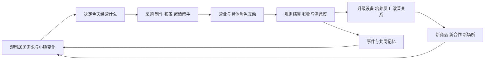

# 小镇优化：从 AI 生活舞台走向可长期游玩的经营游戏

> 编写日期：2026-09-12。本文是产品与玩法设计方案，不代表功能已实现。
>
> 现状依据当前工作区源码及 `docs/town-economy.md`、`docs/town-interactions.md`；工作区包含正在开发的改动，因此“已有”指可找到实现入口，不等于本次已完成运行验证。`ai-town-plan.md` 作为历史背景，发生差异时以当前源码为准。

## 1. 推荐的发展方向

建议把邻舍小镇发展成：**玩家与有记忆、有偏好、有自己生活的角色共同经营，能够通过语言提出新想法，并把这些想法逐步变成商品、店铺、活动和场所的生活经营游戏。**

玩家的长期目标可以是把一家小店经营成镇上的重要场所，也可以是与几位角色一起实现一个共同愿望。赚钱提供行动能力，生产和布局提供策略深度，人与世界的持续变化提供留恋。

最值得放大的优势，是项目已经同时拥有角色关系、对话、经历、世界观和生图能力。这使经营结果能够变成角色共同经历的故事，故事又能够反过来改变经营条件：

> 因为知道某位角色喜欢安静，玩家在店里开辟阅读角；她开始常来，并带来同好。玩家与她商量举办雨夜读书会，准备菜单、招募帮手、布置场地。活动成功后，这里获得固定的每周活动，角色记住第一次共同筹备的经历，店内也留下合照与纪念装饰。

这个例子包含了经营选择、关系发展、空间改造和内容生成，而且每一步都有后续用途。它可以成为整个项目的设计标尺。

建议遵循五个原则：

1. **每项玩法都产生后续选择。** 收入可用于设备、供货、员工和公共建设，关系可带来合作与信息，探索可发现新供应和新场所。
2. **AI 的建议可以进入游戏，执行结果必须可信。** AI 负责理解、提案和表达，钱物、时间、产能和完成条件由规则计算。
3. **自由度通过组合扩展。** 先让有限的经营能力可以自由组合，再逐步增加能力种类。
4. **每个世界保留自己的历史。** 已经建立的店铺、承诺、商品与场所具有稳定身份，不因再次生成而被重写。
5. **先做一段完整、耐玩的体验。** 第一阶段集中完成一家店的经营，再扩展到产业链和整个小镇。

## 2. 当前基础与最重要的缺口

### 2.1 已有能力可以直接承接什么

| 领域 | 当前实现基础 | 下一步应该承接的玩法 |
|---|---|---|
| 地图与美术 | 世界初始化、瓦片与建筑素材、NPC 形象、地图编辑、寻路及渲染 | 店铺装修、经营动线、逐步开放区域 |
| 角色生活 | 日程、到达、工作与休息行动，居民岗位及职责 | 员工排班、顾客来访、居民自主目标 |
| 钱物系统 | 账户、库存、预留、结算、退款、业务回执、世界版本检查 | 真实采购、销售、工资、经营资金及盈亏 |
| 打工与委托 | 门店帮工、配送、工作选择、小费、任务步骤、手艺解锁 | 新手学习、职业成长、经营前期资本来源 |
| 持续供给 | 有限资源生产、到岗证明、经营补货；另有受机会约束的外来订单垫付和消费采购 | 分清自然生产、商业采购及公共补助，扩展供应链 |
| 门店服务 | 咖啡馆及多类功能建筑；购买、定制、住宿、学习、护理等服务原型 | 复用服务执行方式，增加经营者视角 |
| 对话与行动 | NPC 可从受控目录提出互动邀请，玩家接受后执行 | 从单项邀请扩展到多步骤合作提案 |
| 经历与关系 | 正式结算可形成经历和角色记忆；玩家消费有熟客话题 | 顾客评价、共同创业记忆、长期合作事件 |
| 生成管线 | LLM 提示词、ComfyUI 素材生成及后处理、布局与风格相关能力 | 持久的招牌商品、店内陈设、活动布景与新场所 |

当前小镇已经具备经营游戏的重要底层。后续价值主要来自把这些能力组织成玩家能够理解、掌控和复盘的系统。

### 2.2 需要补齐的五个核心缺口

**第一，玩家经营者身份。** 目前配置门店经营关系时，经营者岗位由 NPC 承担；玩家主要做帮工、委托与消费。还需要店铺经营权、资金投入、采购定价、员工安排和利润分配。

**第二，真实顾客需求。** 当前规则行动主要围绕工作、等待、休息推进。居民走到某个地点，不代表已经消费。现有熟客机制主要记录玩家的付费访问，还需要“居民需要什么 → 选择哪家店 → 实际购买 → 满意或失望 → 下次改变选择”的闭环。

**第三，经营成长中的取舍。** 当前日常机会、固定工资、手艺订单和铭牌已经构成生活进度。完整经营还需要库存风险、设备瓶颈、岗位分工、客群取舍和长期项目，给收入提供更多有意义的去向。

**第四，地图空间影响玩法。** 地图需要逐步具有经营意义：门口是否可达、店内能坐多少人、柜台到设备有多远、附近有哪些设施、是否有安静区域。

**第五，AI 内容的持久后果。** 已有对话邀请、服务和剧情联动是很好的入口；下一步需要让一段提案能形成合同、营业计划、场景版本和后续事件，而不只留下文本记录。

这些是基于本次代码阅读的产品判断，具体优先级仍应由实际试玩验证。

## 3. 从星露谷和开罗游戏分别学习什么

星露谷的官方介绍将农场建设、居民日程与关系、季节活动、探索、制作和社区修复放在同一个生活世界中。值得学习的是：不同活动能共同服务玩家对生活和地方的投入。[来源：Stardew Valley 官方介绍](https://www.stardewvalley.net/about/)

以开罗《温泉物语》为例，官方介绍明确把房间、植物与设施布置连接到魅力、温泉效果、顾客满意、客群和地区发展。值得学习的是：经营决策产生可见、可理解的反馈。[来源：开罗《温泉物语》官方介绍](https://kairosoft.net/game/appli/onsen.html)

下面是结合本项目做出的设计取舍，不是对两款游戏全部系统的复刻：

| 借鉴方向 | 希望玩家获得的感受 | 邻舍的具体落点 |
|---|---|---|
| 星露谷式生活节奏 | 今天有事可做，明天有事可期待 | 营业安排、居民约定、生产交付、季节活动 |
| 星露谷式地方归属 | 我的行动改变了这里 | 修复旧场所、建立共同设施、留下角色回忆 |
| 开罗式经营取舍 | 调整安排后，我看得见结果 | 布局、员工、菜单、定价、客群、营业复盘 |
| 开罗式阶段成长 | 发展到下一阶段会出现新问题 | 从亲自接待到雇人，再到供货、品牌和社区建设 |
| AI 角色与语言能力 | 角色理解我的经营想法 | 合作协商、顾客访谈、自由提案、解释经营变化 |
| ComfyUI 与世界生成 | 我们创造的东西真的出现在世界里 | 招牌商品、店铺外观、活动场景、永久纪念物 |

产品重心建议放在“角色共同生活中的经营”。早期不同时展开完整战斗、复杂农业、城市交通和全行业模拟。

## 4. 核心循环：经营、关系与世界共同推进

### 4.1 三层目标

| 时间尺度 | 玩家要回答的问题 | 典型目标 |
|---|---|---|
| 一次游玩 | 这次我要做什么？ | 完成一轮营业、交付订单、解决一位顾客的问题 |
| 若干营业回合 | 我要把店改成什么样？ | 新增菜单、稳定供应、雇到合适帮手、办成一次主题活动 |
| 一个发展篇章 | 我和这些角色想把小镇变成什么？ | 建立读书街区、修复温室、恢复夜市、开通外来商路 |

每次游玩至少收获两种反馈：一个可见变化，例如设备或陈设；一个未来线索，例如某位角色愿意合作。重要项目允许暂停，避免玩家一离开就持续受罚。

### 4.2 同一问题至少允许两条合理路线

例如晚间出现大订单：

- 亲自加班：省工资，但占用玩家本次可做其他事情的时间。
- 找熟悉的角色代班：需要预算、能力和对方同意，可以积累合作经验。
- 缩减菜单：降低备料风险，却会错过部分需求。
- 与邻店合作：分走利润，但建立未来的合作渠道。

要避免所有选项最终都变成“花更多钱，获得更多收益”。时间、个人偏好、空间、信任和风险都应成为真实约束。

## 5. 第一阶段：与角色共同经营一家小店

### 5.1 首个切片选择“合营小店”

建议采用咖啡或茶饮小店题材：已有门店、材料、服务和熟客概念，玩家容易理解，也便于承接聊天、餐点、读书会等特色内容。

技术上应建立可扩展的玩家经营实例，再与现有服务对接。现有咖啡馆属于冻结玩法，旧阶段名、命令及回执需要兼容，不能直接改变其含义。短期可表现为在现有咖啡馆开设一个合营窗口，之后再获得独立经营空间。

首个完整体验的范围限定如下，先以 P1 预置内容交付，再用 P2 补充 AI 共创：

- 一处经营空间、一位合作角色、少量有差异的常来顾客。
- 三款基础商品、两类原料、两项设备升级。
- 两种定位，例如快捷外带与安静堂食。
- 一次供货问题、一次角色合作事件、一次主题活动。
- 一项可以保存和复用的招牌商品；P1 在预置配方中试作，P2 开放 AI 参与设计。

这些数量是控制范围的建议，不是已经存在的配置。

### 5.2 从帮工过渡到经营

1. **见习：** 通过现有帮工了解材料、工作步骤和结算；完成一次即可看到合营方向，不要求先重复刷很多班。
2. **试营：** 角色提供场地和基础设备，玩家获得有限试营库存。投入来源、所有权和亏损上限写清楚。
3. **合营：** 玩家安排菜单、采购和接待，角色负责约定的工作；收入进入店铺账户，分账规则公开。
4. **独立经营：** 完成一个与经营质量相关的目标后解锁，而非仅以积攒金额判断。
5. **稳定发展：** 雇人、调整布局、研发招牌商品，与小镇其他设施发生联系。

亏损后可以退回帮工、缩小营业规模或重新试营。教学补贴应一次性、可追踪，不能通过重开试营无限领取。

### 5.3 首次 30 分钟体验建议

| 大致时间 | 玩家行为 | 希望建立的理解 |
|---|---|---|
| 0—5 分钟 | 进入有基础素材的小镇，与合作角色见面 | 我在哪里、谁与我一起做事、第一件事是什么 |
| 5—10 分钟 | 完成简短帮工，拿到收据，获得试营邀请 | 行动会产生真实结果，经营目标已经可见 |
| 10—20 分钟 | 两种菜单中选一种、准备库存、完成试营 | 菜单和接待方式会影响顾客与收益 |
| 20—25 分钟 | 查看收据与一位顾客的具体反馈 | 我能理解做对了什么、哪里还可以改 |
| 25—30 分钟 | 决定下一项升级或合作 | 下次回来有自己选择的目标 |

以上是体验目标，需要试玩校准。首轮使用预置可用资产；个性化素材可以后台准备，首次进入不应要求等待整镇生图完成。

### 5.4 前七个经营回合

这里的“回合”指一次营业过程，不等同于七个现实日，也不提前规定最终日历实现。

表中是首个完整体验的目标。P1 用预置配方、角色事件和活动模板跑通七回合；P2 再开放自由提案和 AI 商品共创，不把全部生成能力作为 P1 的前置条件。

| 回合 | 引入的变化 | 玩家承担的选择 |
|---|---|---|
| 1 | 第一次试营 | 卖什么、准备多少 |
| 2 | 顾客偏好不同 | 满足谁、放弃哪些需求 |
| 3 | 一位角色可以帮忙 | 支付工资还是亲自处理 |
| 4 | 某种原料暂时不足 | 换菜单、采购替代品或延期 |
| 5 | 招牌商品试作 | 平衡口味、成本、制作时间和目标客群 |
| 6 | 准备共同活动 | 选择主题、邀请对象与活动规模 |
| 7 | 活动与经营复盘 | 决定店铺定位和下一阶段投资 |

之后进入更多变量组合，不循环播放同一套教学剧情。七回合内至少有一次由此前选择产生的回访事件。

## 6. 让经营有深度的基础系统

### 6.1 店铺身份、资金和权限

把店铺定义成独立实体，至少拥有经营者、经营权限、账户、库存、设施、菜单、员工、订单和经营记录。NPC 可以是原店主、员工、合伙人或顾客，角色身份和店铺所有权分开。

先做一种清楚的合营合同：谁提供场地、谁出材料、谁承担亏损、何时发工资、怎样分配可分配利润。暂不做股票、自由借贷和复杂股权市场。

店铺账上有钱，不等于玩家已经获得个人收入。工资、采购、预留订单成本先处理，再形成分红；同一名角色不能既被重复计入工资，又被当作无成本劳动力。

### 6.2 商品、制作与农业的关系

商品至少要有用途、配方、材料成本、制作时间、适用设备、质量、口味或风格标签、库存规则。名称、描述和图片可以丰富，效果来自可检查的属性。

建议先做短供应链：

> 购买原料 → 制作商品 → 顾客消费 → 获得反馈 → 改进配方或采购方式。

经营成立之后，再让农业接入：

> 种植／采集 → 原料品质与产量 → 加工 → 店铺菜单／委托／礼物 → 收入与关系 → 土地和工具改善。

农业初期只补与已存在菜单有关的几种作物，逐步加入生长周期、天气、轮作或温室。它需要成为供货方式上的取舍：自种节省现金但占土地和时间，采购稳定但有费用，委托熟人种植需要合作关系。

### 6.3 定价与客群

建议初期提供“亲民／标准／精品”三档价格和明确预览，后期开放范围内的自定义价格。

顾客购买受预算、偏好、需求强度、距离、等待时间和声誉影响。贵价商品可以获利，但需要对应品质、客群和服务；不能仅靠持续提高价格获得无限收入。

居民提供日常稳定需求，外来访客和商路带来有限外部购买力。外来顾客可以使用可追踪的客群预算，不必每人都生成完整 AI 人格。

### 6.4 布局和设施

早期只让少数空间属性影响经营：

- 入口与柜台可达：决定能否正常营业。
- 座位与制作工位：限制接待和生产容量。
- 工作距离：影响每回合可完成的制作量。
- 安静、采光、绿植等设施组合：影响特定客群。

例如增加座位会挤占设备空间，外带窗口提高周转却减少停留交流。所有加成需要有上限，并能解释来源。反复堆同一种装饰的收益递减，避免强迫玩家为数值破坏装修审美。

### 6.5 员工与合作角色

员工差异先控制在技能、擅长工作、可用时段、疲劳、偏好和合作信任几个方面。

一个擅长聊天但制作较慢的角色，可以承担接待；喜欢研究的角色可以参与配方；不喜欢嘈杂环境的角色可能拒绝夜市班次。玩家可以通过协商、培训和合理排班改善匹配。

关系为合作提供更多可能性，工资、时间和意愿仍要被尊重。高好感不能自动意味着无限免费劳动。

### 6.6 解锁与长期目标

以能力和经历解锁内容：完成稳定供货、让几位顾客再次光顾、培养一位能独立值班的员工、办成一场社区活动。金钱负责购买和投资，尽量减少所有系统都共用一个总等级的设计。

店铺稳定后，自动化接管玩家已经掌握的重复操作。玩家继续负责新商品、用人、扩张与共同活动。每次自动化都应释放精力，不能只增加每天必须收取的收益按钮。

### 6.7 一个篇章要有可以完成的目标

建议把首个中期篇章设为“让旧商业街重新热闹起来”，按见习、稳定经营、共同活动、公共建设四个里程碑推进。最终可以选择扶持熟客社区、发展特色旅游或建立手作合作街，不要求同一存档把所有路线都做满。

达成篇章目标后，给出经营历程、角色寄语和小镇变化的回顾，继续游玩仍然开放。后期目标从提高收入转向培养接班人、完成居民愿望、建设新区域或挑战一种不同的经营方式。玩家也可以维持满意的小店规模。

## 7. 居民从“走动的角色”发展为经营参与者

### 7.1 四层居民状态

| 层次 | 保存什么 | 对玩法的作用 |
|---|---|---|
| 身份与偏好 | 人设、生活习惯、职业、饮食与环境偏好 | 决定选择倾向，保持角色稳定 |
| 现实条件 | 钱包、位置、空闲时段、当前需要、已有承诺 | 决定当前能做什么 |
| 关系与经历 | 谁帮过我、购买是否满意、承诺是否兑现 | 影响信任、回访和合作 |
| 中期目标 | 想学手艺、筹办展览、改善住处等 | 产生持续几次游玩的合作线 |

先给少量重要角色完整状态；普通居民用轻量规则，临时游客用客群模型。扩大地图时不应让 LLM 调用随每个居民的每次行动一起增长。

### 7.2 居民购买流程

> 出现需求 → 检查预算和时间 → 比较可达店铺 → 预约或到店 → 下单与库存预留 → 实际交付付款 → 更新满意度与记忆。

需要明确允许“不买”：没钱、太远、卖完、排队太久、没有喜欢的商品，都可以导致放弃。离开的理由应可观察，例如简短气泡或收据中的流失原因。

NPC 的口头称赞不直接增加营业额；实际购买回执才形成收入。一次失败体验通常影响具体偏好和短期信任，不立即毁掉长期关系。

### 7.3 每个角色有自己的事情

把长期目标控制成少量并行线程。例如书斋角色正在准备一次展览，会需要印刷、场地、点心和宣传；玩家可以承接其中一部分，也可以介绍别人合作。

目标会经历筹备、受阻、调整、完成或放弃。放弃也能成为后续故事，不让所有角色都永远等待玩家来解决问题。重大变化留出介入窗口，关闭游戏期间以可恢复的状态为主。

后期可以加入 NPC 店主之间的竞争与合作，但先采用规则驱动的不同经营偏好。竞争者不能读取玩家尚未公开的计划，也不应靠无限资金压制玩家。

## 8. AI 应该提供的四类核心能力

### 8.1 经营顾问：帮助理解与比较策略

玩家可以询问：“最近生意为什么变差？”“只想轻松经营，下一步买什么？”“明天准备办活动，预算够吗？”

建议采用如下过程：

1. 从真实营业记录中读取销量、成本、缺货、等待和顾客反馈。
2. AI 将问题变成可比较的候选方案，例如调整菜单、增加设备或减少营业规模。
3. 本地计算器／模拟器评估预算、产能与需求情景。
4. AI 解释计算结果、适用条件与不确定性，并给出可撤回的试行方案。

确定性成本提供精确数值；未来销量给区间或情景，不伪装成必然结果。建议需要标明依据哪几轮营业数据，数据不足时允许说“还需要试营一次”。

例如顾问指出：“有几位客人因等待离开，但座位经常空着。先增加制作工位，可能比继续添桌子更有效。”点击后可以看到相关记录并预览改动。

顾问默认保留玩家决策，也可逐步授权自动补货和固定排班。每种委托都要写清预算、时限、最低库存、禁止操作和暂停条件，并提供撤销入口。

不同角色可以提出不同目标下的建议：合伙人重视老顾客，员工希望班次轻松，供应商倾向稳定采购。顾问只读取玩家已知、合法获得的信息，不提前知道隐藏事件和未来随机结果。比较方案时同时展示收益、风险、工作量和关系承诺，避免把全部经营压缩成点击一个“最高利润”答案。

### 8.2 自由表达：把一句话变成可执行计划

玩家说：“我想把周五晚上变成大家能讲故事的小茶会。”

系统应识别并组合已有能力：选择场地、邀请参与者、设置餐单、安排人员、确定预算、准备装饰、发布游戏内活动通知。玩家看到的是活动方案及费用，确认后才创建订单和安排。

实现链路建议为：

> 玩家意图 → AI 草拟方案 → 能力目录匹配 → 检查权限、角色同意和资源 → 展示可执行内容与费用 → 玩家确认或授权 → 规则执行 → 回执 → 角色反应与后续记忆。

复杂提案分为三种结果：

| 结果 | 处理方式 | 例子 |
|---|---|---|
| 现有能力可组合 | 创建可预览的计划 | 茶会、送货合作、菜单调整 |
| 可用现有模板近似 | 说明当前能做到的具体形式 | 把“魔法茶馆”做成有特定菜单与布景的主题店 |
| 需要新机制 | 保存想法或推荐可行替代，明确未执行 | 真正改变物理规则的飞行城市、尚未实现的战斗体系 |

这让玩家语言的自由度可以持续增长，同时保留真实能力边界。不能因为对话里说了“已经建好”，就在没有工程、费用和场景落地的情况下宣称完成。

可以进一步加入有记忆的合作协商。玩家对供应商提出“固定采购三轮，换更稳定的交付”，双方讨论后形成受规则约束的数量、单价、期限和补偿条款。合同占用未来资金与供货能力，履约记录影响之后能谈的条件；一次漂亮话术不能绕过成本底线。它也可以由 NPC 主动提出，让小镇的机会不总由玩家发起。

### 8.3 创作搭档：让玩家拥有原创商品与品牌

招牌商品可以由玩家与角色共同研发：选用途和客群，提出风格，讨论材料，试作，收集反馈，确定版本，再生成图像与故事。

例如“雨天喝起来有森林气息的茶”，可以映射成已有的香气、温度、口味与配料标签。试作质量由配方、设备、技能和已锁定的随机结果计算。描述不自动赋予不存在的效果。

商品拥有稳定 ID、配方版本、成本、制作条件和图片版本。每次改配方是新版本，既有订单仍按下单时的版本交付。更换图片不改变商品品质与价格。

进一步可开放店名、招牌、制服、包装和店内主题。玩家投入的结果持续出现在货架、地图和角色回忆中，形成长期收藏与归属感。

### 8.4 故事组织者：围绕真实经营生成事件

事件优先由状态触发：缺货、员工成长、熟客回访、某类商品受欢迎、合作承诺到期、公共设施达到筹备条件。

AI 可以为这些事件增加人物动机、对话和不同解决办法。任务需求、奖励、可用材料、期限和后果仍由受控规则确定。新任务发布前检查可达、可支付和可完成，避免要求当前世界根本不存在的资源。

同类事件设置冷却、未完成数量上限和重复度检查。一次游玩只突出少量相关事件，允许玩家忽略支线。已经确认的承诺由结构化记录管理，不能仅依赖聊天摘要记住。

## 9. 动态场景：从生成图片发展为生成可用场所

### 9.1 分三层实现

| 层次 | 生成对象 | 玩家能做什么 | 推荐阶段 |
|---|---|---|---|
| 展示内容 | 商品图、店铺招牌、菜单插图、活动纪念照 | 看见自己的创作并收藏 | 最早落地 |
| 可交互布景 | 已有房型中的家具、主题装修、固定交互点 | 摆放、接待、组织活动，使用明确设施 | 单店闭环稳定后 |
| 新区域 | 温室、河岸、节庆街区、店铺室内等结构化场所 | 移动、采集、生产、经营，并留下永久变化 | 中后期 |

一张完整的漂亮背景，只有配上可达区域、交互位置、容量、规则和保存机制，才能成为经营场所。新增场所的玩法价值应先确定，再决定需要生成哪些视觉资产。

### 9.2 场所生成流程

以“把旧仓库改成夜间花房”为例：

1. **形成需求：** 玩家和角色达成提案，确定用途、预算、土地与改建权限。
2. **选玩法模板：** 使用已有花房／营业空间模板，声明入口、工作点、容量、材料和开放条件。
3. **生成布局草案：** 在现有地图和空间规则中布置对象，检查占格、寻路、出口与工作动线。
4. **生成视觉素材：** 用世界风格、结构模板、参考图和种子生成局部资产；条件合适的 ComfyUI 工作流可使用结构引导，能力是否可用需实际验证。
5. **验证并预览：** 检查锚点、透明边缘、比例、遮挡和风格；布局失败用合格模板，素材失败用现有素材。
6. **实施改建：** 确认方案后扣除建设资源，以唯一工程记录推进，完成后提交新场景版本。
7. **投入使用：** NPC 可以到达并开展已声明的活动；新事件引用这个稳定场所。
8. **持续演变：** 后续扩建、季节装饰与纪念品作为增量更新，保留原场所历史。

场景蓝图、碰撞和交互点是权威数据。画面中的一扇门是否能开，由蓝图决定，不能临时依据图片猜测并修改游戏规则。生成内容不直接注入可执行脚本。

### 9.3 对“即时生成”的体验安排

即时生成应体现为“想法马上得到回应，内容逐步变成现实”。实际生图耗时取决于机器、模型和队列，不能把进入场景或完成营业绑在生图成功上。

- 对话和规则结果先到达；生图后台执行。
- 普通装饰用已有资源即时预览，定制版本完成后可替换。
- 结构施工期间保留旧场景可用，完成后统一切换。
- 同一素材复用缓存；按世界风格、用途、外观、工作流版本和种子识别生成版本。
- 首次关键素材失败时提供重试、采用现有方案和取消选项，重试不重复收取游戏建设费用。

生成任务本身需要持久化，保存任务 ID、输入版本、状态、重试次数和结果资产。重启后恢复或重新排队；旧世界、旧施工方案的迟到结果只能进入对应素材记录，不能覆盖当前场景。资产重生、玩法重置和建设退款是不同操作，必须分别处理。

## 10. 一次完整的特色玩法示例：雨夜故事茶会

以下是未来玩法示例，用于检验各系统是否真正连接，不代表当前已经实现。

**起因：** 一位常客最近想找地方读自己写的故事。玩家店里恰好有空闲晚间时段，也积累了几位喜欢安静环境的顾客。

**提案：** 玩家在对话中提出茶会。角色愿意参与，但不希望人数太多；另一位居民提醒附近住户怕吵。AI 把讨论整理成活动草案。

**经营决策：** 玩家在小型预约茶会和开放式热闹活动之间选择。前者需求较可预测、规模有限；后者潜在销量更多，但接待、噪声和备料压力增加。

**准备：** 游戏检查角色时间、座位、原料、工作人员与资金。玩家可以自制茶点、向邻店采购或请角色合作；不同选择改变成本与合作经历。

**场景：** 复用店铺空间，加上阅读位置和灯光装饰。ComfyUI 可以生成活动海报与纪念图；无图时活动仍可完成。

**经营过程：** 顾客按预算和偏好实际消费。某位员工临时疲劳，玩家选择缩短菜单、自己接手或邀请替班。客人发言和反馈随人设及实际事件变化。

**结算：** 展示收入、原料、工资、退款、剩余库存与顾客反馈。活动是否成功，以履约、满意度和玩家选定的目标评价，不强制把赚钱最多视为唯一成功。

**持续后果：** 成功可以解锁固定茶会、常客回访与一段共同记忆；一般表现会留下明确改进方向；失败则允许道歉、补办或退回普通营业。店内纪念品引用真实活动记录。

**真正的扩展空间：** 同一批能力还可组合成手作集市、小型展览、生日包场、雨天避难餐和季节庆典。新的玩家想法拥有进入系统的路径。

## 11. 经济、时间与失败体验

### 11.1 日常挣钱与经营收入分开设计

当前规则中，接单机会初始为 3，按北京时间每日补 3，最多存 9；门店打工、配送和部分托付共用。它适合当前日常挣钱和回访节奏。

未来自主经营应主要受资金、原料、生产时间、设备、员工与需求约束。继续把所有营业统一限制成每天三次，会限制经营策略的展开。原有接单机会可以保留给公共差事，经营收入需要单独的可持续规则。

同样，当前生产配方中的 200 是一个有限资源节点的容量，不能直接当作全世界未来永久的产量上限。后续自然资源需有明确再生或扩展条件；商业补货需记录供货、成本和外部来源。

### 11.2 钱从哪里来、到哪里去

| 类型 | 例子 | 设计要求 |
|---|---|---|
| 镇内转移 | 居民购物、雇员工资、店间采购 | 同一笔付款与收款对应 |
| 外部流入 | 游客、出口订单、有限公共项目资金 | 有预算、来源和触发条件 |
| 外部流出 | 外购原料、设备进口、公共建设等 | 用途清楚，避免只靠无限涨价消耗玩家资金 |
| 资源产出 | 种植、采集、生产 | 消耗时间、劳动力、土地或有限节点 |
| 资源消耗 | 制作、消费、建设、合理损耗 | 不能同时保留原料和产出，也不能重复退回 |

现有受控垫付能够保证部分差事可做；后续要限制适用范围，不能扩展成所有亏损店铺自动获得无限补贴。长期供需健康和“能记清账”需要分别验证。

### 11.3 一张玩家看得懂的营业收据

下面仅演示会计口径，数值为方案示例，不是现有平衡参数。假定无税费、折旧、欠款，剩余商品本轮仍可销售：

| 项目 | 数值 |
|---|---:|
| 开始现金 | 200 邻币 |
| 制作 20 份，每份成本 5 | 支出 100 |
| 售出 18 份，每份售价 12 | 收入 216 |
| 员工工资 | 支出 40 |
| 本轮其他经营费用 | 支出 20 |
| 结束现金 | 256 |
| 剩余 2 份库存成本 | 10 |
| 本轮利润：216 − 18×5 − 40 − 20 | 66 |
| 本轮现金增加：216 − 100 − 40 − 20 | 56 |

利润与现金增加不同，是因为 10 邻币仍在库存中。若之后报废，还要确认损耗。UI 应先显示营业结果，再允许展开明细；AI 顾问必须使用同一份计算结果。

### 11.4 现实时间与经营时间

项目现有日程、预约、天气及部分规则依赖现实时间。后续不能简单把整个小镇加速几十倍，否则会出现角色同时上班和赴约、现实日期与经营期限混用的问题。

建议分阶段处理：

- **近期：** 保留现有现实时间世界。增加玩家主动开始和结束的短营业回合；回合只推进其内部经营流程，不伪造现实日程过去了几天。已入住角色按实际可用时间参与，也可通过订单和留言异步合作。
- **中期：** 如完整经营确实需要快速昼夜与四季，新增独立的经营世界时间模式。该存档的日程、生产、活动、期限统一使用游戏时钟；现实时间只用于后台任务、超时和技术恢复。
- **兼容：** 旧镇不静默更改时间模式。迁移需要处理活动、订单、预约、冷却与离线游标，并明确共享角色的记忆所属世界。同一世界不能同时有两套权威日期。

近期营业回合只处理已经产生、并能预留预算和资源的需求。原料、顾客预算、员工疲劳、可用工时与设备占用持续保存，开张、打烊或取消都不刷新；取消只释放未使用的预留。员工可用时段和需等待的制作任务仍按现实时间检查，不能把一次按钮操作解释成完成数小时劳动。

新手七回合采用一次性的试营计划：有限外来试吃订单、可追踪的供货合同和已约定的短时协作安排，随教学里程碑逐批开放，不随开关店重新发放。订单批次 ID 和已领取进度跨重启、跨地图保留。七回合可以分多次游玩完成，需求与材料按计划保证可获得；普通经营接续真实需求，不能无限重复领取试营订单。

经营世界时钟上线前，P3 的少量作物使用持久的现实时间生长任务，采收不会因再次开张提前；优先提供采购替代和适合短流程验证的品种。若开发评估认为等待严重影响核心体验，应提前实现统一经营时钟，再加入依赖季节的农业，不能在旧世界临时另设一套农场日期。

季节必须改变原料、需求和活动，并提前预告，而不仅改变地图色调。想追求慢生活的玩家可以停留和休息，经营模式的节奏由明确设置决定。

### 11.5 离线与恢复

第一版自动经营建议在玩家离开后暂停未授权决策，只处理已经明确承诺的任务，回来后展示可恢复状态。

后续开放离线经营时，先由玩家选择营业范围和损失上限，冻结经营计划与必要资源，再进行有上限的批量模拟。离线结果需要独立的可信结算记录，不复用“在线观察到岗”的证明去编造出勤。

不在离线期间擅自签长期合同、重大扩建或引发永久破坏关系的事件。后台图像生成可以继续，完成与否不改变已经确认的营业账目。

## 12. UI：经营发生在小镇里

遵循 `AGENTS.md` 和 `docs/design-system.md`。以点击 NPC 后打开的 `TownDialogueStage.vue` 为直接参考，延续立绘、暖纸不规则对话框、墨色描边和游戏选项布局。

| 玩家想做的事 | 世界中的入口 | 界面表达 |
|---|---|---|
| 决定本轮营业 | 走到店门或与合伙人说话 | 简短经营计划、菜单与一个主要开张操作 |
| 采购与补货 | 货架、仓库或供应商 | 缺货清单、订单、预计交付 |
| 分配工作 | 与员工交谈 | 工作牌、可用时间和角色回应 |
| 修改商品 | 工作台或研发对话 | 配方步骤、试作品、反馈与保存版本 |
| 看经营结果 | 收银台或打烊对话 | 收据、顾客留言和下一步选择 |
| 装修 | 店内可布置区域 | 实地预览、占格与可达提示 |
| 提出新活动 | 对话中的自由输入 | 角色讨论、可执行方案与确认结果 |

生活与经营概览复用 `TownPaperPanel.vue`。普通弹窗、按钮、输入、选择、开关继续使用已有 Linshe 组件和 token，不单独发明一套经营后台皮肤。对话舞台与生活面板使用各自已有外壳。

第一层只突出今天计划、当前瓶颈、收支结果和下一步操作。详细账本、配方参数与长期分析可以逐层展开，地图顶栏不随着玩法增加而不断堆按钮。

移动端重点验证单手操作、键盘弹起、地图误触和返回恢复；桌面端验证鼠标与键盘焦点。暖色与暗夜都要对照现有 NPC 对话、Toast、世界观和信箱检查一致性。生成等待使用任务状态和占位内容，避免阻塞整个界面。

## 13. 在现有代码上怎样演进

### 13.1 保持规则、内容与呈现的职责清楚

| 层 | 承担的职责 | 与当前实现的关系 |
|---|---|---|
| 权威经营状态 | 钱、库存、订单、雇佣、生产、营业结果 | 扩展现有 economy、business、order、production 服务 |
| 行动与空间 | 到达、行动占用、工作点、预约、行动完成 | 复用 simulation、action runner、responsibility 与地图能力 |
| AI 计划与表达 | 理解意图、选择能力、拟定方案、解释事实、角色对话 | 在已有互动邀请和服务提示词基础上扩展 |
| 内容生成 | 商品视觉、场景蓝图、素材与主题 | 复用 town 生成管线和 ComfyUI 桥接 |
| 经历传播 | 回执形成事实、角色记忆与后续线索 | 延续 townEventService、townExperienceService 的方向 |
| UI 呈现 | 营业过程、对话、收据、地图变化 | 延续 TownDialogueStage 和 TownPaperPanel |

不能让 LLM 的一句回复直接写钱包或背包。实际流程应先提交真实变化，再由 AI 解释这次变化；解释失败不撤销已经完成的合法交易。

### 13.2 建议补充的数据概念

先确认现有表能否扩展，以下是领域概念，不要求直接按名称新建同名表：

- 经营实例：稳定店铺 ID、经营权、账户、场地与版本。
- 经营回合：计划快照、起止、已接受订单、最终收据与恢复状态。
- 配方与商品版本：材料、效果、成本依据、设备要求和视觉版本。
- 员工安排：角色、班次、报酬、同意状态与占用冲突。
- 顾客订单：预算、偏好匹配、交付与付款，明确流失原因。
- 合作计划：AI 提案、能力引用、资源预留、授权范围和执行步骤。
- 场所蓝图与工程：结构模板、互动点、碰撞、素材版本、施工和发布状态。
- 公共项目：贡献、里程碑、受益设施与后续活动。

同一经营类型未来需要支持多家店铺，以稳定的经营实例 ID 区分；当前每种营业类型一处、部分账户按业务类型确定的组织方式要显式演进，避免第二家店混用第一家的库存和资金。

### 13.3 AI 计划的执行约束

已有世界身份、`worldEpoch`、版本检查、幂等键和回执值得保留。新经营命令还需验证店铺权限、预算、库存、角色时间和目标场所可用性。

AI 提案需要附带生成时的事实版本。玩家确认时若库存或排班变化，应重新核价或更新计划，不能按过期事实执行。整个计划可以部分完成，但每一步的扣费、失败和补偿都必须清楚。

本方案不新增实际 prompt。以后落地 JSON 输出时，遵循仓库约定：提供完整字段和示例值、逐字段约束、严格只输出 JSON 的要求，并同步更新解析与校验。不得仅靠提示词保障正确性。

角色生图人格及外观仍统一经过 `characterPersona.js`；JOIN 数据传入时保证 `id` 为实际角色 ID，生效外观继续走 `outfitService`。新制服和活动服饰应扩展已有外观体系。

### 13.4 成本与降级

| 工作 | 处理策略 |
|---|---|
| 移动、排队、扣库存、成本计算 | 本地规则，不调用 LLM |
| 日常选择店铺、例行排班 | 轻量偏好与规则，必要时批量更新 |
| 玩家对话、复杂合作、关键事件 | 按需调用 AI，限制上下文并缓存事实摘要 |
| 普通商品与家具 | 优先复用素材，允许更换主题 |
| 招牌商品、重要场景、纪念物 | 后台生图，设置队列与预算 |

为每次调用记录用途、等待、成功率、消耗和是否真正被使用。建立交互优先、关键任务次之、批量美术靠后的调度；是否能够抢占执行中的 ComfyUI 任务，以桥接和工作流能力为准。

关闭 AI 或 ComfyUI 后，应仍能使用预置内容完成经营。AI 恢复后补充个性化对话与视觉，不需要重做已经完成的游戏进度。

## 14. 分阶段路线与完成标准

阶段按照能力依赖排序，不承诺未经估算的交付日期。每一阶段都应留下可玩的版本。

| 阶段 | 主要交付 | 进入下一阶段的条件 |
|---|---|---|
| P0：整理经营入口 | 现有打工、委托、到场、消费、钱袋之间的引导；现状试玩和基础记录 | 新玩家能独立赚到第一笔钱、完成消费、说出下一目标；失败或关闭能恢复 |
| P1：一店经营闭环 | 合营试店、菜单、库存、真实顾客订单、成本、营业收据和设备升级 | 连续七个经营回合有不同选择；缺货、亏损、重启可恢复；至少两种定位能成立 |
| P2：AI 共同经营 | 经营顾问、受控活动提案、招牌商品、角色合作记忆 | 一句自由提案能形成并完成计划；建议来源可查；关 AI 仍能完成同样的基础经营 |
| P3：空间与产业链 | 店内布置、供应合同、少量农业、员工成长、公共项目 | 布局和供应选择产生可解释差异；经营收入反哺世界建设；有一个完整发展篇章 |
| P4：居民社会与生成区域 | 居民中期目标、跨店合作、结构化生成场所、世界时间模式 | 新场所可达、可交互、可保存；角色目标相互影响但不造成失控连锁 |
| P5：可扩展世界内容 | 多行业玩法包、世界观变体、可导入的场景与商品模板 | 内容包可验证、可迁移、可停用；新增内容无需复制整套经营引擎 |

### 14.1 P1 最重要的验收场景

1. 从零个人资金出发，可以通过已有帮工与受控试营建立小店。
2. 一轮营业能完成采购、制作、顾客下单、付款、工资和收据；利润、现金与库存一致。
3. 同一菜单在不同客群和接待条件下出现合理差异，玩家能解释原因。
4. 缺钱、缺料、员工不在场、订单取消时，有可理解的后续操作。
5. 重复点击、网络重试、重启恢复和地图版本变化不重复发钱或发物。
6. 设备与菜单至少支持两种可持续路线，不能永远有同一个无条件最优解。
7. 没有模型响应和没有新图片时，仍能完成一轮营业。
8. 七个回合后，玩家能描述一次自己的经营选择如何改变了某个角色或店铺。

### 14.2 后续数值与质量验证

在现有经济、任务、职责及交互测试基础上，增加真实闭环的集成验证。用可复现的随机种子模拟不同客群、供给冲击与经营策略，覆盖几十到上百个经营回合，观察余额、库存、收益与需求是否长期失衡。

重点验证重试与退款、防止生成商品卖回套利、多个顾客抢最后一份库存、同一角色班次冲突、场景施工中断与旧存档升级。结算重放使用已保存事件与结果；随机种子用于复现实验，不能单独替代模型、工作流和资产版本记录。

试玩同时记录首轮完成率、退出位置、是否理解亏损原因、不同策略的使用情况、AI 建议采纳后是否有效、生成内容是否被实际使用。指标先测基线，再定阈值；不把调用次数或生成图片数量当成玩法成功。

## 15. 更远的未来：三条值得发展的方向

### 15.1 角色共同创业与小镇人生

从共同经营一家店延伸到培养学徒、合作品牌、角色自己的事业和公共愿望。员工可能想独立开店，玩家可以支持、投资、建立供货关系或寻找新的搭档。

这里的长期内容来自关系和经营状态共同推进。角色成长会让世界出现变化，玩家也能选择小规模、熟客制的稳定生活，不被迫无限扩张。

### 15.2 会生长的地方

先有经营和关系需求，再开放新空间：订单带来商路，读书会带来旧书馆，花艺合作带来温室，夜市带来新街区。场所生成由玩家与居民的共同历史决定。

每块新区域至少提供一种有意义的能力或取舍，并与既有供应、角色或公共项目相连。地图扩展应考虑模拟与渲染预算，可以用区域切换和分层模拟控制规模。

### 15.3 世界观驱动的经营模板

同一套规则可以承载不同世界：普通茶馆、魔法药草店、太空补给站、海边旅店。初期变化集中在名称、素材、角色、配方与事件；成熟后才增加行业特有机制。

行业之间需要真实区别：茶馆重回访与空间，旅店重房间周转与预订，工坊重工序与批次，农园重土地和生长周期。用共享账户、库存、订单和角色系统支撑差异，避免所有行业只是改名的咖啡馆。

后期可提供玩家内容包：世界观、风格参考、角色设定、配方模板、场景蓝图和事件条件。优先做本地分享与导入，先建立版本、兼容性和有效性验证，再考虑公开内容市场或联机。

## 16. 暂缓事项与近期行动顺序

为保护核心体验，建议暂缓：任意生成代码、完整城市交通、全行业同时开放、每个 NPC 高频调用 AI、进入场景必须实时生图、自由金融市场、大规模联机经济，以及无限地图扩展。

近期行动顺序建议如下：

1. 试玩现有小镇，记录新手从开镇到第一笔收入、消费和任务完成的路径。
2. 明确玩家经营实例与旧 NPC 门店的关系，保留旧存档和服务回执兼容。
3. 用预置素材完成“采购 → 制作 → 顾客真实购买 → 结算 → 升级”全流程。
4. 通过七回合体验确认策略、反馈和成长成立，修正最容易重复的环节。
5. 接入一项有真实结果的 AI 能力，优先选择经营顾问或主题活动提案。
6. 让招牌商品与店内纪念物成为首批持久生成内容，再扩大到可交互场所。

下一轮开发的推荐目标是：**玩家能与一位角色共同经营一家店，经过几次营业作出不同选择，看到真实收益与关系变化，并留下一个属于这段经营经历的原创内容。**

## 附录：本次现状判断的主要源码入口

| 内容 | 当前文件 |
|---|---|
| 当前挣钱与互动口径 | `docs/town-economy.md`、`docs/town-interactions.md` |
| 设计规范 | `AGENTS.md`、`docs/design-system.md` |
| 地图与经营入口 | `web-ui/src/views/TownView.vue` |
| 对话和生活面板 | `web-ui/src/components/town/TownDialogueStage.vue`、`TownPaperPanel.vue` |
| 账户、库存、经营配置与集成 | `agent-core/src/services/town/economyService.js`、`townBusinessService.js`、`townEconomyRuntime.js` |
| 服务与冻结咖啡馆兼容 | `agent-core/src/services/town/townVenuePlaybooks.js`、`townVenueService.js`、`townCafeService.js` |
| 机会、收入与任务 | `agent-core/src/services/town/townEarningPolicy.js`、`townEarningDefinitions.js`、`townQuestService.js` |
| 订单与生产 | `agent-core/src/services/town/townOrderService.js`、`townProductionService.js` |
| 时钟、行为与职责 | `agent-core/src/services/town/townClock.js`、`townSimulation.js`、`townRuleEngine.js`、`townActionRunner.js`、`townResponsibilityRuntime.js` |
| 对话邀请与熟客 | `agent-core/src/services/town/townNpcService.js`、`townInteractionService.js`、`townVenueRegularService.js` |
| 经历与事实 | `agent-core/src/services/town/townEventService.js`、`townExperienceService.js` |
| 生成与布局 | `agent-core/src/services/town/townInitService.js`、`townLayoutGenerator.js`、`townLayoutAI.js`、`townAssetService.js`、`townPromptBuilder.js` |
| 生图桥接与人格 | `agent-core/src/services/comfyClient.js`、`agent-core/src/services/characterPersona.js` |
| 现有验证基础 | `agent-core/test/townEarningPolicy.test.js`、`townQuestRuntime.test.js`、`townResponsibilities.test.js`、`townInteractionRuntime.test.js`；`web-ui/test/townQuestFlow.test.js`、`townEarningCommands.test.js`、`townInteractions.test.js` |

本文只提供发展方案；本次不修改玩法代码、配置、经济数值或更新说明。
